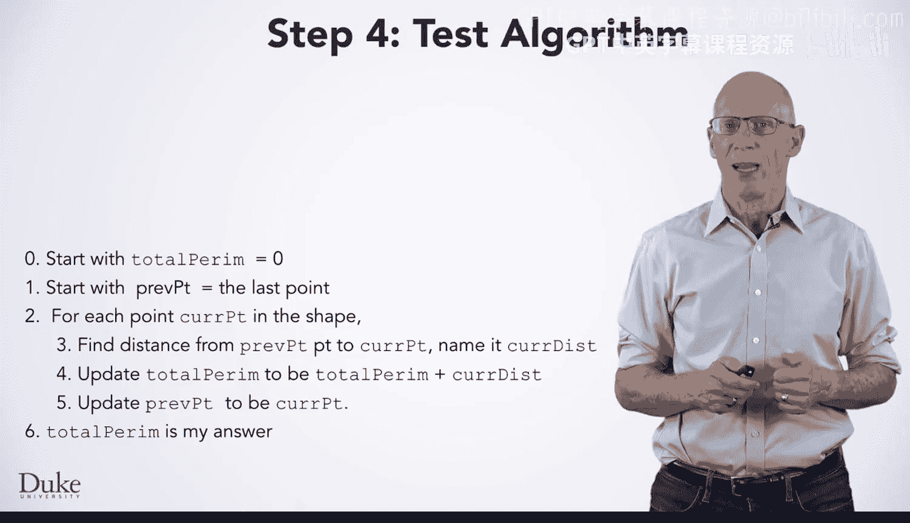

# 杜克大学《Java编程和软件工程基础2-5｜Java Programming and Software Engineering Fundamentals》中英 p21 21_02_03_七步法实战：算法测试.zh_en -BV18U411U729_p21-

Hi， we've developed an algorithm to find the perimeter of any shape。

 but are we ready to turn this algorithm into code？Well we could。

 but we'd like to be confident that it's right before we do that。 After all。

 there were a lot we had to do to generalize our steps。

 and it's entirely possible that we made a mistake。

 or perhaps we just didn't think through all the special cases。 So before we turn this into code。

 we should test it out。

To test the algorithm， we need a different instance of the problem。

 something other than what we used to make the algorithm。 In fact。

 it's good if our test instance is pretty different from the one we used to make the algorithm here。

 we've shown a triangle instead of the fores sided trapezoid we used when we develop the algorithm Before we go any further。

Take a second to figure out what the right answer is， what is the perimeter of this shape？

When we finish， you'll want to check if the answer to our simulated algorithm is correct。

 and to do that， you'll need to know the right answer。

Now we'll execute the algorithm by hand for this particular input as we test the algorithm。

 notice the similarities between the code and English。

We're going to execute this English algorithm by hand just as we executed code by hand。

 they both work pretty much the same way， and that's not a coincidence。

 When you turn this algorithm into code， you want to write down code that has the same semantics as the English。

 the same meaning。 the code should transform the program state in the same way that the English transforms this diagram。

So we'll start with total perm and set it to zero。And proof point being the last point in the shape。

 But what is the last point， We'll say the points in this shape start at the top and go counterclockwise。

 So this point in the lower right hand corner is the last one and well initialize proof point to be that point。

We'll note briefly that if this were actual Java objects， pre point。

Might be an arrow pointing at an object， but we're going to just write down the coordinates here to keep the diagram simple and legible。

Next， we're going to do the steps for each point。 So we need to start at the first point。

 which is this one at the top of the diagram。 And that will be the initial value of cur point as we enter for each repetition。

 Then we'll find the distance between these two points， which is 10。

And we'll update total perm to be 10，0 plus 10， and then we'll update pre point to be curve point。

Now we're at the end of hour for each repetition， so we'll update Cur point to be the next point in the shape。

 which is negative 3， negative 4。 When we update Cur point， we go back to repeat these steps。

We repeat the steps again， finding the distance between those two points， which is 8。

 and then we update total perimeter to be 10 plus 8 or 18。

And then we update Preve point to be the current point。Then we go back to the top of our loop。

 updating curve point， We repeat these steps for the last point in our shape。

 after which we've gone through all the points， so we skip to the steps after our repetition here we can say that total perm is our answer。

Total perm is 24。Is that the answer you came up with earlier？Yes。

 that is the perimeter of this shape。 The fact that our algorithm came up with the right answer here gives us more confidence that we generalized correctly。

 We're done executing the algorithm by hand。 and we have some great confidence that it's correct。

 So we're ready to turn the algorithm into code。😊。