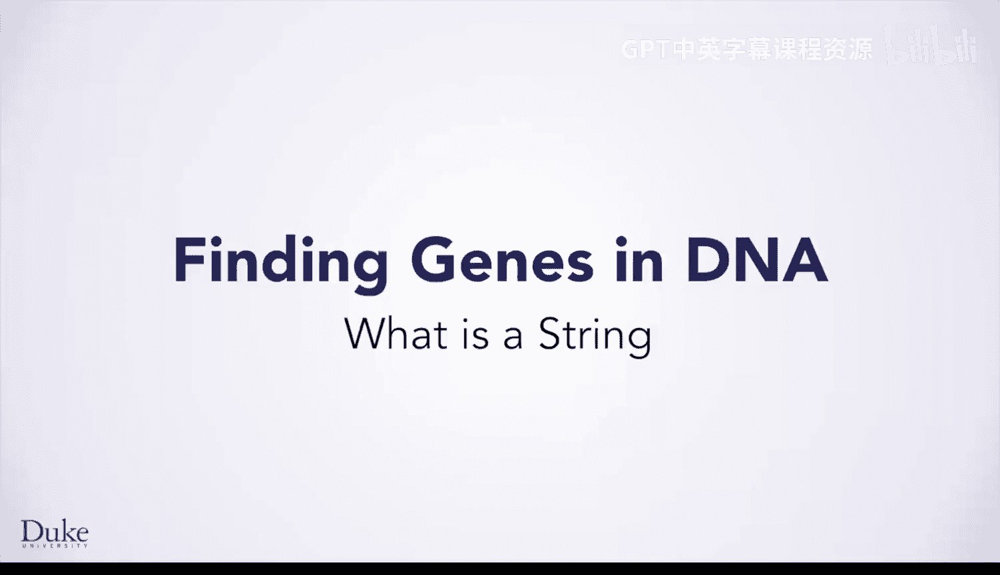

# 杜克大学《Java编程和软件工程基础2-5｜Java Programming and Software Engineering Fundamentals》中英 p23 23_03_01_什么是字符串.zh_en -BV18U411U729_p23-

Hi， I'm Dr。 Alua Gordon， Im a professor in the Duke Center for Genomic and Computal Biology and in the Department of Bosstatistics and Bioinformatics。

My work is strongly based on designing and using computational algorithms。

 programs and tools and I want to tell you just a little bit about that。But first。

 I'd like you to think about the word strings。What does an orchestra conductor think about when she hears the word strings？

What does a sailor think about the word strings？What does a pianist think about the word strings？

Well， I'm a genome scientist， so I will tell you what I think when I hear the word strings。

 and that is genomic strings。The genome ofe organism stores all the genetic information necessary to build and maintain that organism。

This genetic information is stored as a long list or string over the four letter alphabet， A，T， C。

 and G。These four characters correspond to the four DNA bases。Adenine。Saaiin。Saittoine。And Guanni。

The sheer size of the genome makes it difficult， if not impossible， to analyze by hand。

 the human genome， for example， contains 3 billion characters that is a million times more than the characters shown here。

Thus， finding any information in the genome requires computational approaches。In addition。

 the genome is complex and contains different types of information。

Computational approaches are needed to find information。Including genes， as you can see here。

Finding genes requires more than simply looking for the tags or codons that identify the start and end of a gene。

In addition to genes such as the one shown here in red。

 we also need to look for regulatory elements as shown here。

We do this with computational tools and techniques。

These regulatory elements are shown here as simpler letters representing nucleotite。

But it's important to remember that these are actually bound by proteins called transcription factors。

 which help turn genes on and off。My research is focused on identifying such regulatory elements in the human genome using various computational approaches。

You will do similar things in the course， and this will prepare you to become a computer scientist or a genome scientist。

 depending on what your preferences are。