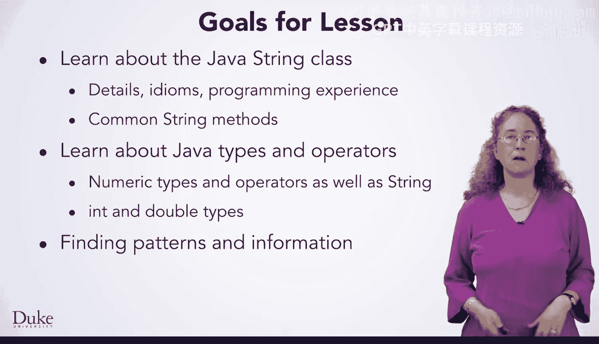
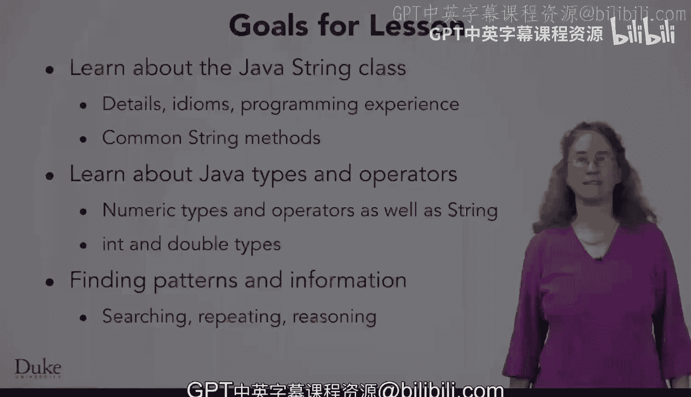

# 杜克大学《Java编程和软件工程基础2-5｜Java Programming and Software Engineering Fundamentals》中英 p24 24_03_02_理解字符串.zh_en -BV18U411U729_p24-

Hi and welcome to this lesson on finding information and patterns and data。

 which is a very general topic that we will make concrete in working with Java strings。

 Strings are sequences of letters， digits， punctuation， Any character that you might type。

 for example， Why will you learn about strings。😊，You've learned previously that everything is a number。

That's true， As you can see here， where I've captured the beginning of three different files。

 These files might be stored in memory on a flash drive or on your computer's hard drive。

 The first file was a video。 A file with a dot M4 suffix。 The second file was an image。

 a file with a dot P and G suffix。 And the third file was a plain text file with a dot T X T suffix。

 Can you tell which group of bits of zeros and ones goes with which file by simply looking at the zeros and ones。

 Some people may be able to do that， but most cannot。😊。

Although everything stored on a computer is a number。

 information stored on a computer is often readable。

 we use strings to sort data so that we can read it and so that we can write programs to read the data and process it。

 here are parts of three data files where the data are stored as strings。

 It's important that the data is readable by you， not just by the computer。

 although we could write programs， even if everything was only a number。

It will be easier to write programs to find patterns。

 knowledge and information and data when the data is stored as strengths。

The first part of a file is genomic data stored in what's called FAA format。

 You'll write programs in this lesson to find proteins and genes in genomic data。

 The second part of a file is from a web page， you'll write programs define links and other information in a web page doing at a small scale what search engines like Google do in ranking pages to be found by those doing web searches。

The third part of a file is data from a CSV file or crime in Sacramento， California in 2008。

 A CSV file is a file in a special format， the CSV means comma separated values。

You'll write code in a later lesson to process CSV files。

We have several goals for you to learn as part of this lesson。

 You'll learn about the Java string class。 You'll learn many details how to write programs with this string class and how that's most often done。

 You'll learn common string functions and how to read documentation to find out more about strings。

You'll learn about Java types and operators here you'll learn more about Java's numeric types and operators on those types。

 which for you will be int or integer and double or a floating point number。

You'll learn about programming to find patterns and data by searching for specific parts of a string。

You'll repeat searches to find information and patterns like all the links on a webage or all the genes in a strand of DNA。

 Let's get started， solving problems。 Thank you。

