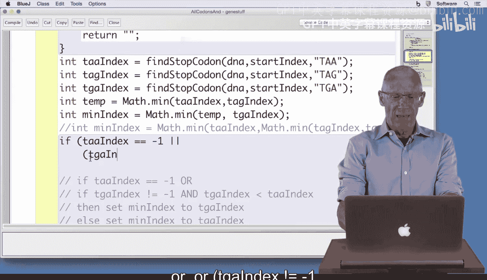
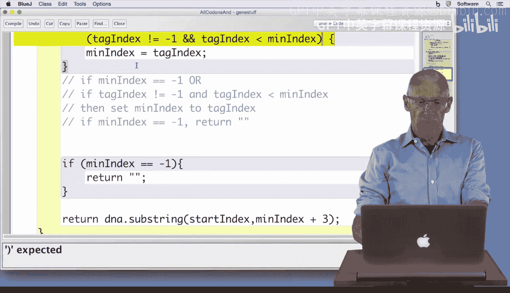
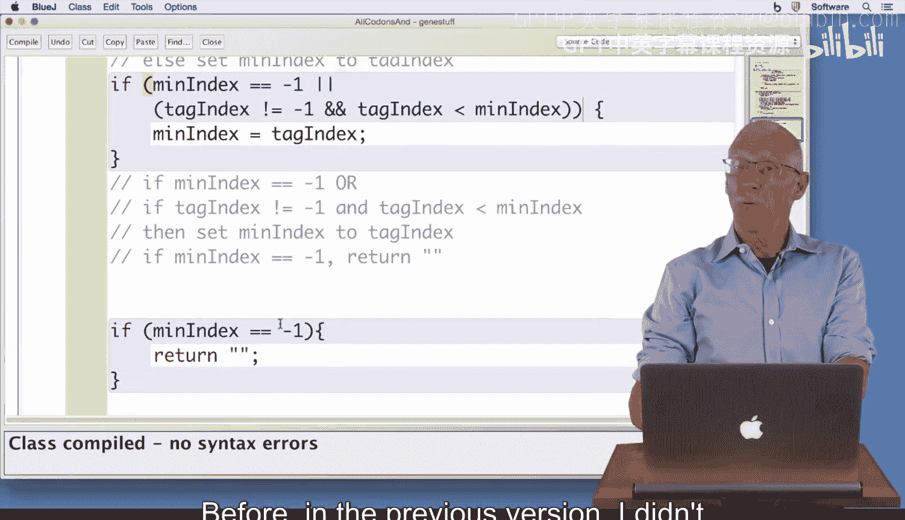
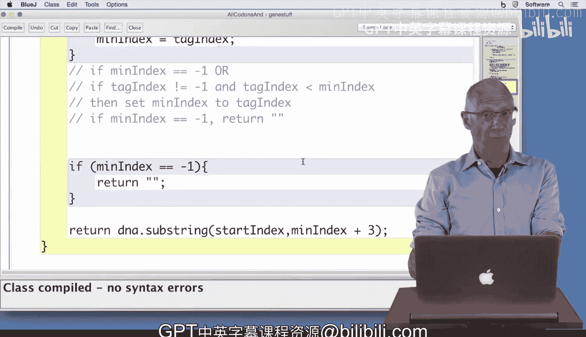

# 杜克大学《Java编程和软件工程基础2-5｜Java Programming and Software Engineering Fundamentals》中英 p38 38_03_10_与或运算编码.zh_en -BV18U411U729_p38-

Hi， welcome back to Gene Finding yet another time。In this version of the program that we're writing to find genes。

 we're going to make one small change to what we return when we look for a stop code on。

 and that change is going to mean that we have to use some complex boing expressions using ans and or's to make our code work properly。

So as we've already seen， the one small change we're going to make is that instead of returning DNA stir dot length to indicate that no。

Stop codon was found， we're going to return negative1。

That's a good value to return to indicate that nothing was found because now our code mirrors what。

 for example， the index of method in the string class uses。 It uses negative one。

To indicate that no string was found when searching， now。

 our find stop codon method also returns negative 1。

Now that change means that our test function won't work correctly。

Remember we had a test function down here， these functions will now fail because they didn't find that。

 so to see that very quickly， I'm going to run this new class。

 create an object on the object workbench。And test the fine stop codons。

And you can see I got an error 26 twice， and that's because in my program。

I had if it's not equal to 26， so if I change that to negative 1。Compile。

And now test my program again。Finding stop codons， I can see that my tests finished。

 so my test program needed to change to recognize this return value of negative one rather than the length of the string。

Now I'm confident that my stop codon method with this one small change works correctly and that it return negative one to indicate that no stop codon was found。

 that means my find gene method is also going to need to change。Rather than using Math。t min。

 I'm going to need these Booleing expressions that you've just learned about。

And I've put here in my comments what those Boolean expressions are supposed to do。

 So I'm going to simply translate this。Stuff。The comments from my seven step process into code。

And what that code says here is。If。TAA index。Is equal to negative 1 or and we use that double vertical bar for or or TG8 index is not equal to negative1 and TG。

A index is less than T A index， now that's a lot， so let's look and make sure we got that right。

It says if TAA index is negative 1 equals negative 1 or。TGA index is not equal to negative 1 and。

TGA index is less than T AA index。 In that case， it says set min index to T GA index。

 So I'm going to say min index。Gets TGA index just as it says there。

That means I'm going to not use these versions of Min index， which were from before。

But if I compile this code， I'm going to get an error message， something about temp。

 so if I comment that out。Let me comment all of these out。

Now I get that variable min index isn't known， so I'm going to define mint index。

And I going I need to give it a value， I need to give it some value。I'll just give it zero。

I'm going to put in my else statement here。What it says to else set Min index to TAA index。

Min index gets TAA index。So what I've got now。In my code is a translation of if TAA index is equal to negative1 or。

TGA index is not equal to negative one。And this expression。

 then set Min index to TGA index else set min index to this value。

Then I still have yet another bulloleying expression to write， I need to write if。

Min index is equal to negative 1 or。TGA index is not equal to negative 1 and T。

A G index is less than min index。In that case。My comments say set Min index to TAG index。

So I'm writing that。I'm simply translating this。Into my code here。Finally。

 it says if min dentex is equal to negative one rather than DNA dot length。Return the empty string。

 Otherwise， return this。 My program compiles。 Well， almost compiles。

 I forgot a second parentheesis up here， but that's an easy thing to fix。

Well， maybe not fixing it that way by erasing at all。Maybe I should type in a curly apphesy instead。

 Now， when I compile my program， it works。 How do I test this before in the previous version。

 I didn't have a test program， a test method。 Now I do。 I have my test method fine gene。

 So I'm going to try that out。

See if it works， right click to create an object。Right click to Test find gene and it's just simply printed tests finished。

Which is what I wanted since in fine gene， I looked for a gene。I found this start codon。

And I found this stop code on TAA。Now， I could change this TAA to a different stop code on。

 and I would keep testing those to make sure that my method works correctly。

 I'll leave that to you because as we've already seen。

 testing is as important as writing your code because you need to be sure your methods work correctly。

 have fun testing， have real fun programming。

