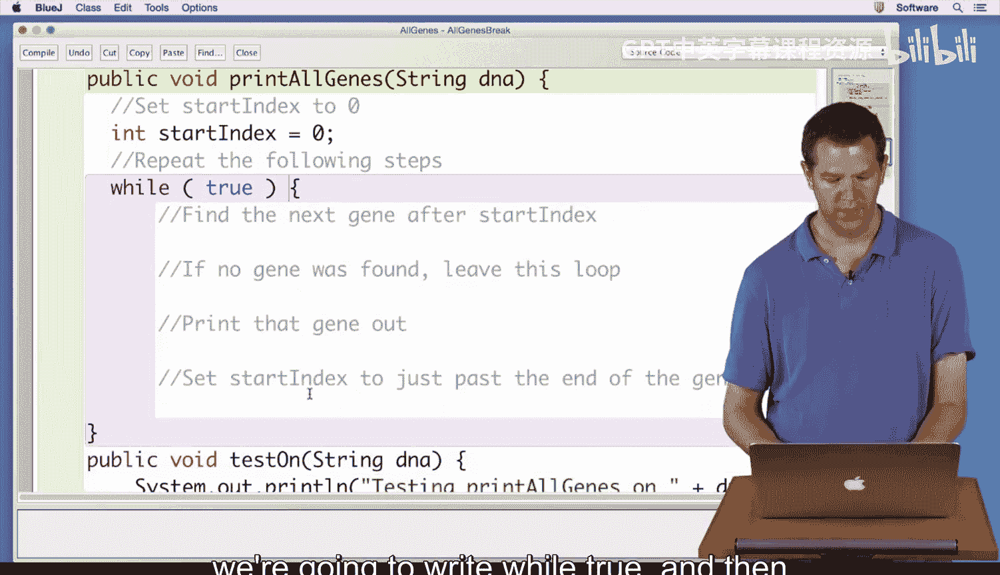
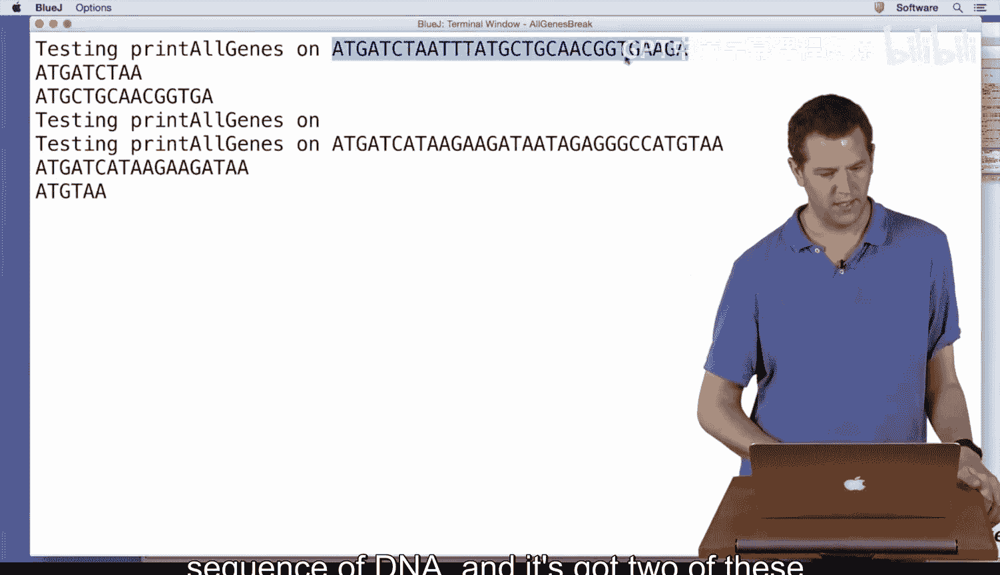
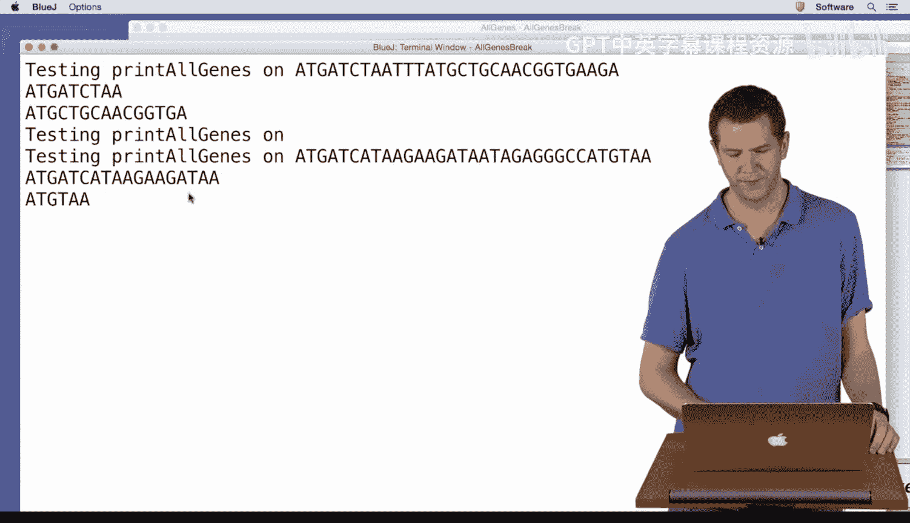

# 杜克大学《Java编程和软件工程基础2-5｜Java Programming and Software Engineering Fundamentals》中英 p40 40_03_12_代码翻译.zh_en -BV18U411U729_p40-

Al right， so you've been learning about while loops and break statements and working on your gene finding algorithm and your current task is to write a method which will print out all the genes in a sequence of DNA。

So we have here the print All genes method， which takes in a string for the DNA and has the algorithm or pseudocode that we came up with in a previous video。

Now we have earlier here in this code the gene finding algorithm that you developed along with Owen in a previous video。

 and we're just going to make one small change to it。

 I'm going to have it take one more parameter to say where to start。

And this is going to let us start looking for a gene somewhere in the middle of the sequence of DNA。

 so once we've found one at the beginning， we can start looking for one after that by passing in this index and we'll just pass that to index of to tell it where to start looking for the first start codon。

So with that small change， we're going to go back here and start translating our algorithm into code。

The first thing we said to do was to set the start index to zero。

 so we haven't made a variable called start index yet。

 so the first thing we need to do is declare start index。

 It's going to be an int since we're setting it to zero。It's going to tell us a position in a string。

 also a good clue that it's an integer。And then we're going to repeat the following steps。

 So you're used to repeating steps by now you've done things for each pixel or each of a variety of other things before for each is a lot。

 you've also seen some examples of while where you've had a condition for as long as something。

 but here we want to repeat some steps and then figure out somewhere else inside those steps when we're done。

 So we're going to write while true。And then put curly braces around our steps。

 and then we're going to go in here and we're going to start doing stuff and then figure out when we want to stop repeating these。

Now we want to find the next gene after start index。 Finding a gene is a big complicated step。

 You've been devoting lots of effort and thought into how to do that。 Fortunately。

 we've abstracted that out into a method so we can just call it and let find gene that we've already written do all of that work for us。

 So what is fine gene take takes a string for the DNA and an int saying where to start and then it returns a string So here we want to call fine gene passing in what DNA。

 Well， this DNA that we're working with。 and where do we want to start。At start index。

And then it's going to give us back a string as its answer so we want。To give that a name。

 I'm going to call it current gene， we didn't say to give it a name in our steps so we kept referring to it without a name。

 we kind of know what we mean， but it's good to give things names in your steps anyways。

 and now we can refer to that gene that we found。If no gene was found， leave this loop。

If something is the case， do some other steps by now。

 you should be getting very familiar with if statements。So if no gene was found。

 how do we know if no gene was found， what does find gene do if there's nothing left？

If you don't remember， we can go back up here and look。 We can see that it returns。This empty string。

So we want to know is current gene the empty strength？Fortunately， for us。

Stringings have a dot is empty method， which will tell us if they're the empty string。

How would you do that if you didn't know well you could go look at the Java documentation。

 are there other ways to figure out if a string is empty Sure。

 could you could see if its length was zero， for example。

 any way that you can find that works is a good way to do it。All right。So if this gene is empty。

 if current gene is empty and we didn't find it， what do we want to do， we want to leave this loop。

 that is we want Javas executing along and it gets here， we want it to jump down here past this loop。

 that's exactly what a break statement does which you just learned about。So we would。

Get here and then come down here， we've basically put the loop condition in the middle。All right。

 if we don't break out of that loop， we want to print out that gene system dot out dot print line。

 hopefully you're getting somewhat familiar with that。We can print out that current gene。

And then we want to update start indexdex to be just past the end of the gene。All right。

 so now this seems a little tricky， like we wrote a step that's a little bit complicated and maybe we have to think it through a little bit。

let's just go down here to where I've got some testing and think about what we're going to do。

I've written some methods to help us test， and let's think through one of these cases here。

So here's this test on just prints out that we're testing it and then does print all genes。So we say。

 okay， start index is going to be zero。We're going to find this gene right here。Which is length。9。

And so then after that， we would want our new start index to be9？So we might think， aha。

 we just want to add the length of the gene right， that got us from  zero to9。That's a。

 that's a good first guess。 Now， let's think about this next one。 So then we're gonna go。

 and we're gonna find。This next gene here， which is length 3，6，9。12，15。

But that didn't start right where we left off。 right， So if we were to only add 15。

 we'd end up here in the middle of this gene。 And we want to end up over here。

 So what do we need to do Well， we need。To add the length to the start position of this gene。

 how can we find that gene， Well， index of is becoming your friend， right？

 So start index is going be DNA dot index of。Current gene， starting from start index。Plus。

Current gene dot length。that seems kind of magical。 Let me just explain that again， really quickly。

We want to find where that current gene was in the string， we can do that by looking for it again。

 starting at start indexex。So that's going to tell me a this gene was right here and then we can add its length to end up past here that'll work for this first one because looking for this first gene from starting index of zero is just going to give me zero。

 then when I add its length I'm going to end up here。

If that still doesn't make sense to work it out on your own。So now I'm going to hit compile。

all is well there， and I'm going to come over here and I'm going to make a new object。

And then I'm going to run my test method。And you can see it says， all right。

 I'm testing print all genes on this sequence of DNA and it's got two of these back over in my code I tried to make this a little easier for us to see so we've got this gene here。

And then we've got this gene here and these little V's are just for me to keep track of the codons and those were what it printed here。

I tested it on the empty string， I wouldn't expect to find any genes in there。

 but it's always good to test on these like wacky corner cases where maybe our code would break if we weren't careful。

 we didn't find any genes but our code didn't crash either that's really good and then on this one where we have this one long gene here which we found in printed out and then this really short gene here which we also found and printed out。

So that worked well， and the important thing here， the new lesson was this while true figure out if we want to keep going in the middle and then break。

