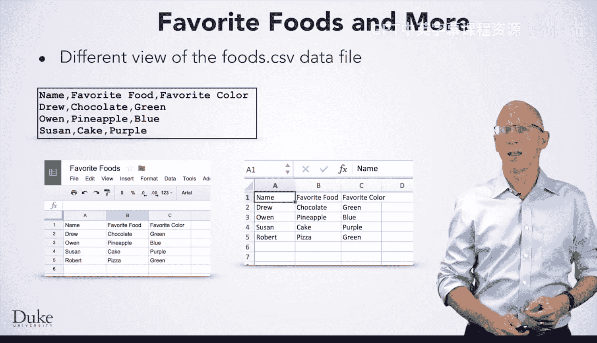
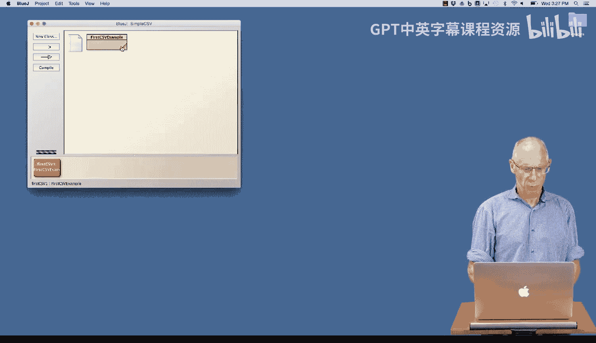
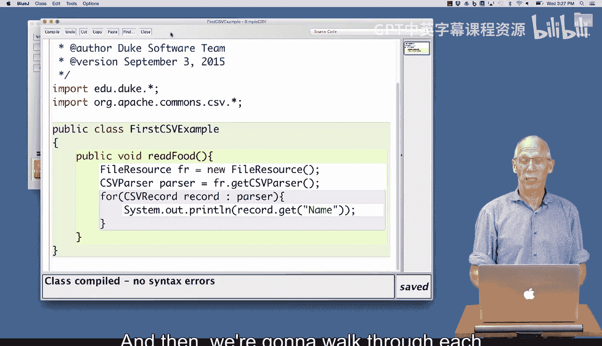
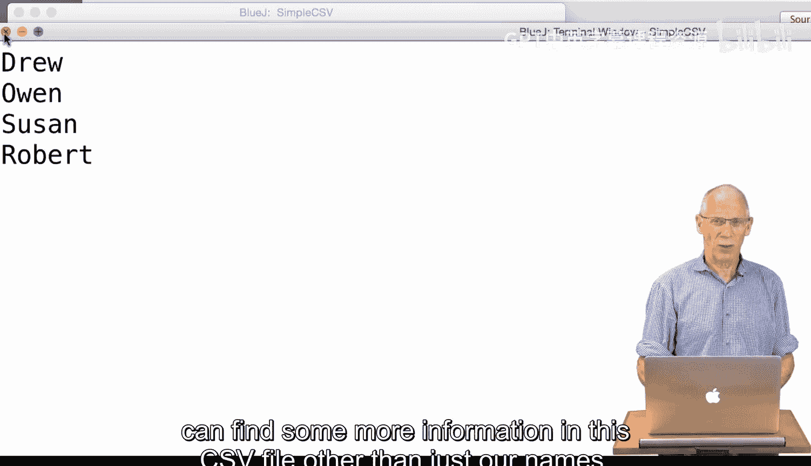
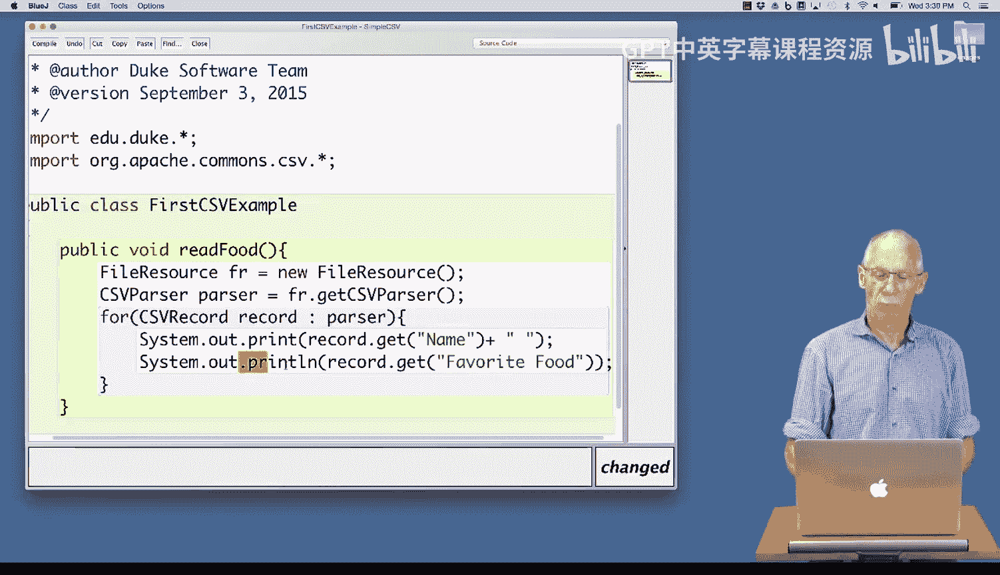
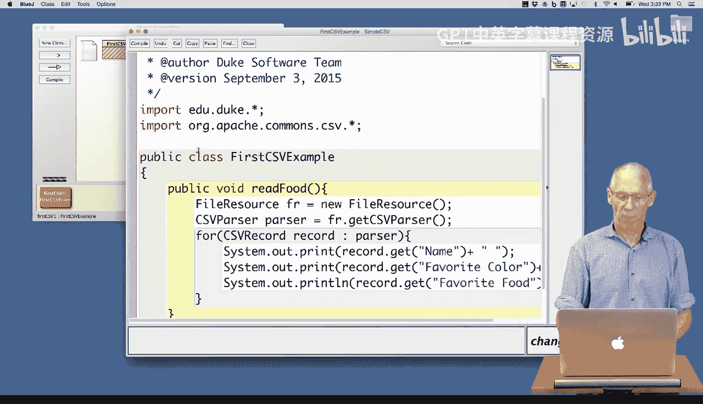

# 杜克大学《Java编程和软件工程基础2-5｜Java Programming and Software Engineering Fundamentals》中英 p45 45_04_03_使用CSV库.zh_en -BV18U411U729_p45-

Hi， the code you're about to see will show you how to access a comma separated values file named Foods。

csv using Java to better understand that program， here are three views of the data in the Foods CSv file。

The file itself looks like this with the first row having labels used for each column。

 This is the header row。 you can see the labels for each column of data。

 and you can see the data in each row is separated by commas。

Here's the view using the spreadsheet program， Microsoft Excel。

 Some of you may have used this program before。The Google sheetets program that runs in a web browser is free software that also allows you to manipulate spreadsheets。

 Here's the view of foods CSsv from that program。 You can see the first column has the label name。

 The second column has the label favorite food。 and the third column has the label favorite color。

 Let's get coding。

I'm going to walk through a simple example of using the CSV libraries that we have in our course so that you can understand how to create a CSV parser and how to use it in the most basic ways。

 More complex ways will be something that you learn in later。

Parts of this course and that you can read about when you study the API。

 So I have a simple first CSV example。

I'm going to open up the code so that we can see a few things。

Rather than studying it in detail right now， I'm going to run it very quickly so that we can understand how it works。

 and then we're going to walk through each piece and make one small modification。

So my class is already compiled， I can see that because there's nothing shaded here。

 I'm going to right click and create a new object on the object workbench。I already have one。

 now I have two。 I'm going to read the food from that。That pops up a file dial。

 this is an example of our directory resource， and I choose foods。csv， a CSv file。

And the program comes in and reads and prints Drew Owen， Susan and Robert。

 so I'd like to try to understand why it's printing those names and then see if we can find some more information in this CSV file other than just our names。

Looking at the source code again， I'm going to notice a few things。First， I've imported theedduu。

 Duke libraries， which is common in many of the examples we do， because I'm using the CSv parser。

 I need one more import and that's a very complicated one。

 but kind of something that you'll just be able to cut and paste over a while org。appache。coms。 csv。

 We're using an open source library for our cv parser and we've made it a little more convenient to use in a way that I'll explain。

I have one method， read food。I've created a file resource object that's using our standard library because it has no parameters。

 the file resource object will pop up a dialogue and allow me to navigate to the file I want to use I just showed you using Foods。

csv。 then I asked the file resource object FR to give me the parser get CSv parser This is the new class。

 the CSv parser class。 that's part of my Apache library that you can see highlighted on the screen。

I now loop over the iterable。That is the parser getting a CSV record each time。

 So I have two new classes here， the CSV parser class and the CSV record class。

 The CSv record class has one method that I'm using， get。

 and that allows me to get one of the records on the line of that CSV file。 As you may remember。

 CV files consist of several elements of data separated by commas。 One of the elements is named。

 named in this case。 Since I've studied the CV file。

 I know that one of the other elements is named favorite food。

 So if I ask the record to get me the field， the element that's favorite food。That will do it。

 I'm going to print。This one。With。Just a space after。

 So notice I've changed the print L to just print that stays on the same line。

 Pri L will finish the line。 I'll show you how that output works。 My class is compiled， no errors。

 I'm going to create a new object on the workbench by right clicking。

 which is what I normally do here。 So I'll select right click。

Create a new one。And then on the object workbench， I'm going to read。Navigate to the foods。

csv file and notice now I have Drew's favorite fruit is chocolate， Owen。

 its favorite food is pineapple， Susan really likes cake and Robert likes pizza。One more example。

 it turns out that in addition to favorite foods。In this CSV file， there's also a favorite color。

So I'm going to print the favorite color， we'll look at those briefly and then we'll review finally。

 so favorite color。And I should put a space at the end of that line， so it's easier to read。

I'll compile that。When I create the new object。It appears on my object workbench。I'll run that。

Navigate to the foods dot C SV file。 And lo and behold， Drew's favorite color is green。 Surprisingly。

 Robert's favorite color is green， too。 If you're a very stewed observer of the courses that I've done so far。

 that might make sense to you。 Susan loves purple and I， like blue。That is running through。

 Let me review one more time in this CSV file that。This program read， there are three fields， name。

 favorite color and favorite food。 If you tried to get another field。 So， for example。

 I decided to say。That my favorite number was。Get favorite number。 So I'll say get favorite。Number。

That will compile。And when I try to run this example。By making a new object。And。Running。

By right clicking。Sometimes I can't write click too well。Openfoods。 CSv。

And I've got all kinds of illegal arguments excepter， favorite number not found。

 my CSV file does not have a favorite number。Field。

 and so I could not open that When we study this in more detail。 and when you read the API。

 you'll see that there are ways that you can avoid trying to access CSV elements that don't exist。

 But for right now， we've seen。Use a library appropriately that's org。apache。coms。csv。

Get the CSV parser from a file resource object and then loop over the parser。

 which isn't iterable to get records one at a time。

Have fun with CSV and finding information from data。

