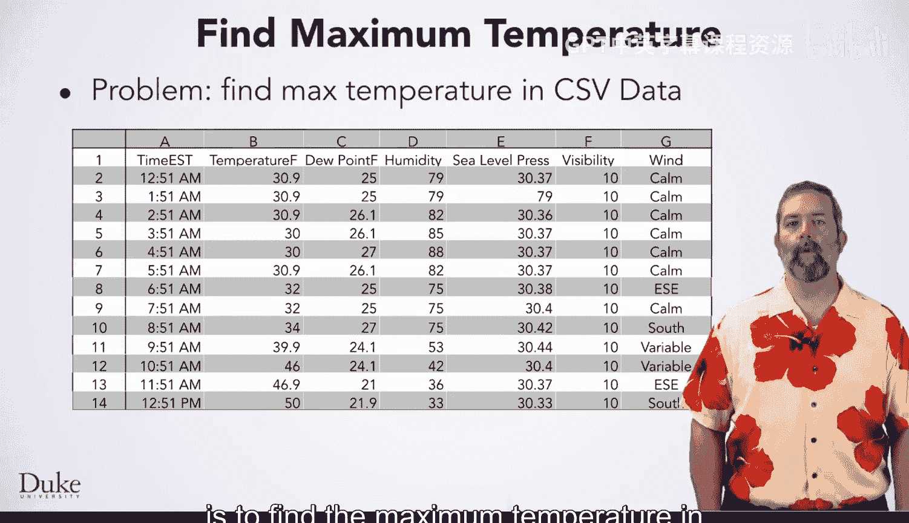
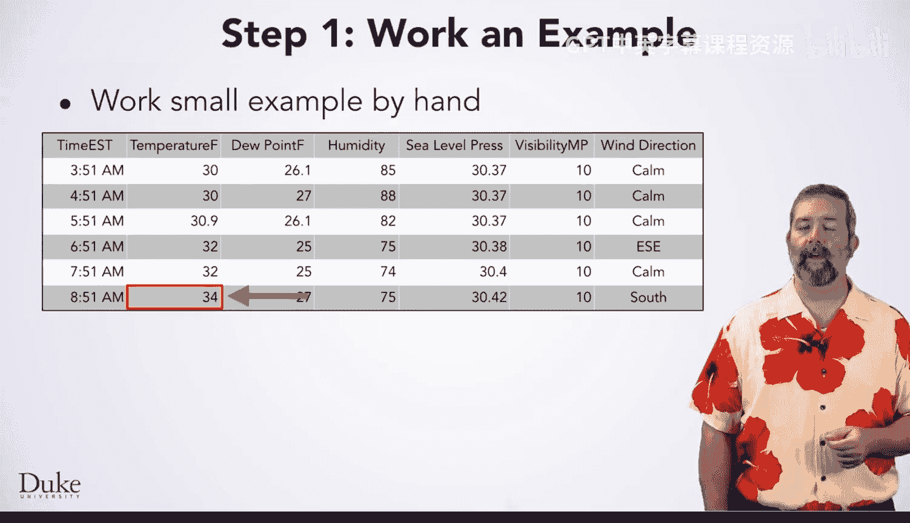
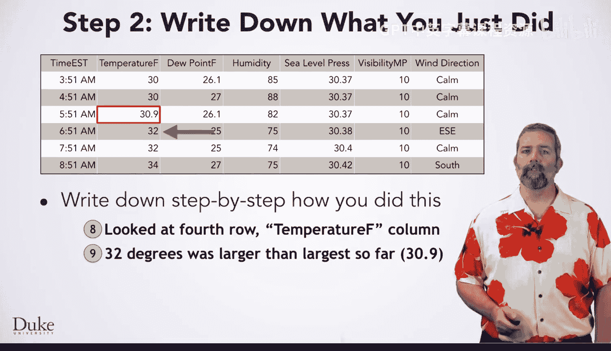
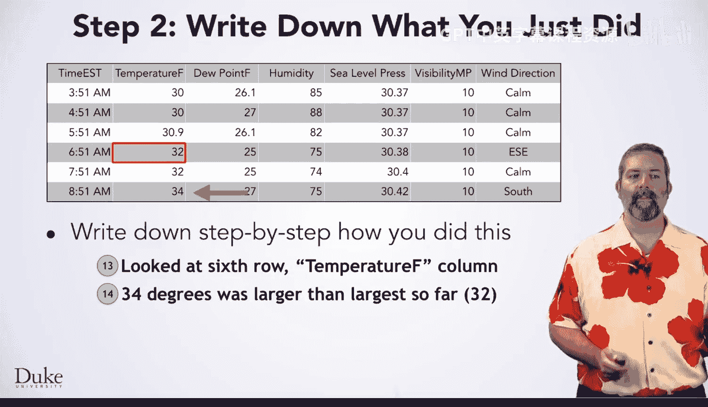
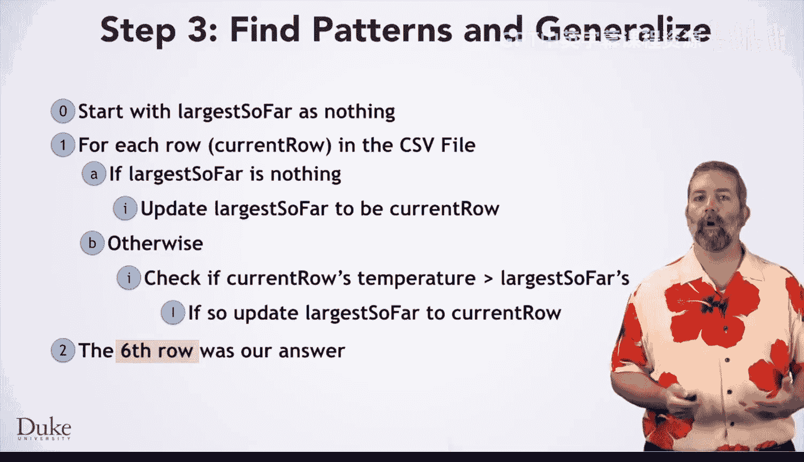
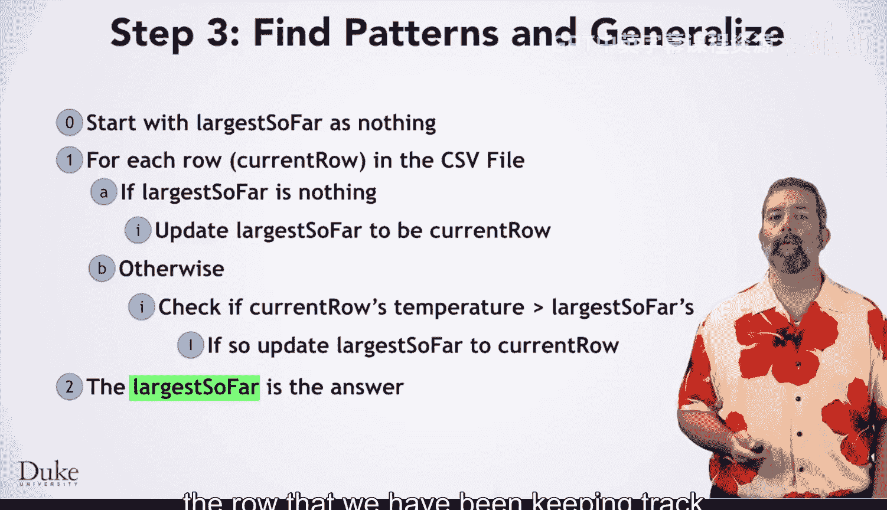

# 杜克大学《Java编程和软件工程基础2-5｜Java Programming and Software Engineering Fundamentals》中英 p51 51_04_03_最高温度：算法开发.zh_en -BV18U411U729_p51-

Welcome back， the first piece of solving the problem of finding the highest temperature in a year。

 which has its data spread across hundreds of files， is to find the maximum temperature in one day。

 which always has one file。

As always， we're going to start by working a small example by hand in a step by step fashion。

 here we have six rows of data to work with。The first thing you might do is look at the first row and in particular。

 at its temperature， which is 30 degrees Frenit。 That is the maximum we have seen so far。

Which you will want to keep track of。If you were just working this out with a small data set。

 you might just remember it in your head， but we will draw a red box around it to be explicit。

You might then go through the rest of the data in a similar fashion。

 looking at each row and deciding whether it is the largest you have seen so far or not。

After you look through all the rows， you have found your answer。

 which in this data file is the last row。

Okay， now that we have worked an instance of the problem by hand。

 it is time to write down exactly what we did in a step by step fashion。

The first thing we did was look at the first row， in particular， its temperature F column。Next。

 we noted that it has the largest temperature so far。The next step was to look at the second row。

Its temperature is not greater than the largest temperature we have noted so far。

Then we looked at the third row。Its temperature is 30。9。

 which is larger than the largest we have seen so far。

 So we updated our largest so far to be the third row。For the fourth row， we did very similar steps。

Saw that 32 was larger than the largest so far， and updated。

Our largest so far。The fifth row was not larger than the largest so far。

And the sixth row was larger than the largest so far。 So we updated our note of what was the largest。

 That was the last row。

So we are ready to give the answer。 In this case， the sixth row was our answer。

Now that we have all of those steps written down for this particular instance of the problem。

 we are ready to find patterns and generalize。The first thing you might notice is that you are doing similar。

 but not quite the same things for each row of the C S F file。 As you can probably guess by now。

 you will eventually write code， which loops over the rows to solve this problem。 However。

 before you can do that， you need to think about the differences and find ways to make them the same。

The first difference you might notice is that for the first row。

 we just noted that it was the largest so far， but for later rows。

 we compared the row to what we had previously noted down as our largest so far。

The first row is a bit unusual here because we have nothing else to compare it to。

 We did something implicit。That we did not write down。

 We check if our largest so was nothing or something First。

 We'll need to incorporate that into our generalized steps。

The other difference you might notice is that sometimes we updated what we recorded as the largest so far。

 while other times we did not。 We marked the first rows update in purple。

 as we just discussed how it is different from the others and marked the steps in red。

 where we did not update the largest so far and in green where we did。 What is the pattern。

It is when the current rose temperature is higher than the largest so far as temperature。

Thinking through these patterns leads us to the following thoughts on how to decide when to update the largest so far。

If the largest soar is nothing， meaning wet， we don't have one yet。

 then the current row is the largest so far。Otherwise。

 if the rose temperature is greater than the largest soar as temperature。

 then the current row is the largest so far。After thinking through that。

 we can express our algorithms in terms of for each row in the CSV file。

For each row will which we will call current row， you will want to decide how to update the largest so variable。

 as we have just discussed。We have not said anything about what largest so far starts as。

 so we should be sure to put that in here。 We mentally glossed over this while we were writing down our steps。

 but we implicitly started with it as nothing before we began looking at each row。

 We should write that down in our algorithm here。The last step， which we did write down。

 was to give our sixth throw as our answer after we finished looking at each row。

Is the answer always going to be the sixth row？

No。It is always going to be the largest so far， the row that we have been keeping track of as we worked through the data。

We should test this out before we try to write our code。 Try it out on these four rows of data。

 Does the algorithm give the right answer。Yes， it does。

 We are now more confident that we wrote our algorithm correctly。

 so we are ready to turn it into code。