# 杜克大学《Java编程和软件工程基础2-5｜Java Programming and Software Engineering Fundamentals》中英 p52 52_04_04_Java空值：无对象时的null.zh_en -BV18U411U729_p52-

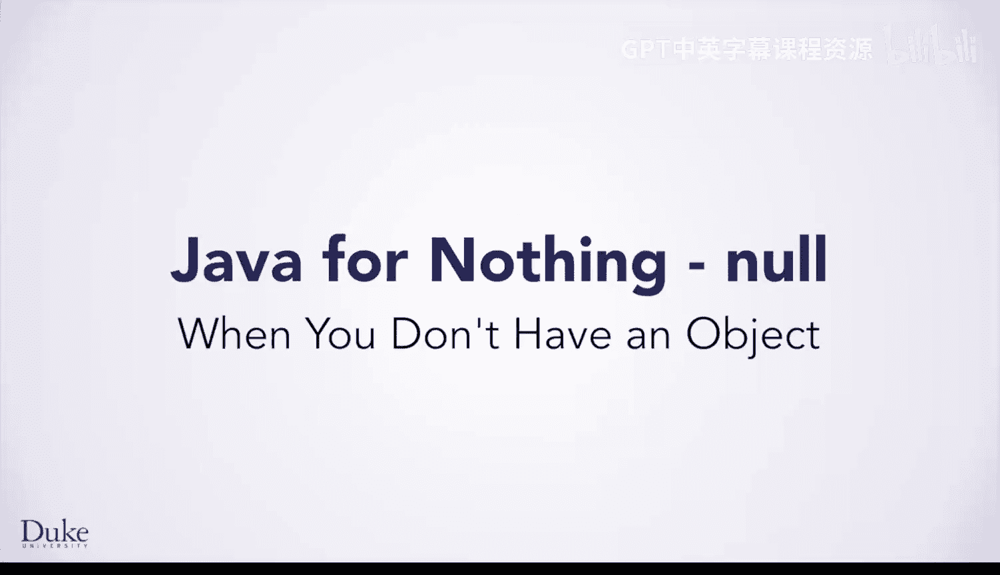

In writing the algorithm to find the maximum temperature in a CSV file。

 we wrote down steps that do not correspond to anything you know yet in Java。

 The idea of having nothing。 How do you turn that into code。

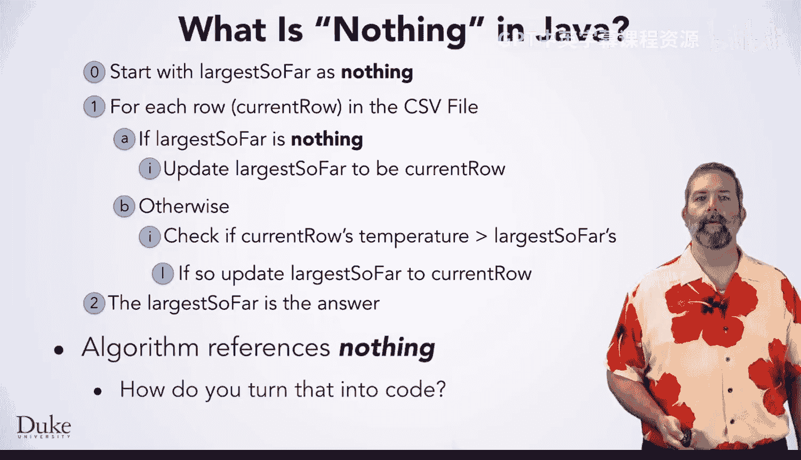

This introduces an important new concept in Java null。In Java and many other programming languages。

 no means nothing or no object。 This concept is very important。

 as it is common for algorithms to need to refer to the value， no such thing。

OneOne thing you can do with null is initialize a variable to it。 for example。

 CSV record largest so far equals null means initialize largest so far to be no such thing。

Another use of null is when an algorithm has an answer of it doesn't exist， or there's no such thing。

In that case， returning null from a method is an appropriate way to indicate that no such answer exists。

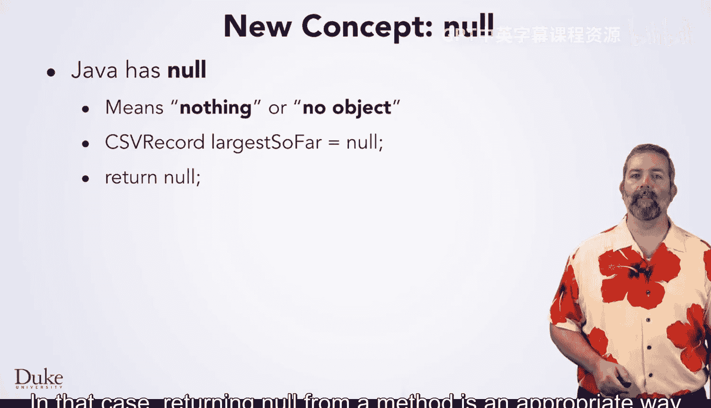

You can also check if an expression is equal to null， which is quite useful in many algorithms。

In the algorithm we are working on， you want to check if larger so far is nothing。

 that is if it equals equals null。

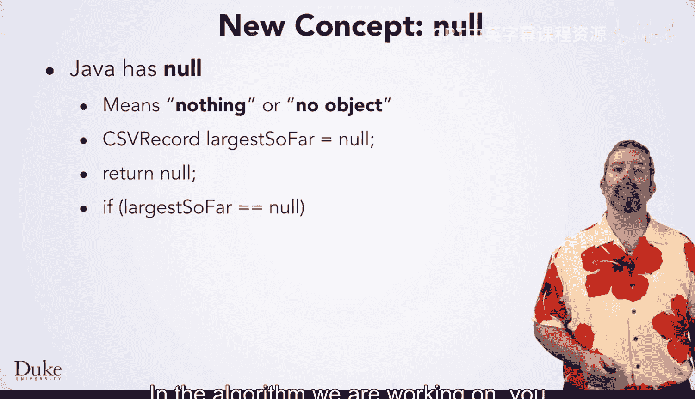

One thing you cannot do with something that is null is call a method on it。

 Since null means no such object。 it does not make sense to try to call a method on no such thing。

For example， this code is problematic， even though it compiles just fine。

This second line will cause the program to crash when you run it。

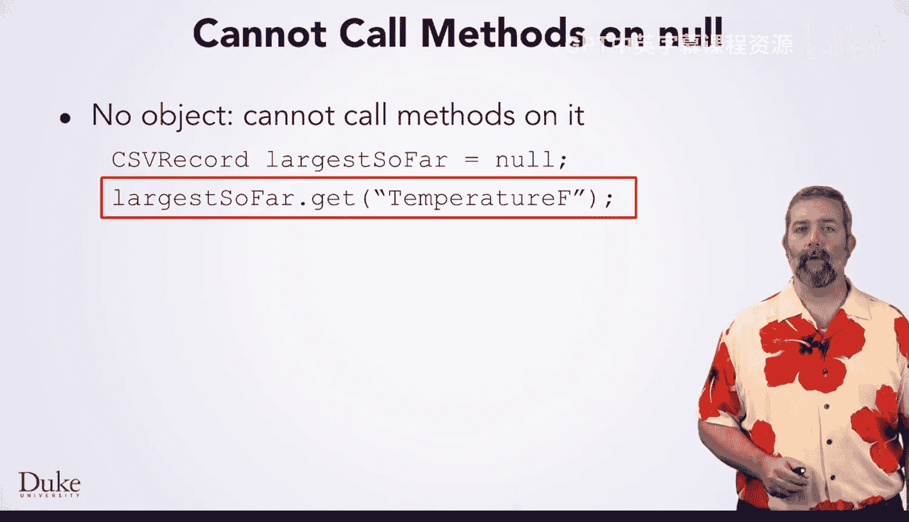

You would get an error message like this， which tells you。What went wrong？

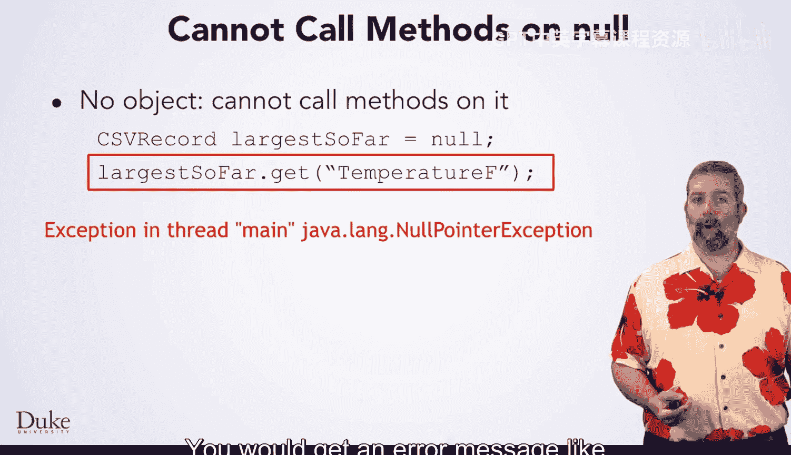

The first thing about this error message is that it says exception。

 which generally means that something went wrong with your program。

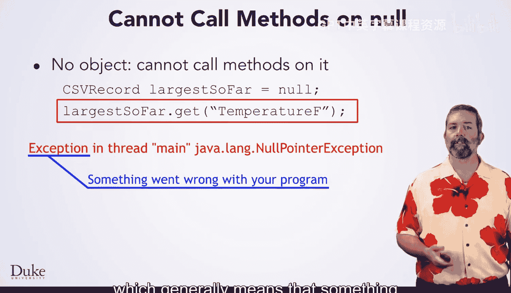

The last part tells you what kind of problem you had。 Javavalang null pointer exception。

 in this case， means you tried to do something with null that needed an actual object。In this case。

 trying to call a method on it。

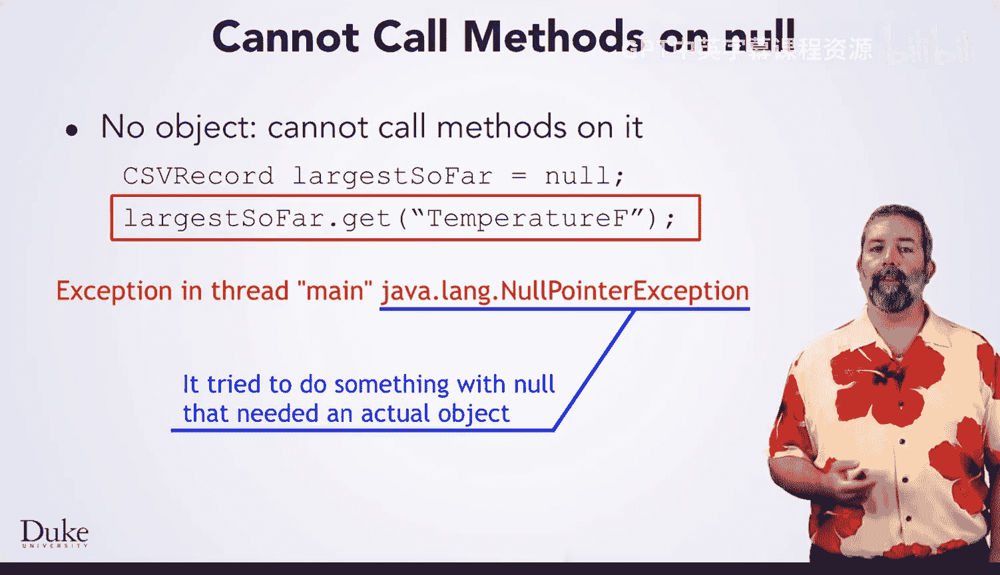

While we are discussing null， remember that all expressions have types。

 you have previously learned that it is important to know the types of expressions as you write and think about code。

This raises an important question， what type of thing is null？

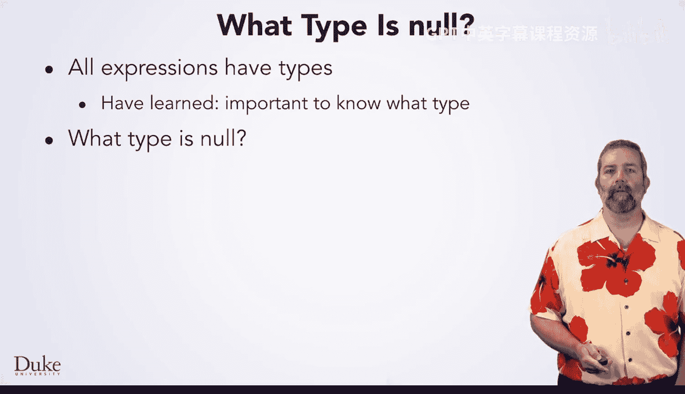

We wrote CSV record largest so far equals null and told you that was legal。

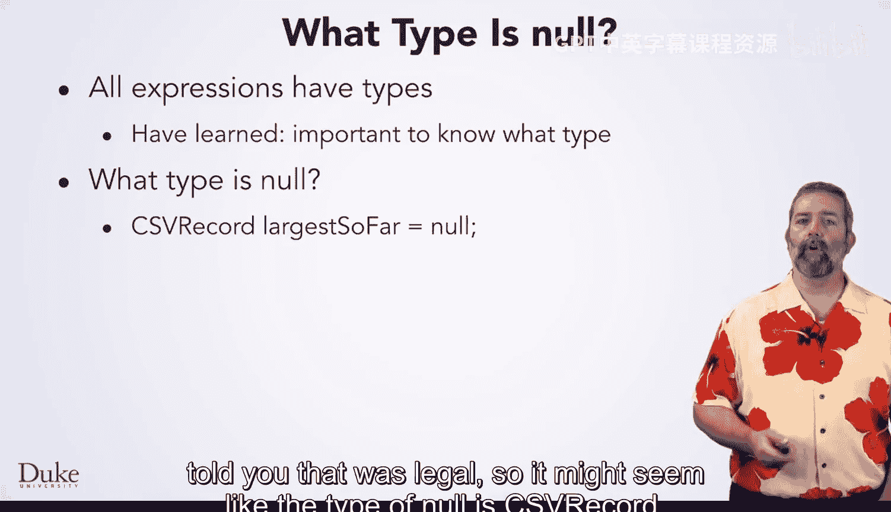

So it might seem like the type of null is CSV record。But does that really make sense？

Would Java be designed such that the type of nothing is a CSV record？

Shouldn't we be able to have nothing for other types too？Java actually has a special null type。

Unlike other types， you cannot write down the name of this type in your program。

 You cannot declare variables of this null type， nor can you make methods who return type is this special type。

The literal null is a special type， and this type can be converted into any object type。 That is。

 Java will let you assign it to variables of any object type。

 return it from methods whose type is an object type or compare it to any other type of object。

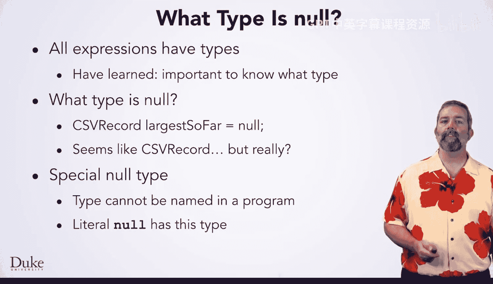

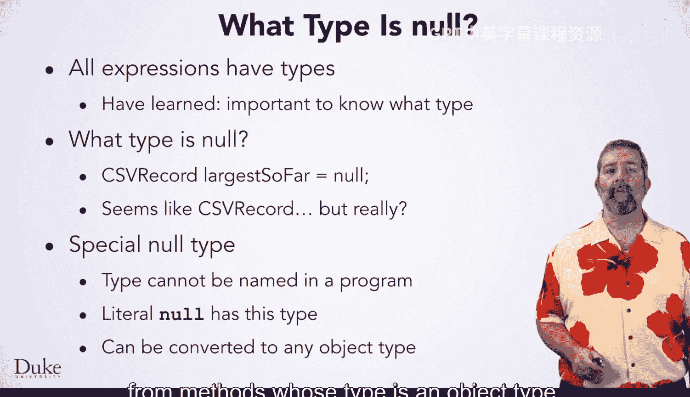

You may have noticed that we just said any object type， not just any type。

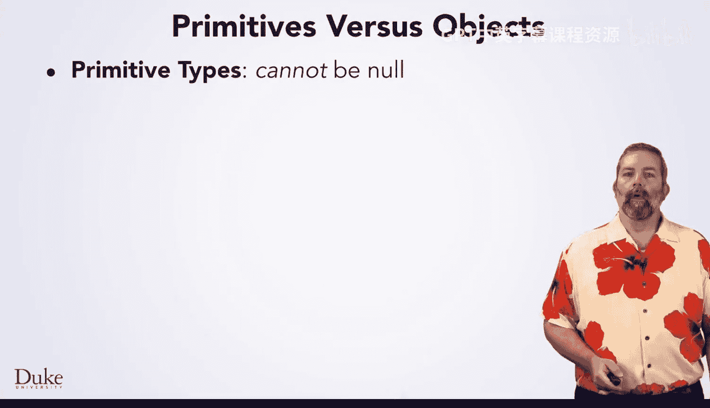

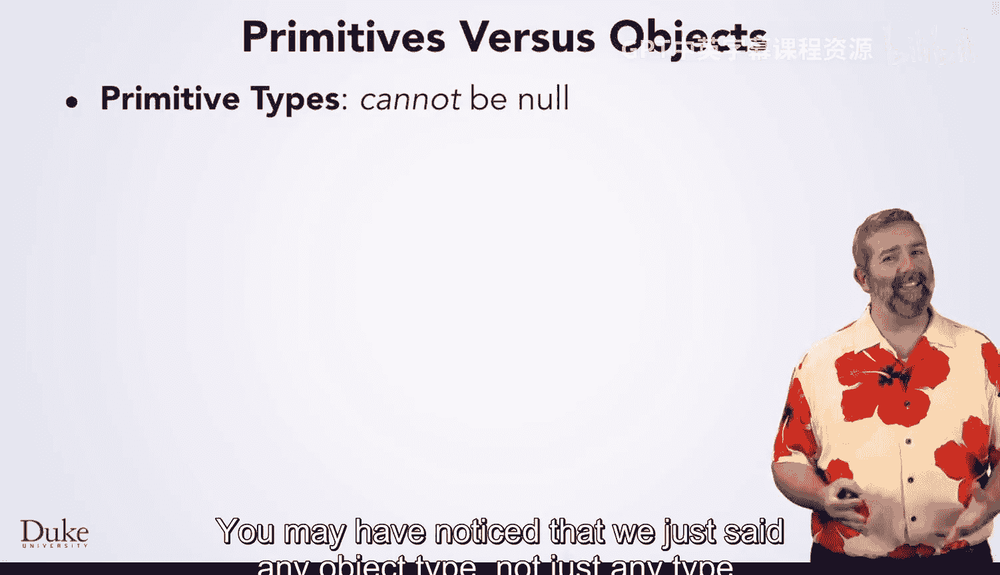

Java has two categories of types， primitives and objects。 Priitive types cannot be null。

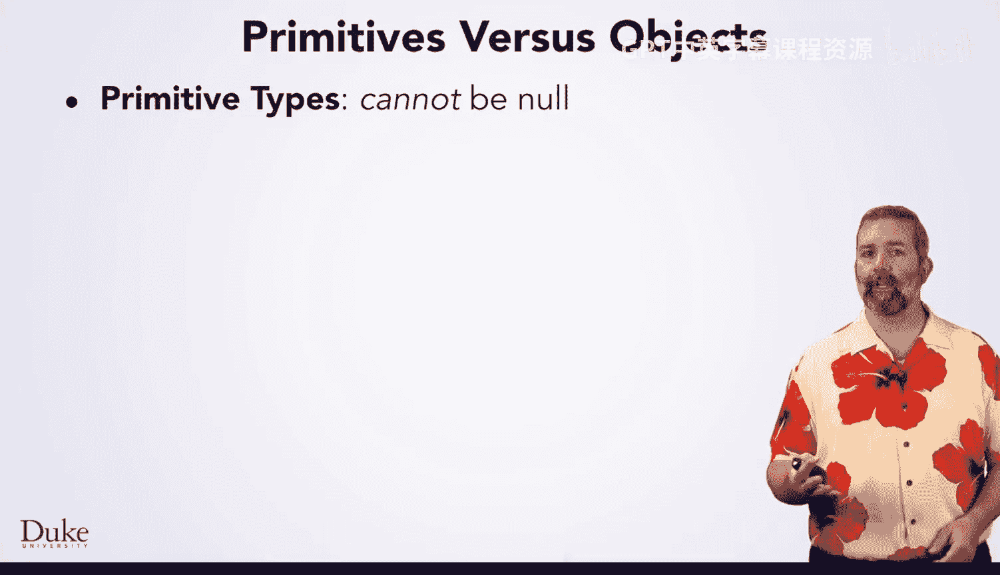

You have seen four primitive types so far， int， double， char and Boolean。

There are also four others you have not seen， bite， short， long and float。

These types are all built into Java and they are just plain data。

 They do not have any methods associated with them， and they cannot be null。

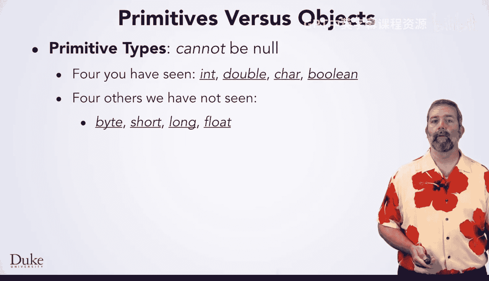

The other category is object type， which can be null。You have seen many object types so far。

 file resource， string， CSV record， and Pel just to name a few。In general。

 anything with a method in it is an object type。Likewise， any class you write is an object type。

There are some other differences between primitives and objects， but they're not relevant yet。

 so you will learn about them later。

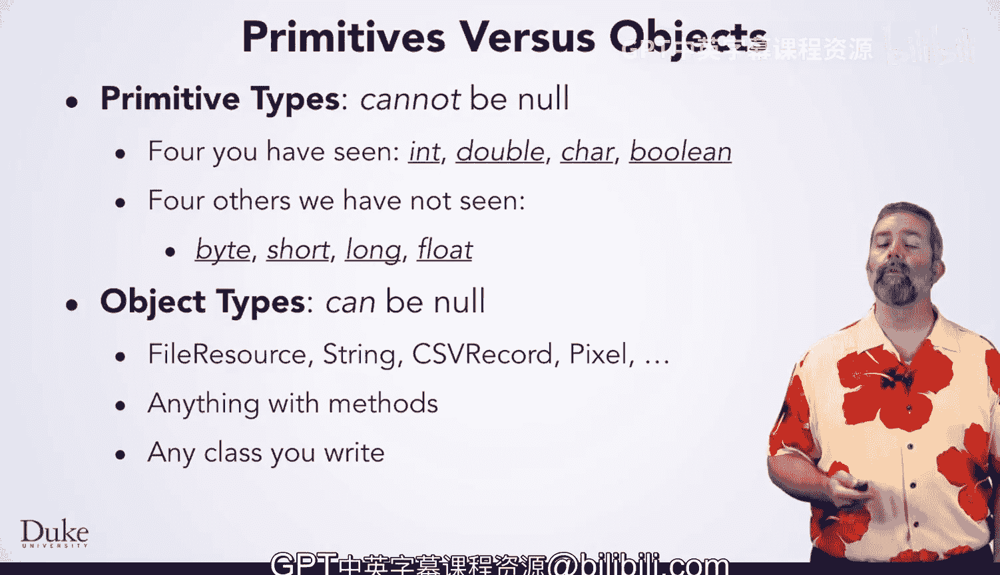