# 杜克大学《Java编程和软件工程基础2-5｜Java Programming and Software Engineering Fundamentals》中英 p56 56_04_08_最高温度：重构版本.zh_en -BV18U411U729_p56-

Technically， my code is done。But I feel a little uncomfortable about the amount of duplicated code that occurred in both of the methods that I wrote。

 and I know that it was duplicated because I copied and pasted between the two methods。

 And in programming， that's not a good way to create your programs。

 because if you have a problem in that piece of code。 it now appears multiple times。

 And you have to try to fix it in all those different places。

 So what I'd like to do is I'd like to factor out that common code and put it in its own method。

 which here I've named getlar of two。So that I can reuse that code in all of my other methods。

So the part that I copied and pasted was this if L statement that appears both in。

The hottest of many days， and in。

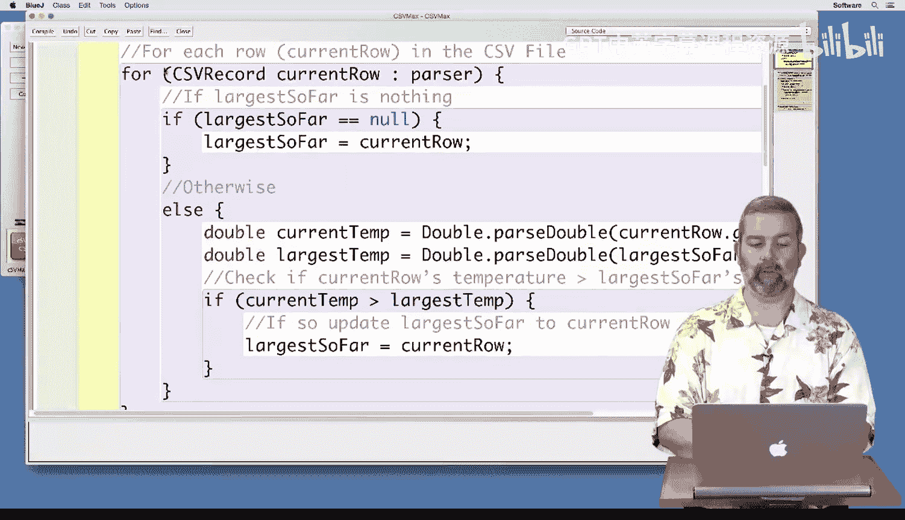

The hottest hour in a file。So I'm going to go ahead and cut that code from。

That method and put it into get largest of2。

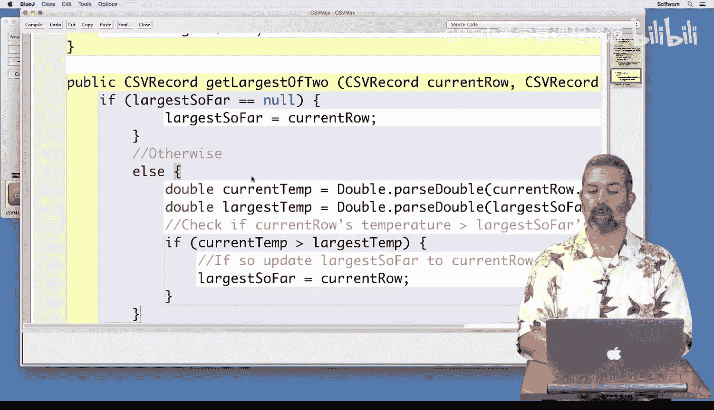

Including at the end。Returning。The largest， so far。

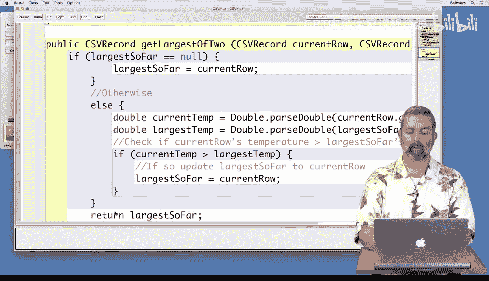

So that I。Have the right result。

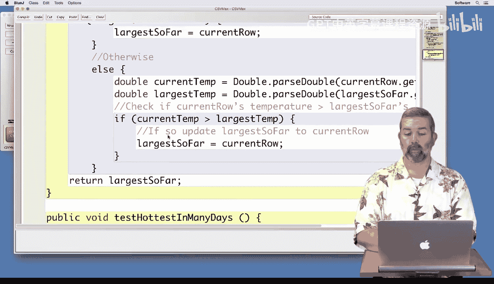

And I have， I don't have to make any changes to the code because in my particular case。

 I had everything named the same。 So both of them call the current one current row and the largest one。

 largest so far and largest so far should remain the same。

 unless it's null or unless current temp is greater。 So in those two cases。

 I should update largest so far， but otherwise largest so far as the correct value。

 So that's what my method is going to look like。 It's just going to be those two。

 the if in the L statement。 and and a return of its own。

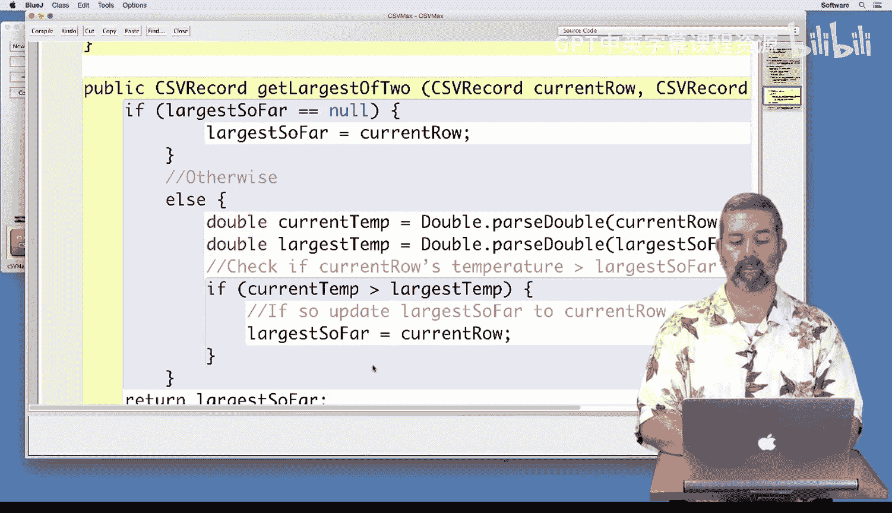

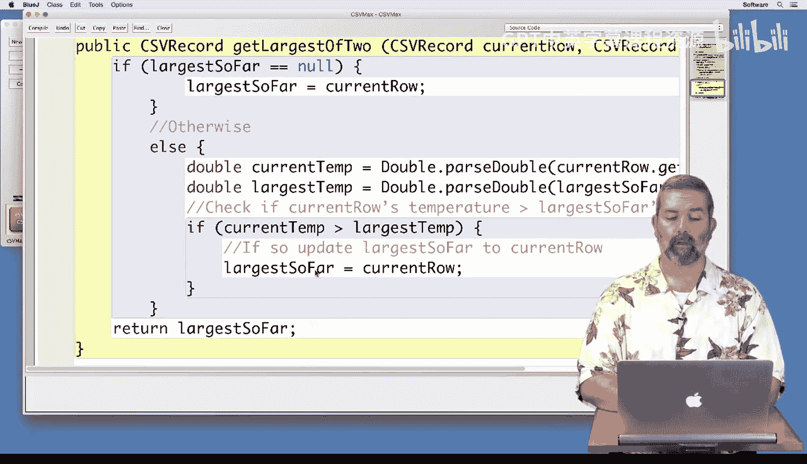

And now I can use that here to say。Largest so far， gets。Get。Lrgest of two。 and I'll pass it。

The current row and largest。So far。

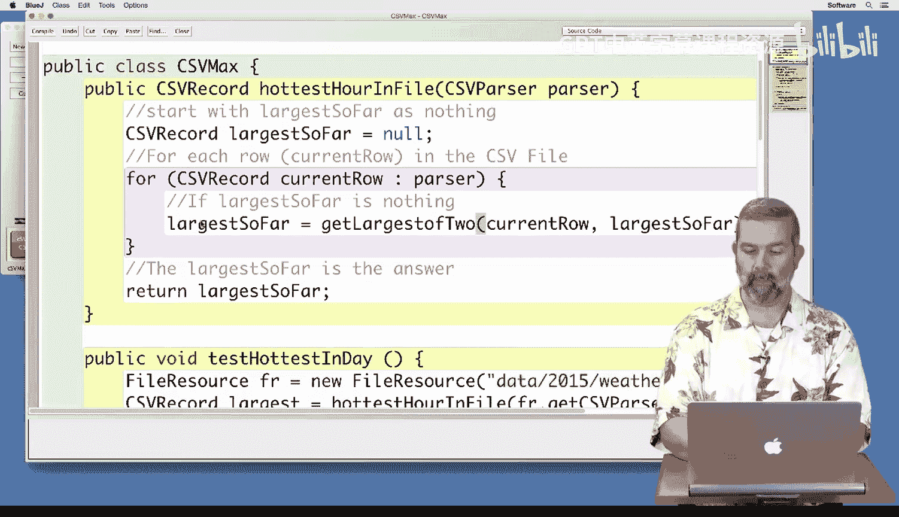

That will do the work of IFL statement， store the result there。And likewise。

 I can now copy and paste this one line of code。Into hottest。Of many files。And replace， again。

 that same if else with。

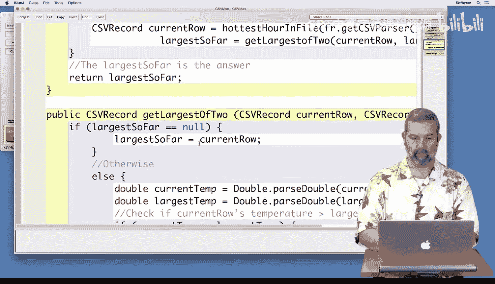

That one line。Sorry， I lost my place there for a moment。So I get the current row from the file。

 and I get the largest of the two。And now let's go ahead and compile and make sure that。

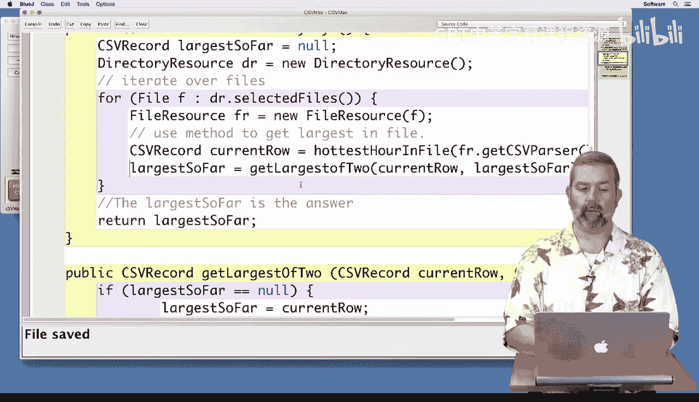

Aye。Didn it misspell something by not capitalizing it？

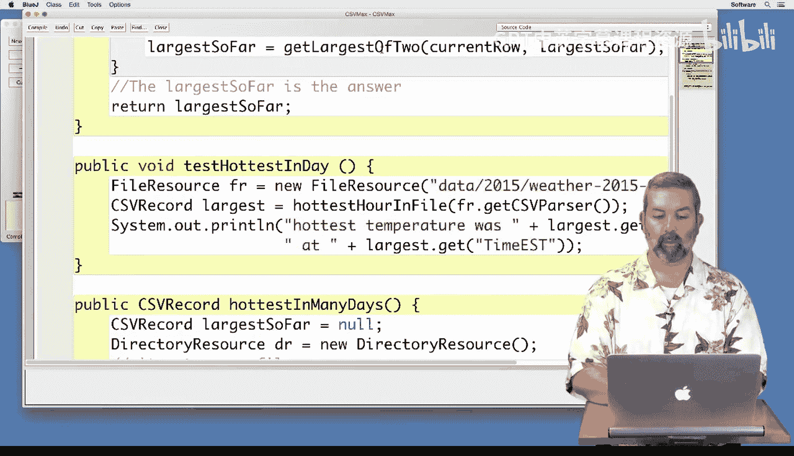

And then since I copied and pasted that， I have to fix it twice。

 which is exactly what I was warning you about earlier。And so now， hopefully。

 since I fix both of those， it will compile。 And now we have to go back and test it just to make sure。

That everything is correct， So I'm going to create a new CSV max because even though I moved code around and it shouldn't have changed the functionality。

 I want to actually make sure that that's true。 So I'm going to test the hottest of the day。

 And sure enough， it gives 54 for January 2 of 2015。

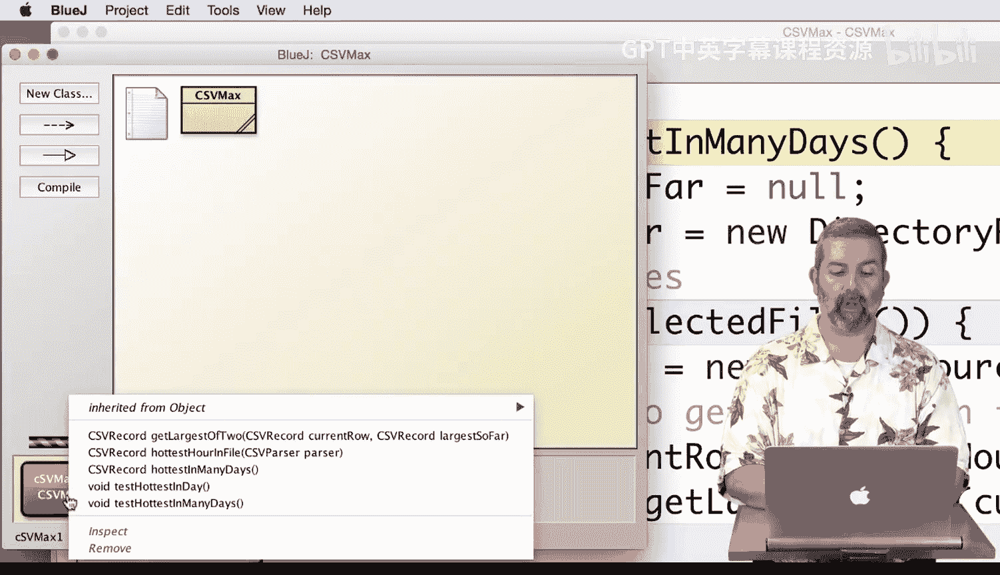

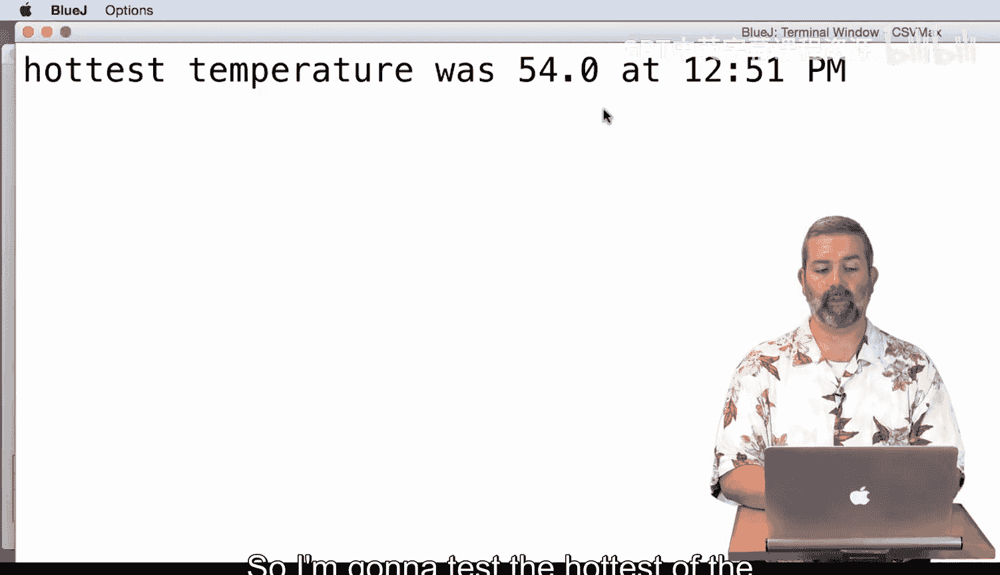

And I'm going to call get hottest in many days， and I'm going to go back and select those two days。

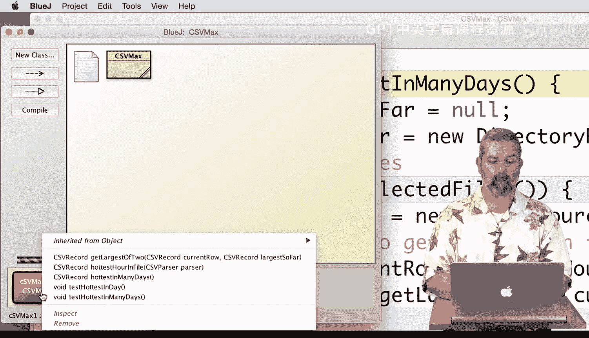

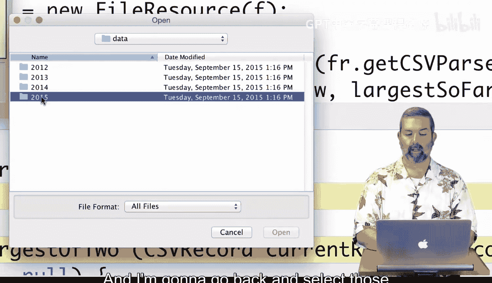

That we've been using for our tests and sure enough， it still thinks it was 54 degrees。

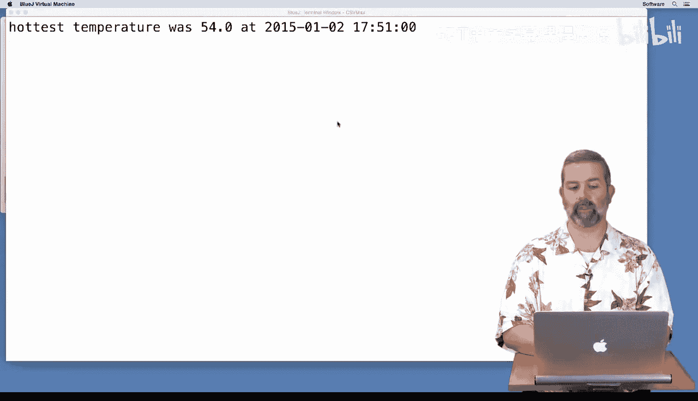

So with those tests， I feel good that the changes that I made in terms of moving code around didn't affect the functionality。

 but now I feel more confident in my code because this large piece of code that was duplicated。

 now Ive taken care of it and it only appears in one place。 So if I ever find a problem with that。

 I can go back and fix it just in that one place。😊。

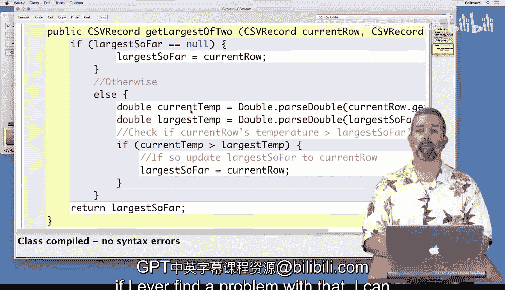