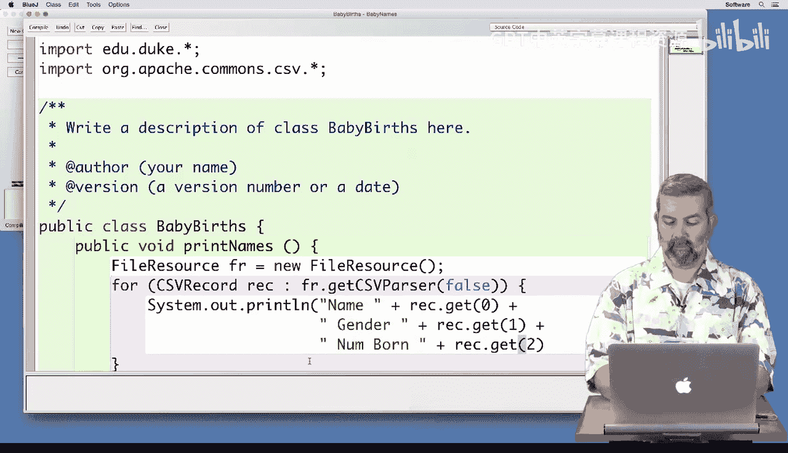
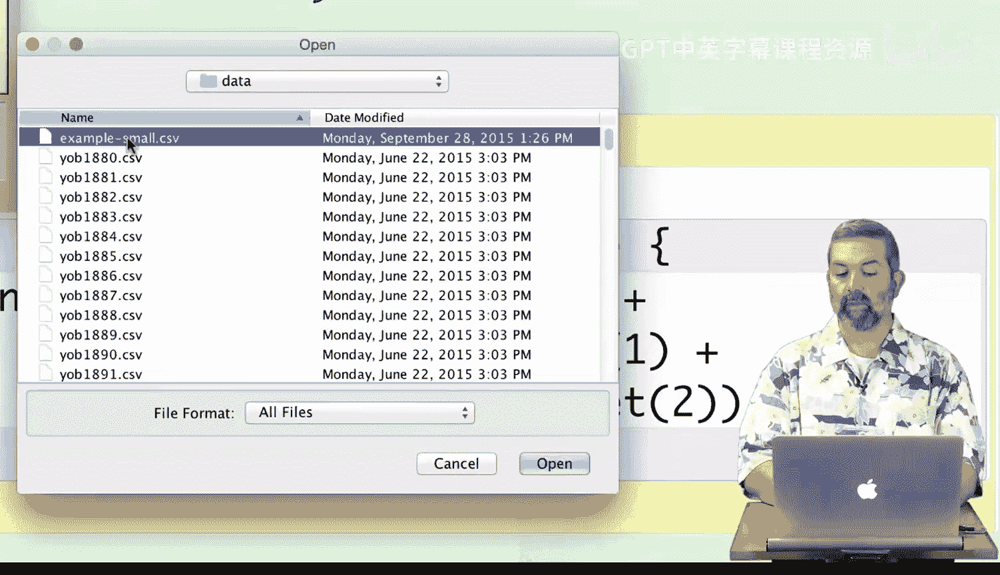
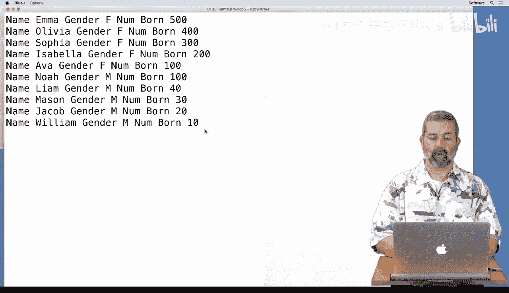
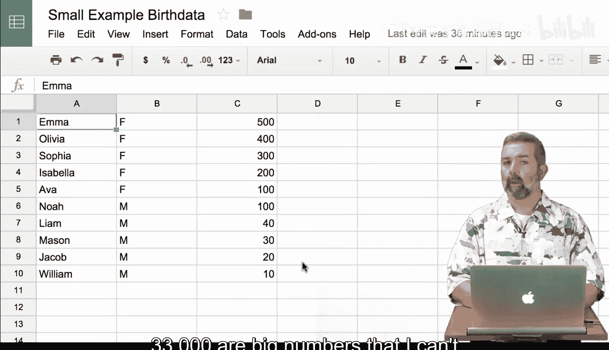
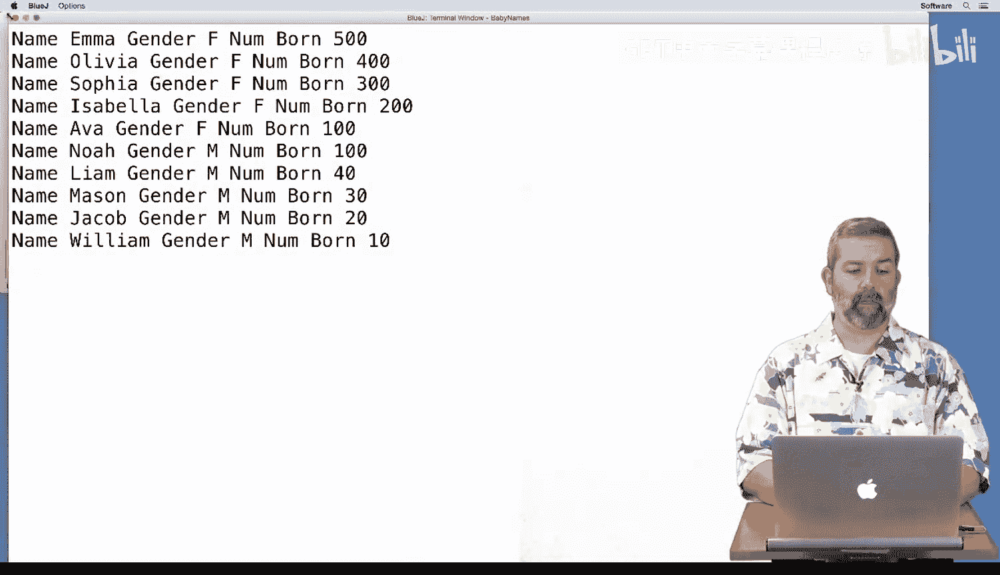
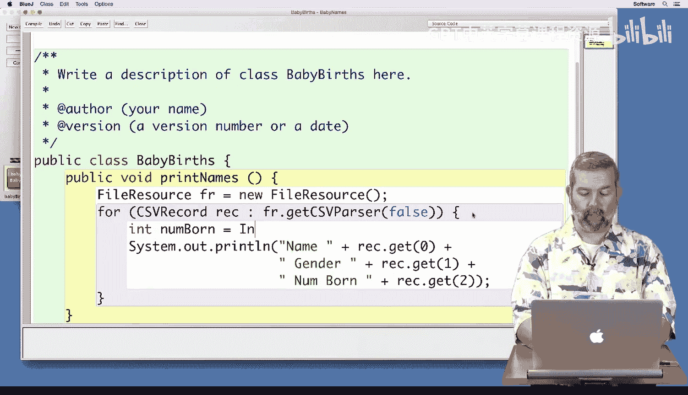
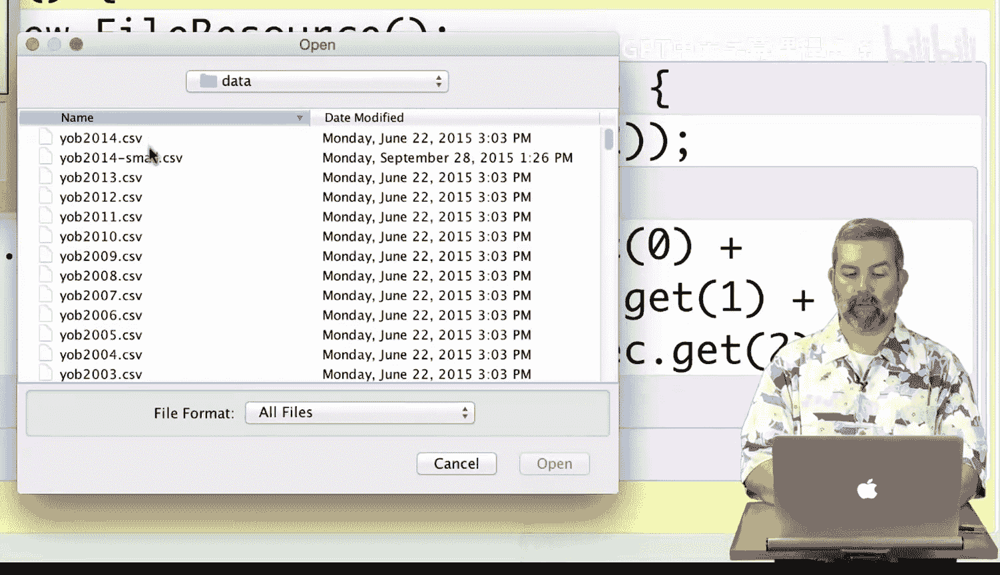
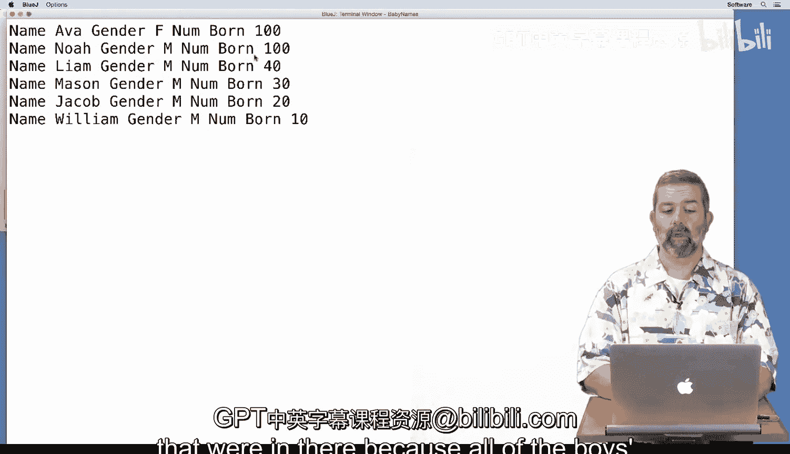

# 杜克大学《Java编程和软件工程基础2-5｜Java Programming and Software Engineering Fundamentals》中英 p59 59_05_02_婴儿姓名迷你项目数据概览.zh_en -BV18U411U729_p59-

Now that you've learned about the problem that you're going to be solving for your mini project。

 let's take a look at the data files and some code for working with those data files to get us started in working through the problem。

For this first example， I'm just going to go ahead and print out some basic information about what's in the data file so that we can get to know it and make sure that we understand what's going on。

So I'm first going to make a file resource， and I'm going to choose which file I want to go ahead and open。

 and then I'm going to create a CSV record。And I'm going to iterate over all of those records in the。

In the file by using the CSV parser that we've seen several times。 but in a new twist。

 as we saw in our video， we're going to put the word put the data value false when we create the CSV parser。

 And that means that this。CSV file does not have a hetero row。In other words。

 the very first line of the file is actual data that we're going to be using instead of the heteroer row。

For each record that we iterate over right now， we're just going to print out the。

Basic information about it in a nice format so that we can kind of read it and make sure so I put spaces in between the names。

And again， which is different than we've seen before。 we're going to be accessing our information。

Using numbers instead of names。 And that's because again。

 we don't have a header row so that we're doing it by value。

 whereas 0 is the first one and one is the second one。And。2 is going to be our third one。

Which is all of the fields that we're going to have in our data。

So that's it for our first version of this program， we're going to compile it。And run it。

On data file that I've created。That is meant to be a very simple example， just to get us started。

And you can see that Emma is the name right here。Emma's gender is female。

 and there were 500 girls named Emma born in this example。 The second one， Olivia， female。

400 born all the way down to Eva， who was the last ranked girl with 100 born。

Noah is the first male born。With 100 born。 So he was the most babies born。

 So he's ranked number one in the。In terms of male births。

 even though he appears as the sixth name in the file， So it's all females first。

 and then all males following that according to their rank。 So 1，2，3，4，5 in our example file，1，2，3，4。

5 in our example file。 So we have five girls and five boys。

You can see the actual data file that I've created。

Here in this spreadsheet where I've loaded the data up。 And again。

 there are five version or five females and five males。

And this is what the data file would look like on a small scale so that we have some numbers we can test with。

Here's an actual data file where。This is for the birthths in the year 2014。

 and you can see that Emma again is the most popular， but with 20。

799 birthths instead of the 500 that I made。In this particular example。

 I've gone ahead and calculated the totals just to give us a sense of how large this file is。

 and you can see from the total names there are 33，000，44 different names in this file。

 that means there are 33，044 different lines in this file because each name occurs on a separate line。

Of those 19067 are girls names， so that means the first 19067 lines in the file are the girls' names and then the 19068 name in the file is NOAah who is the highest ranked boy for this year and he would be first of 13。

977 boys names that appear throughout the rest of the file so we're going to be working for our examples with this small file right here just so we can get a handle on it because 1933000 are a big numbers that I can't really work with and test very easily。

 but we're going to use these for our testing purposes。

So just again， as a simple little thing to try， we're going to go ahead and only print out the names。

If。The number born is under a certain value。 So I'm gonna go ahead and。Create an integer。

From the string。That we get back。For the number born。

 And so that's going to be the second piece of information。 And then I'm going to check if that。

Number born is less than or equal to， say，100。And then print out。Those。Names， only those names that。

Are smaller than 100。And。And so let's see what those are going to be。So， now， when I。

Compile it and run it。With that same。Small data。

I see that I get Ava， who was the last ranked girl and all of the boys' names that were in there because all of the boys's names had numberborn less than 100。

