# 杜克大学《Java编程和软件工程基础2-5｜Java Programming and Software Engineering Fundamentals》中英 p60 60_05_03_婴儿姓名迷你项目：总出生数.zh_en -BV18U411U729_p60-

Now that we've seen the basics of working with these files。

 let's go ahead and solve a real problem calculating the total number of babies born。

 total number of boys and total number of girls。 In this case， I've created a new method。

 total births to for us to work in。 In this case， I'm taking a file resource。

 instead of having us choose。 that'll make it easier for us to test and work with later。

But I'm still going to use the same basic idea that I used in the previous one of looping over。

And the previous problem of looping over all of the CSV records in the file。

 and I'm still going to pass false because it has no header row。

So now what we're going to do is we're going to check out the number that were're born each time。

But we want to add that to running total of how many were born。

 So we're going to create a variable called。Total births。And we're going to add to that。

The number born at this iteration of the loop。The problem with writing this piece of code here is that we can't both declare a variable and add on to it for this iteration of the loop。

And the same line。 So we have to declare the variable someplace else。

 And the right place to do that is at the top of。The method before the loop is ever started with an initial value of 0。

 meaning we haven't seen any birthrs。 and then at each iteration through the loop。

 we calculate the total number that was born or add to the total births， the number that were born。

For that particular name。 And then at the end， we're going to print out。

The total number of births to see and verify whether or not we got the right thing。

So let's just again， run our simple little function just to see if were if it's going to work now in this particular case。

 since we've been past a file resource， we need to have a test method that allows us to choose that which resource we're going to be using。

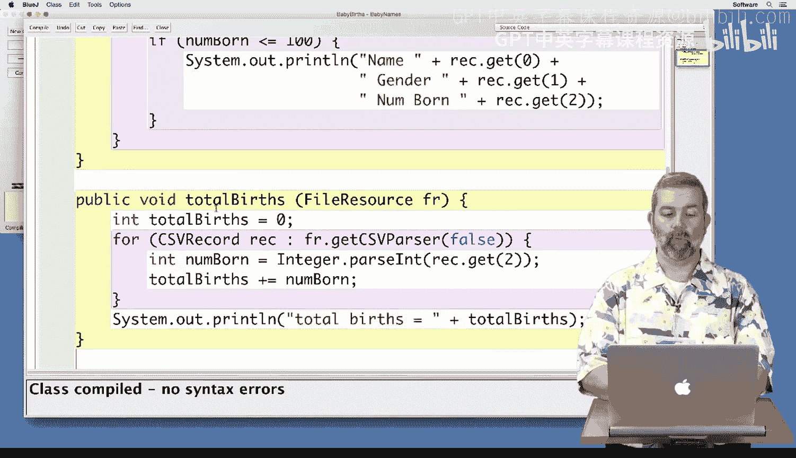

We're not going to have a dialog box pop up this time because we already know what we want to work with。

 we've got that nice small example file that we're going to work with。

 so I've already put that information in there and I've already called total births to make sure that we're going to be able to see our output。

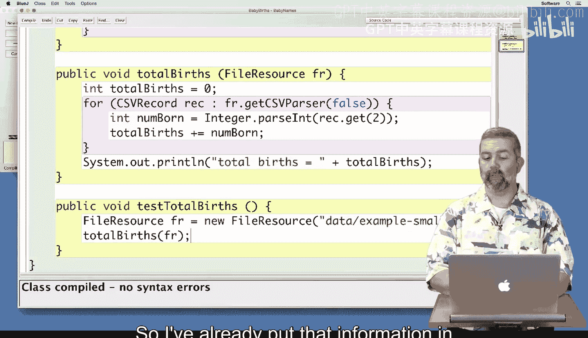

Since our code compiled， I'm going to go ahead and。Create a new instance。And。Call test total burst。

 and I get that the total bursts were 1700。And again， if I look back at our example file。

 I'm adding 500 plus 400 plus 300 plus 200 plus 100 plus 140，30，20 and 10。

 I've added all these numbers up， I don't trust myself to do math on the fly so I've created in this spreadsheet I've created a formula that will do the calculation for me and it came up with the number 1700 as well。

 so I feel pretty confident that this basic piece of code is doing what I want。

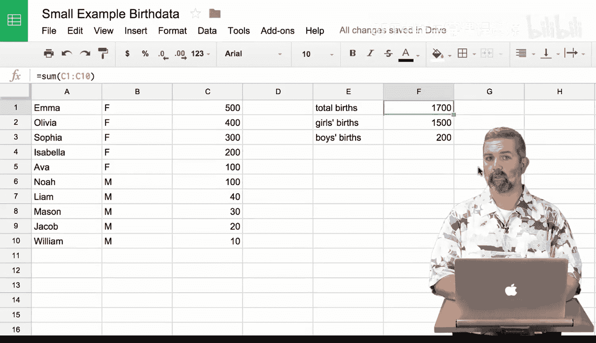

Let's revisit this code， and。Look at the total for total number of boys born and total number of girls born in order to do that。

 we're going to have to divide up the children based on their gender。

So the way that I'm going to do that is I'm going to。Check and see if the gender is a certain one。

 So I'm going to say if the current one。Dot get of one， because again。

 the second field is what represents a gender。And if that equals。Mail， say， for example。Then。

I want to add to a total for the total boys。It goes。The number born。And otherwise。I want to。

Add one to the total girls。Instead。Obviously， I need to create those variables。And again。

 on the assumption that only number， whole numbers of babies were born each time。

 I'm going to go ahead and make those ints。And I'm going to initialize all of。The variables up here。

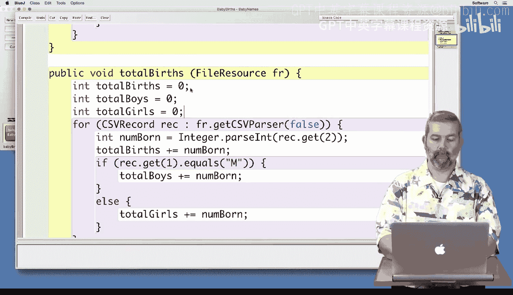

And then again， I'm going to add a print statement down here。To make sure that。We。

Checking our information。I'm going to compile quickly to check that I didn't make any silly mistakes。

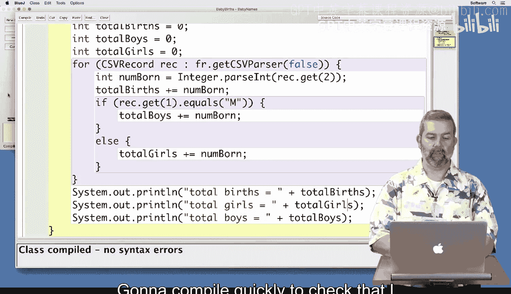

And try testing this again。And now I get 1，700， 1500 and 200。1700，15 hundred and2 hundred。

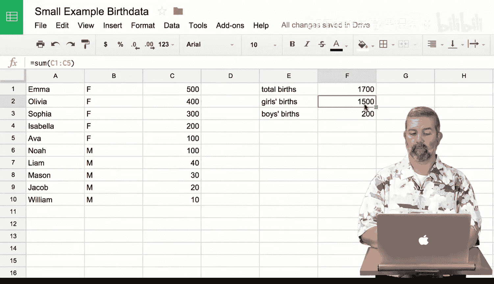

So I think again， that I feel somewhat confident that it seems to be working。

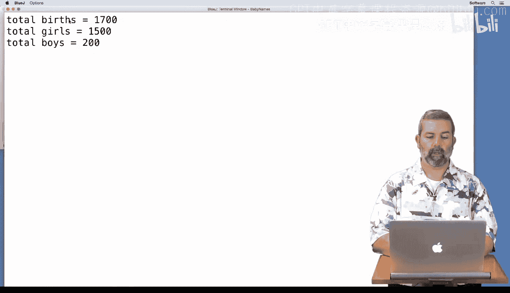

But just to make sure I'm going to try it on a larger data file。So instead of example small。

 I'm going to try it on the year 2014。

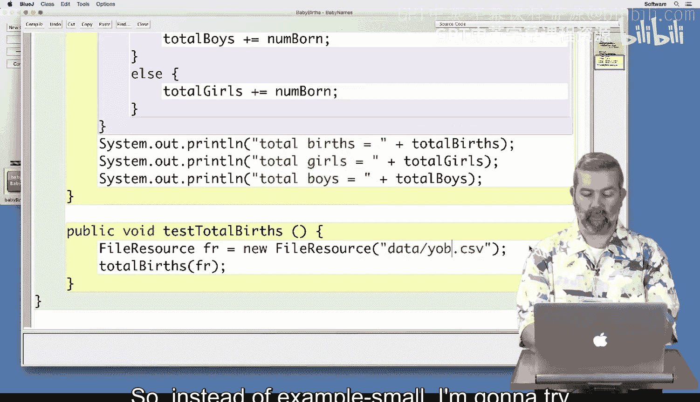

And。Try running that one。And in that case， I get 367，151。1768775，1901376。

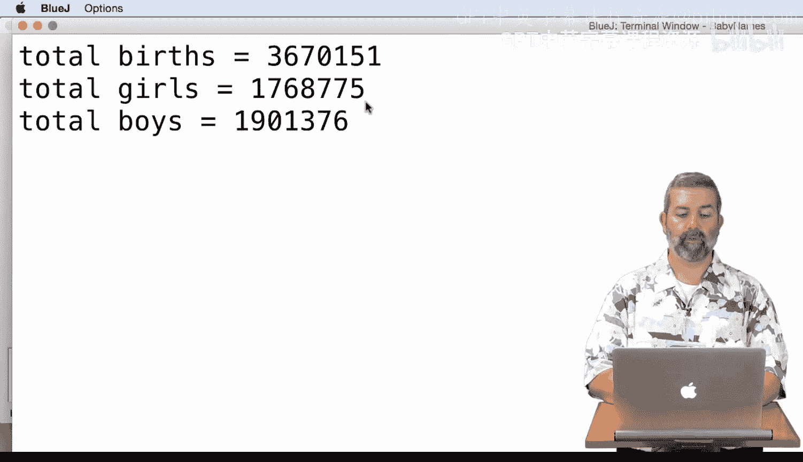

I've done the same trick in my spreadsheet over here。With letting it to the sums。

 and I see that I get the same numbers for total bursts。

Girls births and boys births as what I calculated in my program。 So， again。

 I feel relatively confident that。

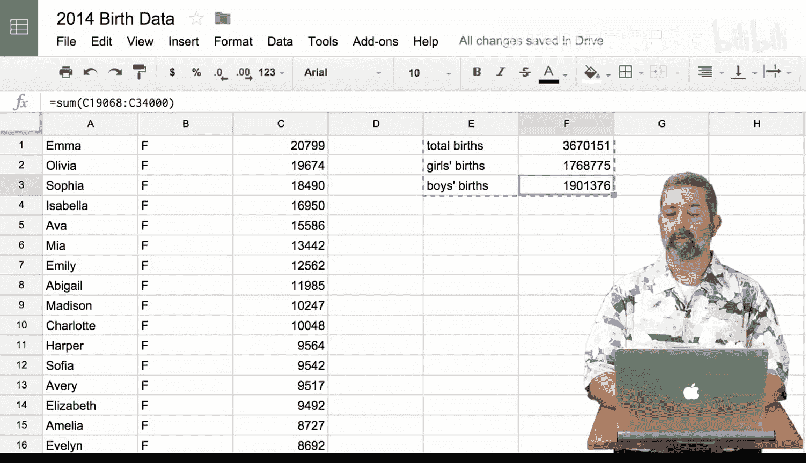

My solution is correct。

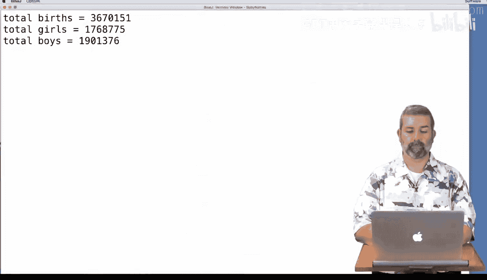

In this code。An interesting question is， does it matter how the boys and girls names are organized in the file？

That's right。 It doesn't for this code， for this code。Since we check the gender each time。

I could have the boys' names first， and then the girls， or I could even have the names interleaved。

 But in your files， all the girls' names are going to be first。

 and all the boys' names are going to be second。 And that's going to determine how you figure out what their ranking is。

 since we weren't worried about ranking for this particular program。

 We didn't have to worry about that distinction， but you will in your code。

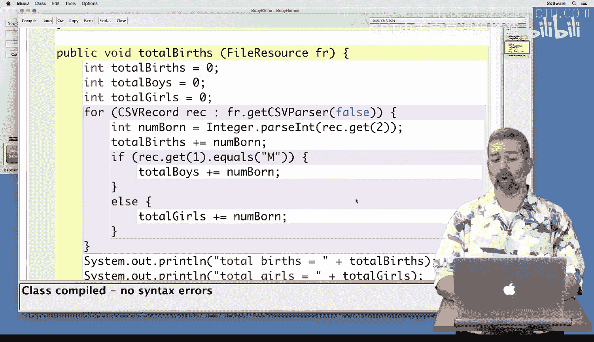

Good luck with the mini project。