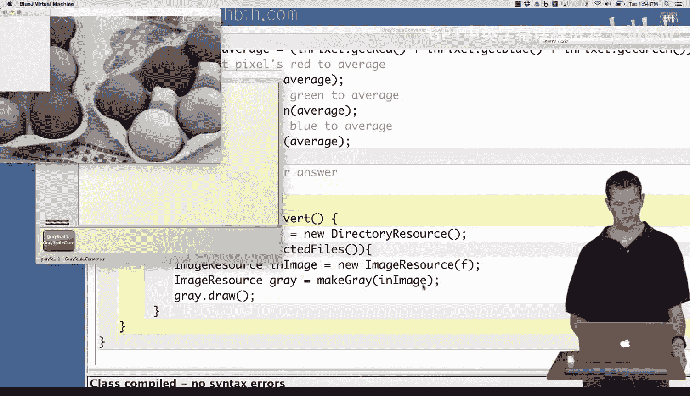
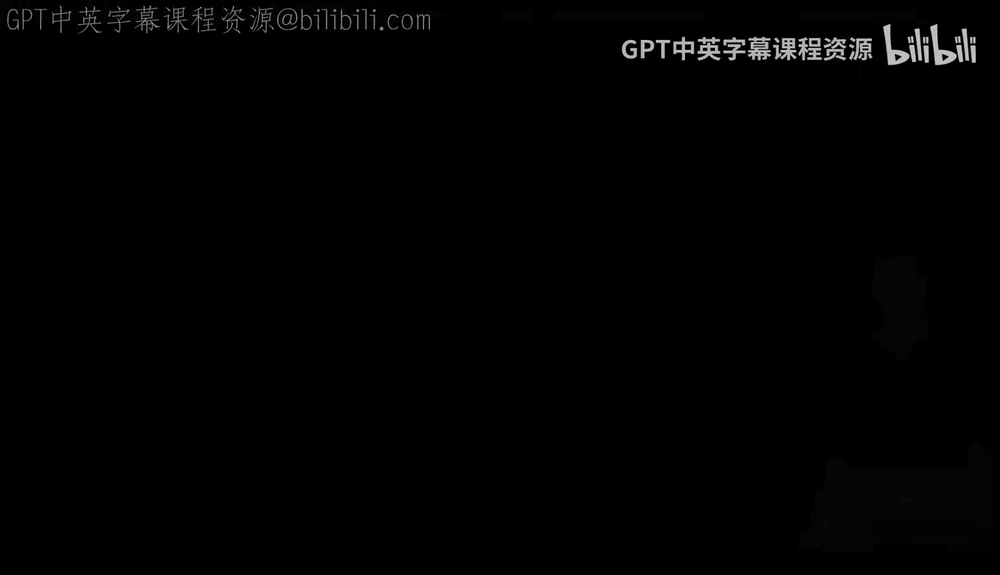

# 杜克大学《Java编程和软件工程基础2-5｜Java Programming and Software Engineering Fundamentals》中英 p64 64_05_04_批量处理灰度转换.zh_en -BV18U411U729_p64-

Having written the code to convert one image to a grayscale。

 we'd like to go one step further and convert many images to grayscale。

We've started here with the class we wrote in the previous video in which we implemented our algorithm in code I've added a method at the bottom。

 select and convert， which is going to let us select a bunch of files and convert them all。

You've already seen this code before， which iterates over a selection of files and just prints out their name Now we're going to combine these two ideas to give us code which is going to iterate over a bunch of files and convert them all to grayscale。

So we're going to start with a very similar structure here， we're going to make a directory。Resource。

which is going to be a new directory resource and we're going to say for file F in directory resourcesource do and if you don't remember this name。

 you can look at the API or look at the code we did before， it's going to be selected files。

And what we did last time was we just printed out F。

 What we're going to do this time is we're going to convert the。

The image corresponding to that file to grayscale， so I want an image resource。In file。

 which is going to be a new image resource， and I'd like to create this from F that is make an image by reading in this file。

Then I would like。Another image resource。Which we're going to get by calling。Make grayray。

 the method we wrote before。Passing in。Yin。I called it in file。

 but I'd really prefer to call it in image since it's actually an image。

And then the last thing we're going to do。Is just draw this file so we can see something happening。

 so I'm going to compile this。And it told me it cannot find the symbol class file。

What we need to do to use file is import Java。o。star because that's the package in which files are now it compiles fine。

And now I'm going to go back over here to my main blue Jay window。

I'm going to make a new grayscale converter。And now I'm going to click on this and I'm going to choose select and convertvert。

And it poppeds up this dialogue。And if we navigate through here back to somewhere where there are images。

We can now pick。Someam。Selection of。Pictures that we would like to convert each of them to。

And you can see that it went through and converted each of these pictures。Into grayscale。

And drew it drew the resulting image。I think it's still converting one of them。

The last one was really big。All right， so now we've put those two ideas together。

 we've converted any set of images you select， the next step is going to be to save these images to a file。

