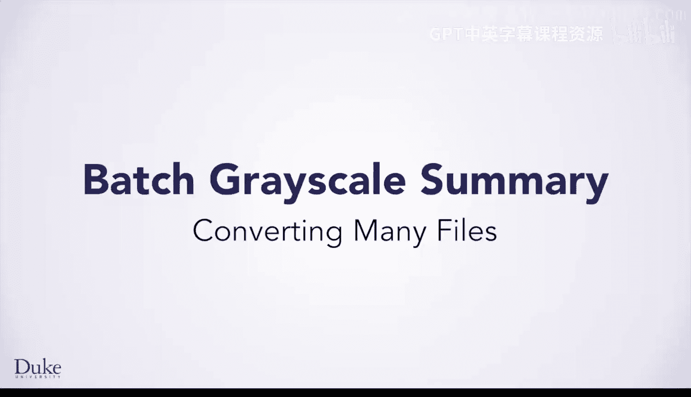
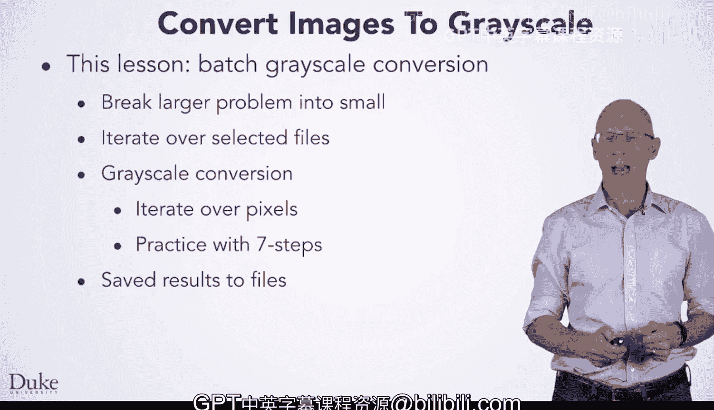

# 杜克大学《Java编程和软件工程基础2-5｜Java Programming and Software Engineering Fundamentals》中英 p66 66_05_06_批量灰度转换总结：多文件处理.zh_en -BV18U411U729_p66-

Hi， we're now done with this lesson in which you've written a Java program to convert many image files to grayscale batch processing。

During this lesson， you learn how it can be really useful to break a large problem down into smaller pieces。

 into smaller programs that you can then develop incrementally， making each program work。

 and then putting the correct working programs together。

You' got more practice writing code which iterates over data， first。

 iterating over files that the user selected using the directory resource class。

 and then iterating over the pixels in an image where you wrote code to actually convert an image to grayscale。

Converting the image to grayscale gave you more practice in solving a programming problem using our seven step method。

 Finally， you put the finishing touches on your batch grayscale conversion program by making it save the new images with file names that were similar to the old file names。

 This is a reasonably complicated program， and you should be proud of having made your way through this lesson。

