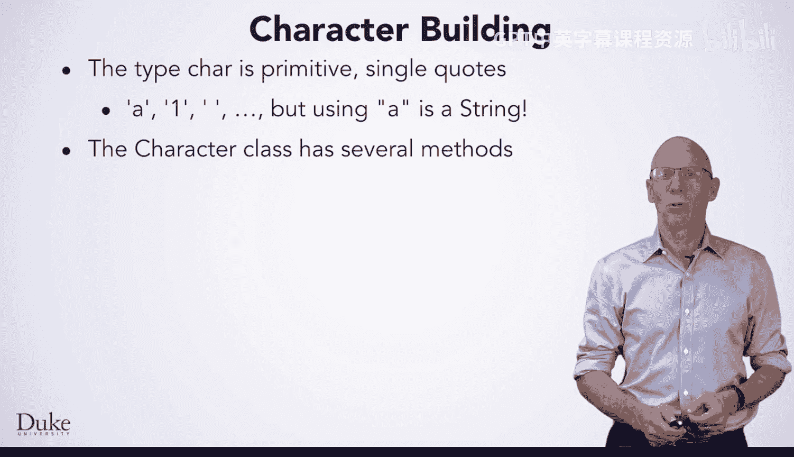
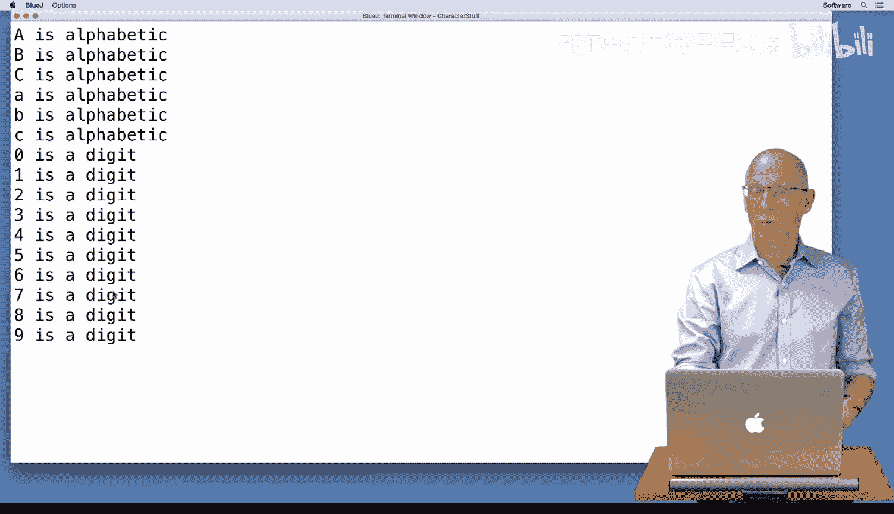
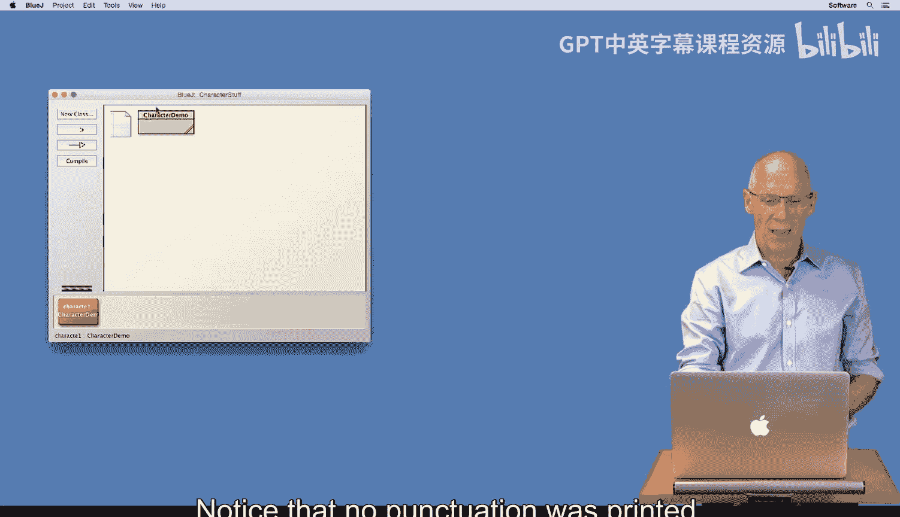
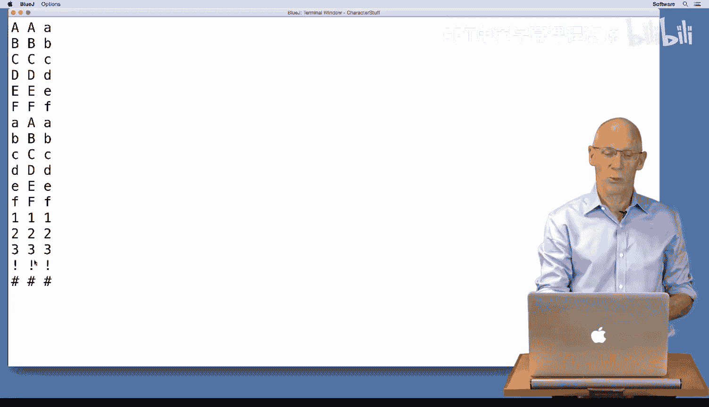
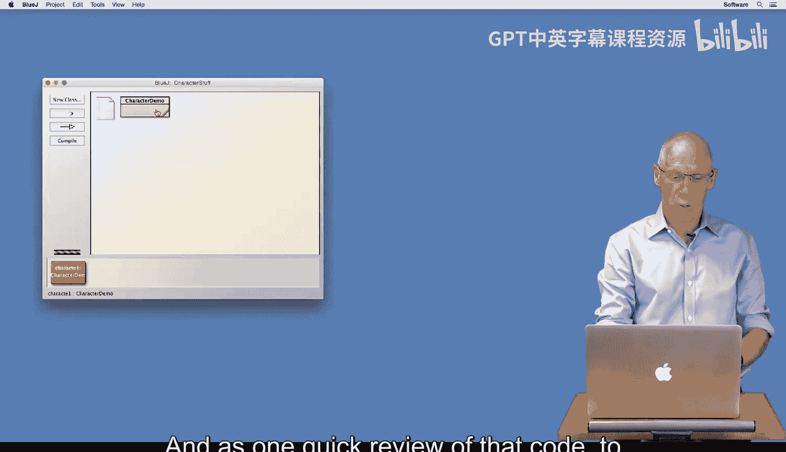

# 杜克大学《Java编程和软件工程基础2-5｜Java Programming and Software Engineering Fundamentals》中英 p72 06_02_06_字符类.zh_en -BV18U411U729_p72-

Hello。😊，We'll introduce the class character， which you can use to determine properties of character values in Java。

The type care is a primitive type like int， Boolean， and double。Some people pronounce it char。

Some people pronounce it car， and some people say care。

 but everyone says the word character the same way。 So I typically use the careful pronunciation。

Care values are specified with single quotes。 For example。

 you can see quote a quote and quote one quote。And space quote here。 These are character values。

 The value quote a double quote is a string value。 It's usually much easier to write the code than to say all these values。

The character class has several methods you can use in writing code。

 You may remember the methods integer dot parsant and double dot parse double。

 These were methods of the classes， capital I integer and capital D double respectively。

The method capital C， character dot 2 lowercase， returns a lowercase equivalent of its argument。

 For example， this call will return a lowercase G。 Since an uppercase G is the argument to character dot 2 lowercase。

 If you pass a character that's already in lowercase， the same value will be returned。

The table shows Boolean valued functions like is lowercase and is digit。

 as well as conversion functions like two lowercase and two uppercase。

 usingsing the Java documentation will show you more Boolean and conversion methods have fun building character。

And writing code。We have the character demo class here in Blue J。

 and we've got two methods that I'm going to run through and illustrate。

 Now I'll add one very quickly。 This first method， digit test creates a test string that has uppercase characters。

 lowercase characters， digits and punctuation。Move through every character of the string and calls the character dot is digit method。

 a Boolean method， and the character dot is alphabetic method， Another boolean method。

 So let's run through。Digit test and see what it does。

 I'm going to create a new object on my workbench by right clicking。

And then I'm going to run the digit test method by right clicking on that。

And we can see here pretty clearly that A， B， C， uppercase characters， little A little B， little C。

 Those are all alphabetic characters。 And then the digits are labeled as digit characters。

 Notice that no punctuation was printed so that when I go back to my editor。

 We can see that the uppercase characters were all alphabetic。

 The characters that looked like digits were all labeled as digits。

 and the punctuation wasn't any character in that it didn't have the label alphabetic。

 and it didn't have the label digit。

Just want to illustrate one quick thing here。 I can also say if C， H is equal to。The character。

 hashtag。Then I can print a message that。It's a hashtag。Highly enlightening。

And now if I compile this program。It compiled without any errors。And I'll make another object。

I'll invoke thee。Digit test method。 and we can see that lo and behold， hashtag is a hashtag。

That's just a reminder that， for。Characters， we use single quotes to differentiate the values。

 whereas strings use double quotes。 We can see that here where I've created another string test in the method conversion test。

 I've created a similar string with uppercase characters， lowercase characters。

 digits and some punctuation。 I'm going to loop through by using the string careat method to store a character variable C H。

 I'm creating an U C H variable and an LC C H variable， both of type care。

 I'm creating them calling character at to uppercase。

 which will return an uppercase character and character do two lowercase that will return a lowercase equivalent。

 Remember that。Converting a digit to upper or lowercase doesn't change the digit at all。

 And if a character is already lowercase， converting it to lowercase leaves it alone。

 So running that method， I will right click on my class and call conversion test。

 We can see that I get the characters in my string on the left column， the。

Function that you get by calling two uppercase。And the results that you get by calling two lowercase。

 So I get character， uppercase， lowercase。 You can see that in each column。

 I have all upper case characters or digits and punctuation。

 All lowercase characters or digital punctuation。 And as a one quick review of that code to remind you of where that came from。

You can see that I called two uppercase。lowercase and then printed them as the character。

 the uppercase version and the lowercase version using the Java documentation for characters will help a lot in making your program run smoothly when you're using character values。

 Have fun  building more character than you did last time。😊。

