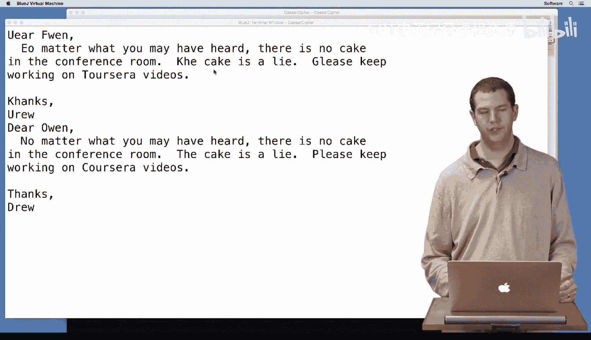

# 杜克大学《Java编程和软件工程基础2-5｜Java Programming and Software Engineering Fundamentals》中英 p75 09_02_09_测试与调试.zh_en -BV18U411U729_p75-

Now， we've written and tested our Caesor cipher class。 We tested it out on one message。

 and it looked like it worked。 Does this mean we can be sure our code is correct， Of course not。

 Remember， when your testing software， each test case makes you more confident in your code。

 but no number of tests can guarantee that your code is correct。

 You want more and more tests to be more and more confident and one test case generally isn't enough。

So here I have a different message。 Dear Owen， no matter what you may have heard。

 there is no cake in the conference room。 The cake is a lie。 Please keep working on Coursera videos。

 So I want to encrypt this and send an encrypted message to Owen to f him off from the cake in case he intercepted my message to Robert。

I'm going to use my test Caesar， and now I'm going to do message 2。Txt。And when I look at this。

 I'm going to see that the D in D turned into a U， that's good， but then EA and R were left the same。

Then the O and O in turned into an F， but then WEN were all left the same。And， in fact， most of this。

Is unchanged。

So my code isn't quite right。 If I look back at it。

 I'm going to see that it's only going to work with capital letters and not with lowercase letters。

 This was the problem in our first test case。 it only had capital letters。

 it didn't have lowercase letters， so we didn't really test all the cases enough。

We're going to leave this to you to fix， there are a couple different ways you can do it。

 and we hope you can figure one of them out。So good luck and happy fixing of your code。

