# 杜克大学《Java编程和软件工程基础2-5｜Java Programming and Software Engineering Fundamentals》中英 p79 13_02_03_随机数与数组.zh_en -BV18U411U729_p79-

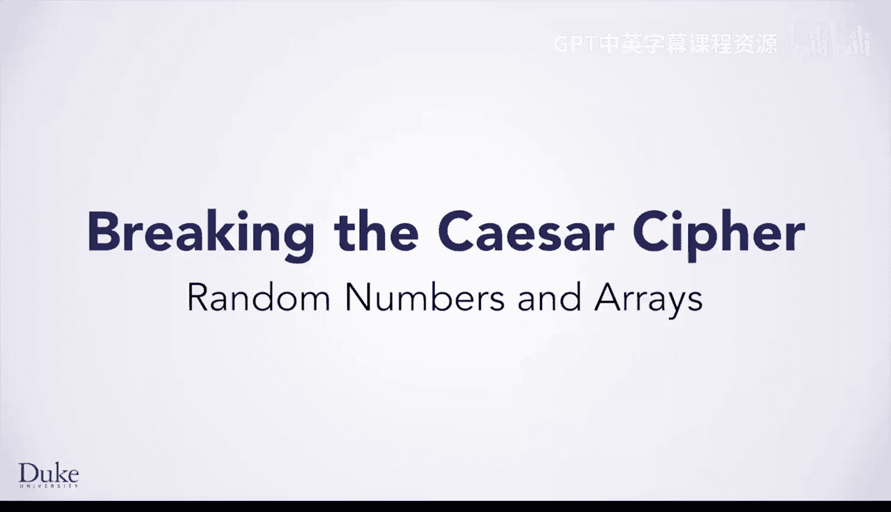

Computers are very good at modeling and simulation， in part。

 because computers can perform billions of mathematical operations every second。Often。

 simulation and modeling relies on generating random numbers in this coding example。

 we'll see a simple use of arrays to help determine how really random the Java do u do random class is。

Computers don't use natural random phenomena， but model randomness with what's called pseudo randomness。

 using mathematics to model what might be random events in nature。In this example。

 we will simulate rolling a pair of dice many times by generating random numbers。

 We would like to know how many twos do we roll， How many sevens do we roll。

 We will count how many times each type of roll occurs。

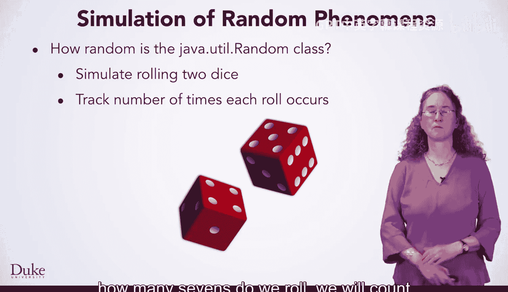

So I've got this code right here called simpleple simulateim and I can run it and say how many roles I want to do and right now it counts how many times I get two and how many times I get 12。

 so let's run it and see what it does。

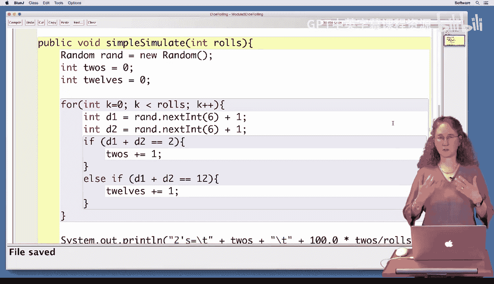

So we'll come over here。

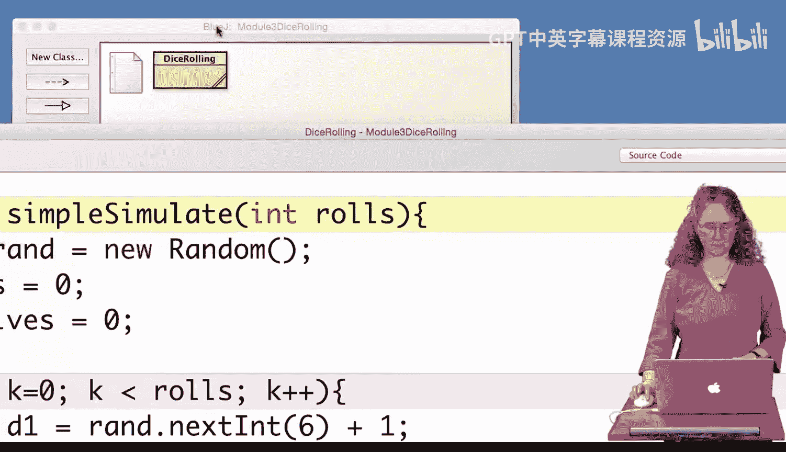

It's already compiled。I'll create the object。And we'll run simple simulateim。

 and here we actually get to choose how many times， so I'll say 10，000 times。And we'll just run it。

And you can see I got2，298 times， and I got 12， 271 times。

 It'd be nice to run it and count all the possible roles you could get from 2 to 12。

 so let's look at doing that。

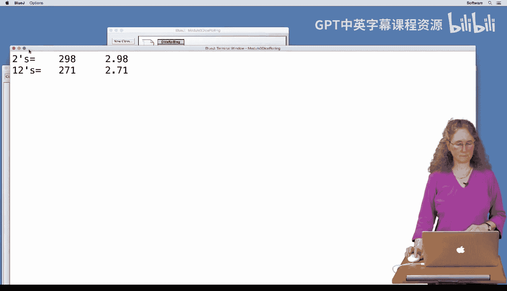

So what I'm going to do is I'm going to cut and paste this and we'll write a different method。

So we'll just copy this whole thing。u。And then we'll put it up here。

And we'll just call this one simulate？There we go。 And so now we're going to have to modify it。

 So the first thing is we have generate R and then we need counters for 2，3，4，5，6，7，8，9，10，1，12。

That's a lot of counters。 So what I would like to do instead is to use an array of counters。

 so that's what we'll do。So we'll replace this here。With an array， so we want an array of counters。

 so it'll be ant array instead， we'll have to give it a name， we'll call it counts。

And then we'll have to create the array。It's an integer array。And then what size is it going to be。

 So 2 through 12， we need at least 11 counters， but it would be kind of nice if we set it up so that when we threw a4。

😊，We would count for in the fourth slot of the array。

 So what we'll do is we'll create the array with size 13， which will allow us to use from 0 to 12。

 and really we'll just use2 through 12 and we'll ignore the0 and1 counters。

So I'll make my array of size 13。I don't need this 12 counter anymore， so we'll get rid of that。Okay。

 so now we're gonna have to adjust the code to handle using this array of counters。

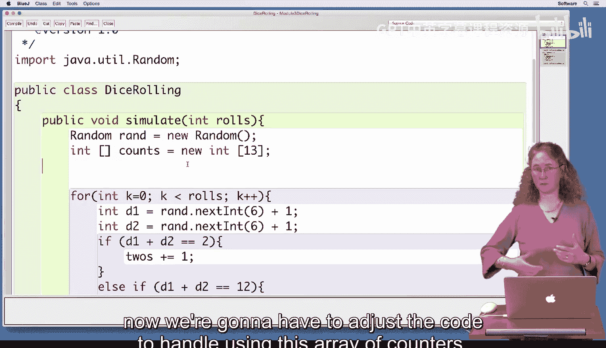

Okay， so we're still rolling whatever number of times we type in for rolls。 So that's the same。

 We're still throwing2 dice D1 and D2， and we are going to add them together。

 but as you can see here， we have this this if statement where we had to check and see was it2。

 Was it 12， and we could add all these other if statement。 Was it 34，5 and so on。

 But instead we can just notice， we just add the two together。

 That's also the index position of the counter。 and that's all we have to do。

 so we can get rid of this if statement。And instead， we're just going to add code。

 so we're going to update our counter that position by one。So will our array is called counts。

We're going to add in the D1 plus D2 slot。We're just going to add one。Plus， equals1。That's it。

 That replaced a huge if statement。Let's see。 So now。We're going to output。

 So you can see we have two lines of output for twos and12s。What we're going to do instead is we。

 we would be nice if we just had one print statement。

 and we used it over and over again for each position in our counter array。

 So we're going to add a for loop here。

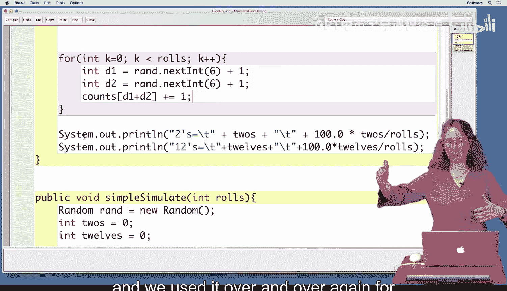

And remember， our， our counter。Started at 2。 So we'll have our K start at2 because the first。

 the lowest thing you can get is two ones from each dice， and that's2。So that'll be the lowest。

 and then it'll be K。Less than or equal to 12。Because we're going go from 2 to 12。

And then we'll update it the same way， K++。Okay， and then we just need one of these output statements to modify。

Or I'll just， actually I'll just type a new one。 We'll just say here so。System dot out print line。

And what we want to do is we want to print K。Because that'll be the counter。 So k for2 through 12。

 right， so we will print K。And then we'll print。We can still do the quotes。Equals and a tab。

/lash T is the tab。Plus， and then we want to know what was the how many like twos were there or how many tens were there。

 et cetera。 And that's just count。Counts。K， that's how many of type K there were that we counted。

Plus。呃。We can add another tab。And then we can add the rest of this，100。Times。Counts of K。Divided by。

Rose。And I'll just put that in parentheses。😔，Like you said doesn't matter。嗯。We do need to add。

Please send me corner at the end。

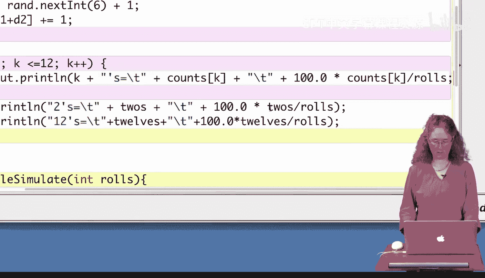

And then I can get rid of these two print statements here。There we go。Okay。

 so I think we have everything now。 So we've got。um。We now have our loop that prints for each one。

2 through 12。 what it does。 Let's see if we have it compiling。

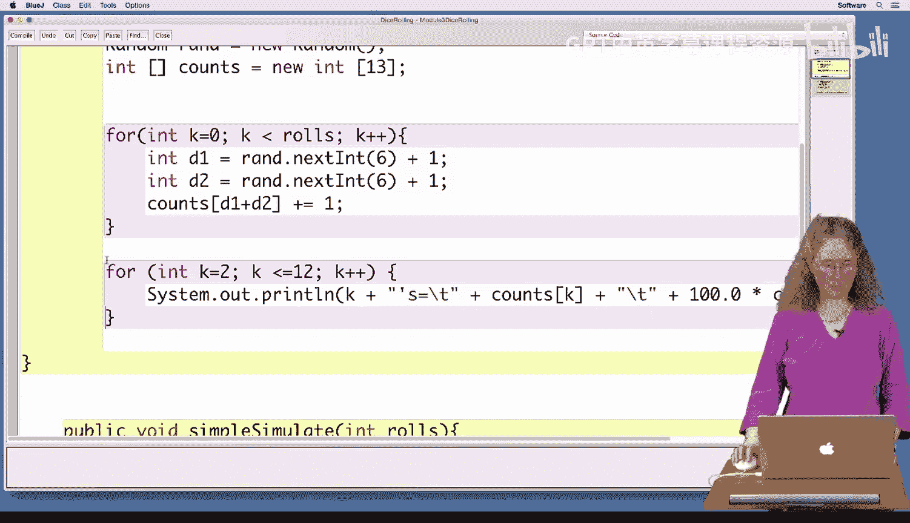

WeWe're missing one left right par end right here so we can add that。

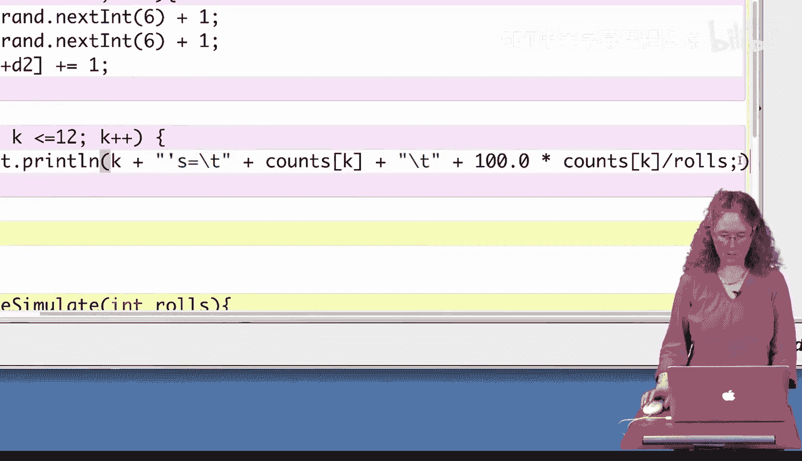

Oops。We'll add it and then put our semicolon。 There we go。 Let's try compiling it again。

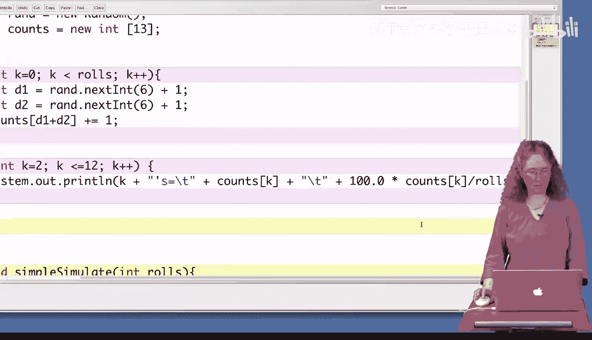

And it says it compiles， there's our code， so now let's run it and see what happens。

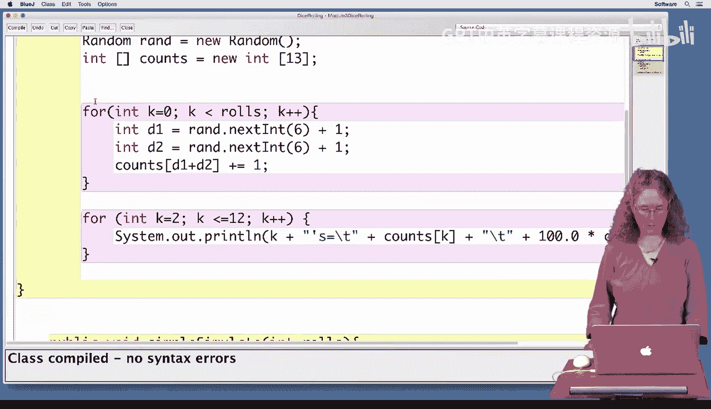

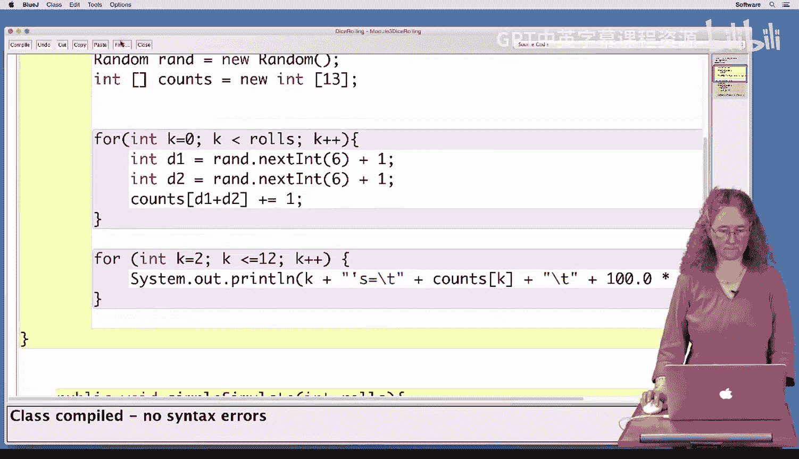

It's already compiled， we can create our object。And then we can run it simple simulate。

 or this is called simulateim。And then we's run it again like， oh， let's run it 100000 times。

There it goes。 Okay， so now you can see we're getting lots of numbers， lots of counts for twos。

 threes， fours， and so on。How do you know it actually works， We just got lots of numbers。

It looks pretty good in the sense that。If you roll 7。

 you're going to get that more likely than any other thing because 7 is2 and 5，1 and 6，3 and 4。

 And it does have the highest number。 But to really be sure what we'll do is we'll run a simple example。

 and we'll add print statement。 Like， let's run it 10 times and let's see what the actual roles are。

 And we can see if our counters are really working correctly。 So let's do that real quick。

 We'll go back to the code here。

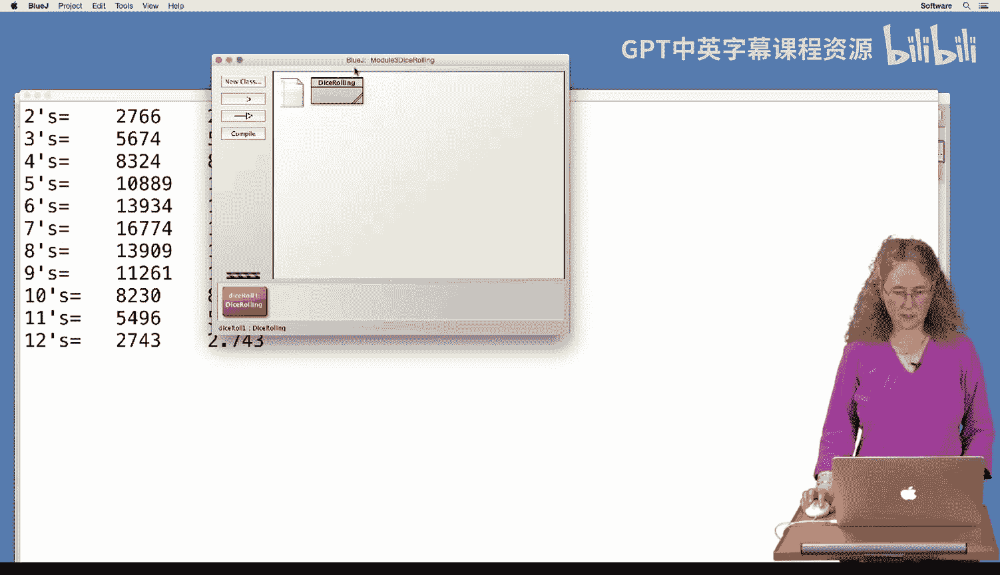

So this is really adding just for testing it to make sure that the counters are really the counters we think they are。

 So whenever we roll a dice， which is right here。

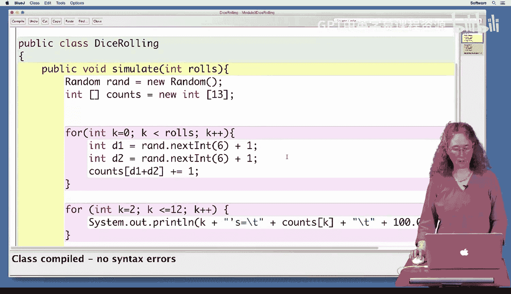

I'm just going to add a print statement here。So what I'll do is I'll print out。Roole is。Dwan。😔，Plus。

😔，D2。😔，Which equals。D1 plus d2。Yeah don't know。So that's all we're doing。

 We're just printing out the role。 Then we're going to just run it a very small number of times so that we can see our counters are actually working correctly。

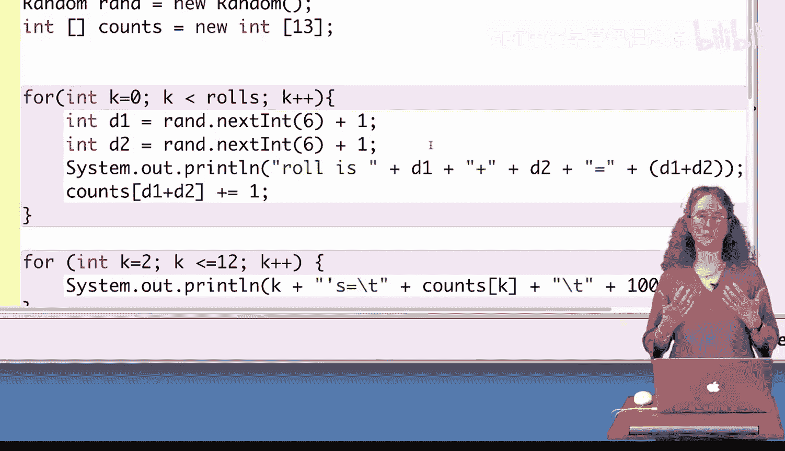

So we'll compile that。

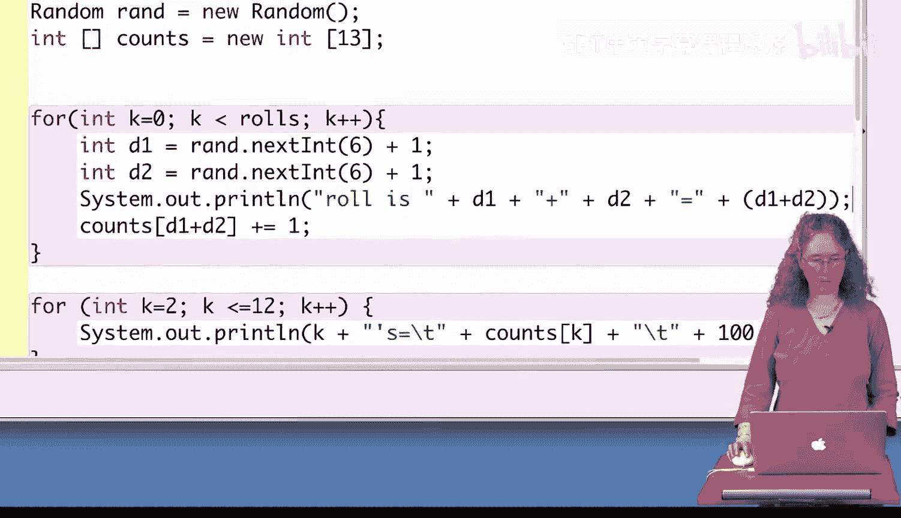

And that worked， so let's run it now。

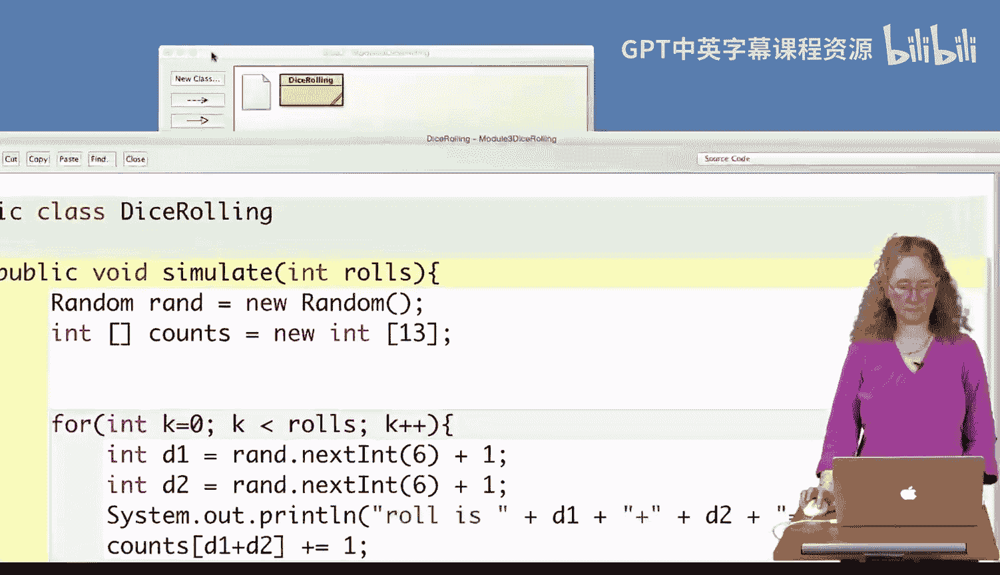

Okay， so I'm just going run it 10 times。 throw the dice 10 times。And let's see what we get。So。

 we got。

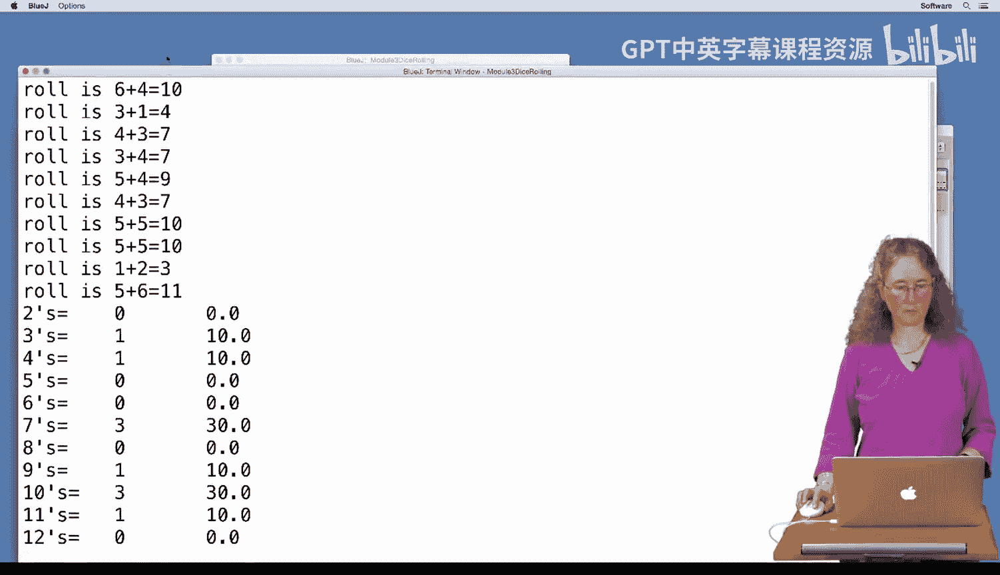

It looks like 1，2，3，7s。 And if you look， it counted 7， three times。 we got 1，2，3，1s。

 and it counted 10， three times。 We got a four once。 we got four。

 So it looks like it is counting them correctly。 So this is the way you can kind of test it on a small amount of data。

 and that seems to work。All right， so anyway， I hope you enjoyed dice rolling。

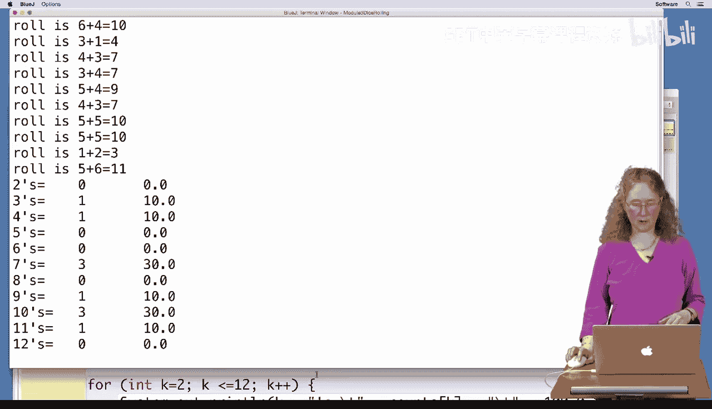

Thank you。