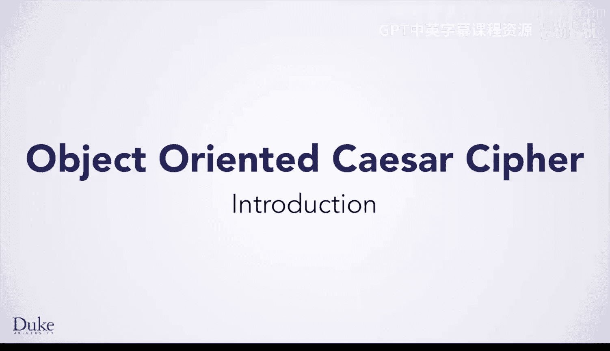
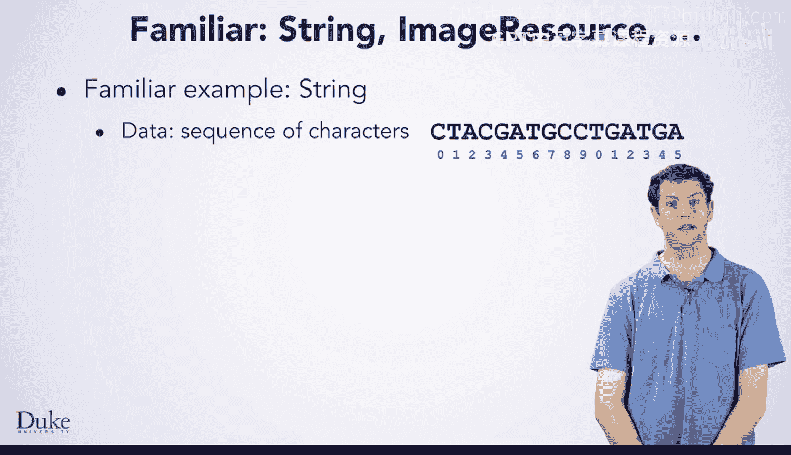
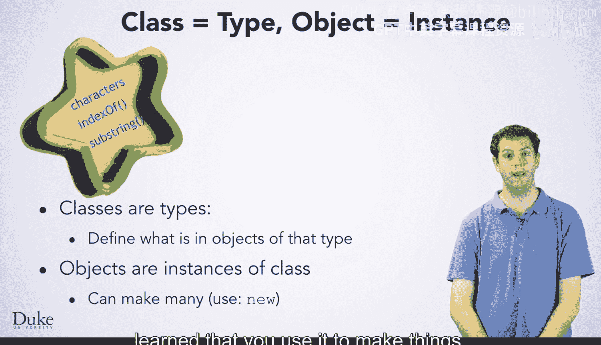
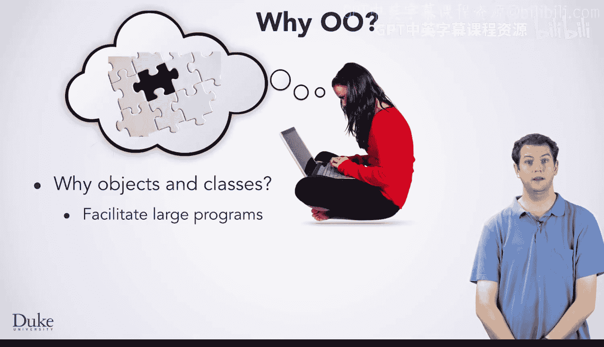

# 杜克大学《Java编程和软件工程基础2-5｜Java Programming and Software Engineering Fundamentals》中英 p83 17_02_01_简介_2.zh_en -BV18U411U729_p83-

Welcome back。 Now that you are becoming proficient at solving problems in Java。

 It is time to talk about some aspects of Java that will help you solve larger problems。

 You have probably heard that Java is an object oriented language but what exactly does that mean As the name suggests your code works with objects which you have already been doing with objects from a wide variety of types。

 strings， image resources and CSv records just to name a few One of the important characteristics of objects is that they encapsulate code and data。

 putting them together into one logical unit。 You have already written methods which are the code in an object。

 However， you have not yet made your own fields which describe the data within an object As a familiar example。

 think about strings which you have worked with a lot a string is an object and it encapsulates code and data together。

 For a string。 the data is the sequence of characters which it represents these characters are。

In of the string object， you can also call a lot of different methods on a string to operate on it。

 And thus on the data inside of it。 You are familiar with many methods in string。

 such as index of and substr。

As you learn a bit more about object oriented programming。

 it is useful to be precise with terminology。 A class defines a type。

 specifically what fields and methods are inside of objects of that type。

 Objects are instances of a class。 You can make many different objects from the same class。

 which you do with new You have seen new before and learned that you use it to make things。

 but now you can be a bit more precise。 new creates a new instance of an object。😊。

So why use an objectoriented language， what is the point of classes and objects a long time ago programming language designers realized that it was helpful for programmers to be able to think in terms of objects as they correspond more naturally to how you think about the world they designed objectoriented languages around this idea along with a variety of features which help programmers design and write large programs。

You are going to learn some basic features of object oriented programming here so that you can create your own classes with both code and data。

If you continue onwards to take our Java programming principles of software design course after this。

 you will learn some more principles and techniques of object oriented programming。

 so let's dive right in。