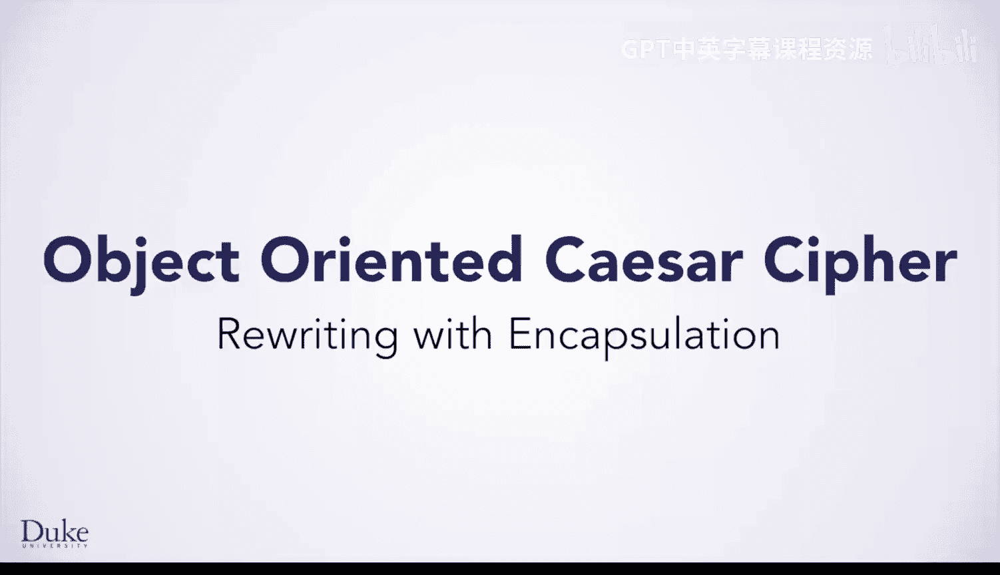
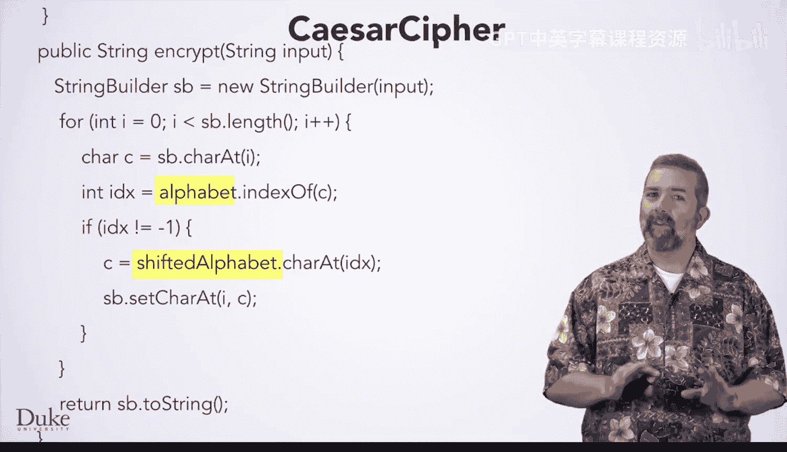
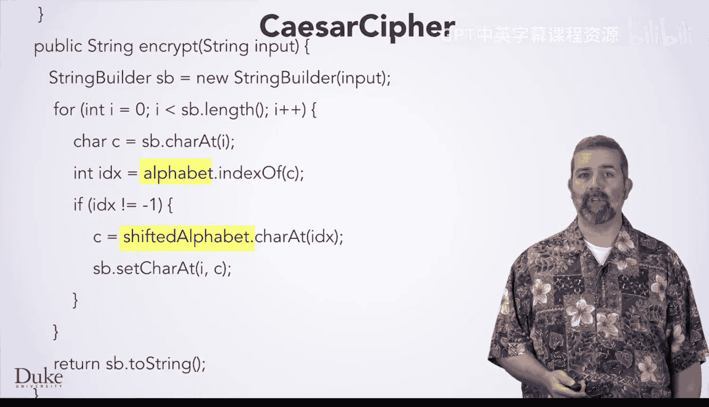
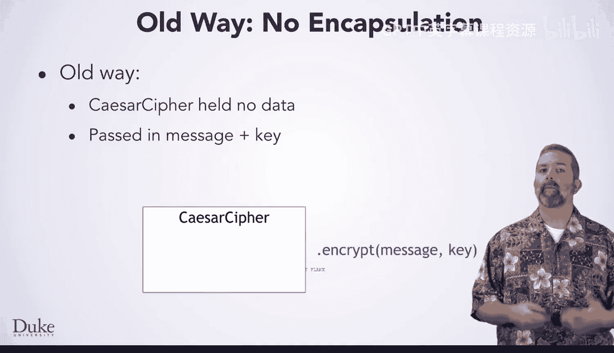
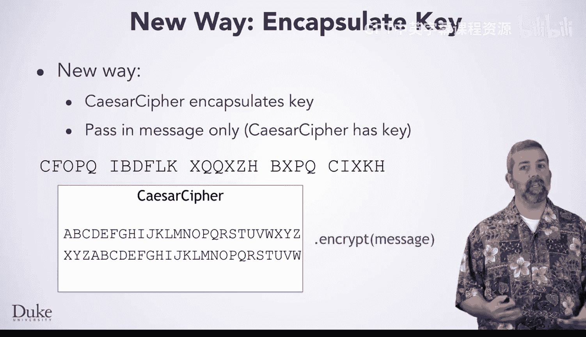
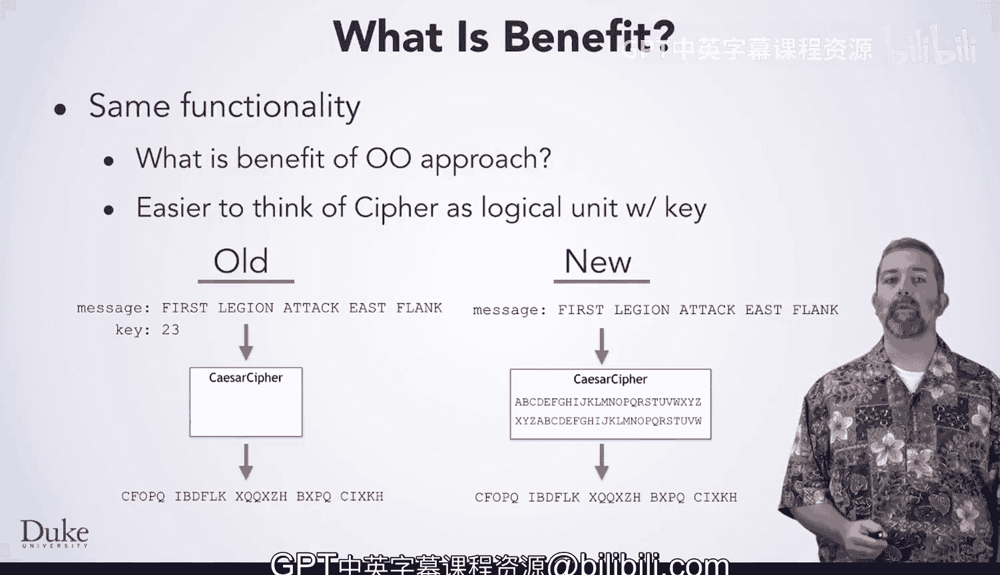

# 杜克大学《Java编程和软件工程基础2-5｜Java Programming and Software Engineering Fundamentals》中英 p84 18_02_02_使用封装重写.zh_en -BV18U411U729_p84-

Welcome back to start learning concepts of object oriented programming。

 it is useful to take an existing piece of code and see how you could write it differently in a more object oriented way。

Here is the code you wrote in a previous lesson to perform encryption with a Caesar cipher。

As you may recall， one of the parameters to this method is the encryption key that you want to use。

And the first thing you did with this code was to compute the shifted alphabet based on this key。

Here is a different way to write the Caesar cipher class， which does exactly the same thing。

 but makes better use of the object oriented nature of Java。This class has two fields。

 A field is a special kind of variable， which lives inside of an object instead of inside of a method Here。

 the two fields are the strings for the alphabet and the shifted alphabet。

 and they have been moved outside of the encrypt method。

Notice that they are now declared inside of the class， but outside of any method。

These are now data that are encapsulated in your object When you make a Caes cipher object。

 it will have these two fields， which any code inside the class can refer to by name。Next。

 notice that there is some code here which looks like a method where we forgot to write the return type and named it the same as the class。

 This code is actually a constructor， which means code that gets run to initialize an object when it is created using new。

This constructor takes in the key as a parameter and initializes the alphabet and shifted alphabet fields using the same approach you used before。

If you look further down in this implementation of the Caesar cipher。

 the encrypt method looks mostly the same as before， but it no longer takes the key as a parameter。

 nor does it compute the shifted alphabet。 but the rest of the code is the same。In fact。

 the code uses the alphabet and shifted alphabet fields in the object。

 even though these are not declared inside the method。

 this code is allowed to use them because it is inside the object so it can use any fields within the object。

An illustration helps understand the differences between these two approaches in the old code。

 a Caesar cipher object held no data。 When you do new Caesar cipher。

 you pass in no argument and create an object with nothing in it。 When you call encrypt。

 you pass the message and the key。 and the method returns the encrypted message。

In the new way， each Caesar cipher object contains a key。 Now， when you do new Caesar cipher。

 you pass in the key and the object you have created stores that key inside of itself。

 When you call encrypt on such an object， you pass in only the message。

 The key is already in the object， and it still returns the same encrypted message as before。

So if these two implementations produce the same result。

 what are the benefits of an object orated approach？

When you encapsulate the key inside of the cipher object。

 you have one thing that is capable of taking a message and encrypting it。

 That makes a nice logical unit to think about a thing that does a task。

 You do not need to separately track the key and pass it in。

For small programs such as the ones you have written so far， that may not seem like a big deal。

 however， as you solve larger programs with more complex code。

 this design idea will help you immensely。Now that you have seen an example of these ideas in action。

 the rest of the lesson will teach you about the details of the technique you just saw。

