# 杜克大学《Java编程和软件工程基础2-5｜Java Programming and Software Engineering Fundamentals》中英 p85 19_02_03_字段.zh_en -BV18U411U729_p85-

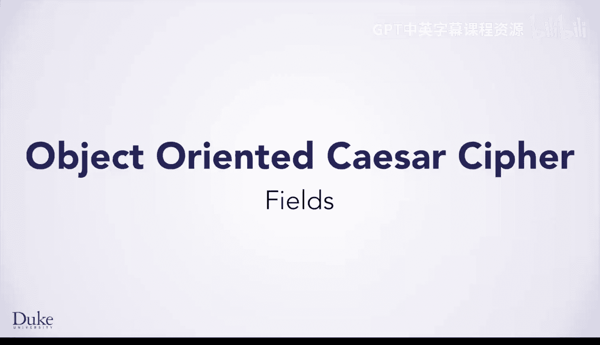

Hi， now that you know a bit about object oriented concepts。

 it's time to go a bit deeper into the idea of fields， which are also called instance variables。

 Remember that when we redesigned our Caesar cipher to be more object oriented。

 we created two fields， one for the alphabet， and one for the shifted alphabet。

 These fields are declared inside of the class。 But outside of any method。

 They belong to the object and are created when new is called to create an object， either in code。

 you write or when you create an object in blue J that's shown on the object work benchnch。

These fields are part of the object and exist as long as the object exists。What does all this mean？

Every Caesar cipher object you create has its own alphabet and its own shifted alphabet。

 This is why fields are also called instance variables。

 They act like variables where there is one variable per instance of the object you create。

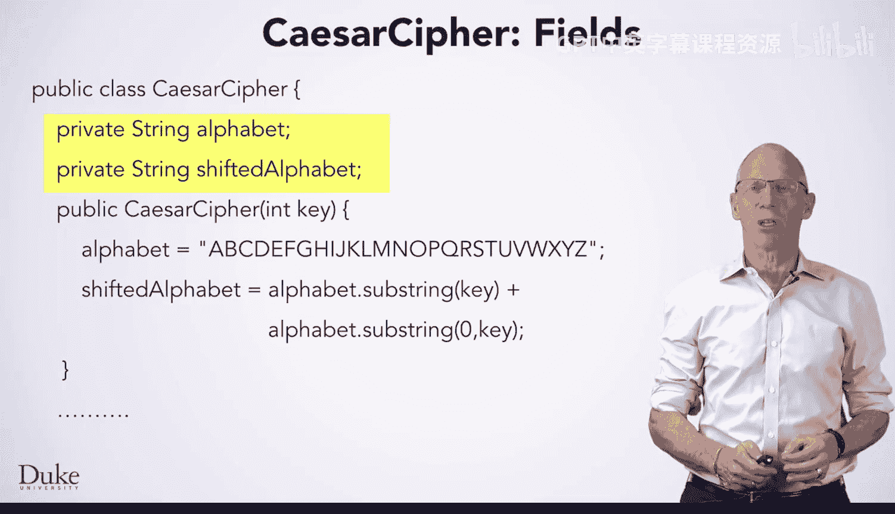

What does this really mean， Let's look more deeply at fields and instance variables。

Every Caesar cipher object has its own copy of the alphabet。

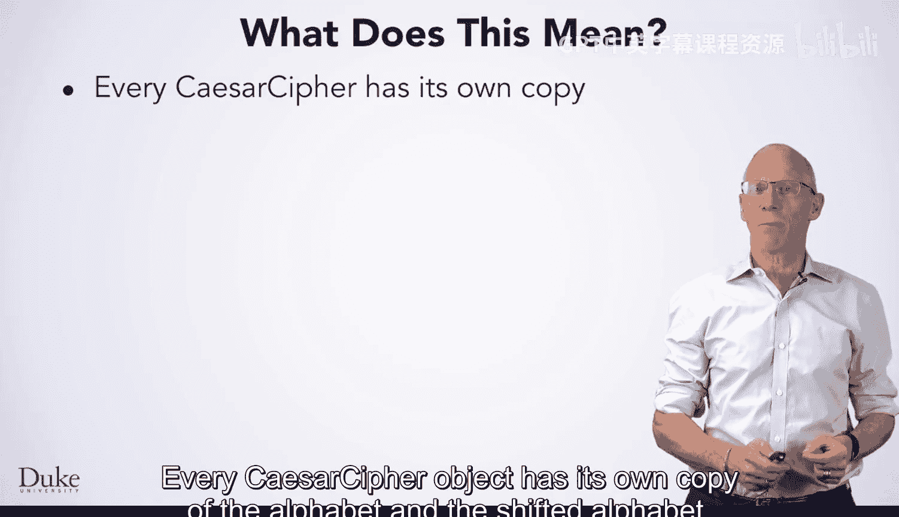

And the shifted alphabet。You can make different Caar cipher objects。

 and each will have its own instance variables。 These variables are specific to the instance。

 If you create three Caar ciphers with three different keys。

 each has its own copy of these fields with potentially different values。

One cipher might have a shifted alphabet of QRS， for example。

Based on the integer shift value passed to the constructor。

While another object might have M&O as a shift value。

And the third object could have HIJ as its instance variable set again when the object is constructed。

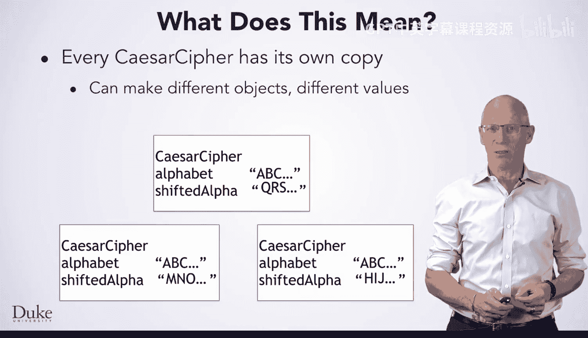

To call a method like encrypt on an object， you'll typically use a variable name like C C。

 and you'll write C dot encrypt。 You can also call a method from an object on the Blueja object workbench。

 these objects have names too。 And when you call dot encrypt， for example。

 the method will use the values of the fields in the object you use to call the method like C C。

 if you wrote C dot encrypt。Calling encrypt on this Caesar cipher will use its QRS shifted alphabet。

So when we call dot encryptrypt and provide the message。

 first Leion attack East flank as the parameter。The QRS alphabet is used to create the encrypted version that you see here。

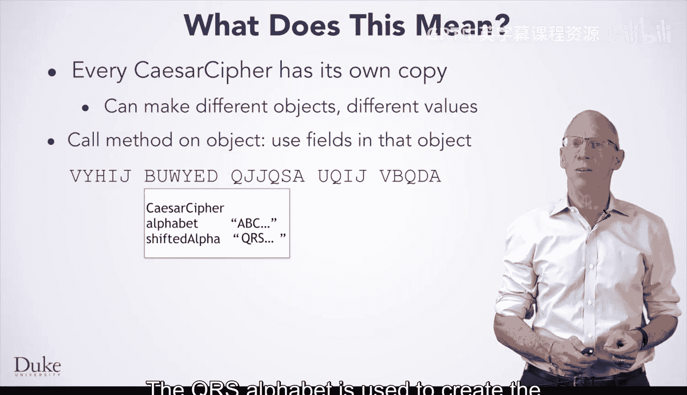

In the same way， calling encrypt on this Caesar cipher object will use its M&O shifted alphabet。

 This is the principle of encapsulation。 The method and the data are logically inside of the object。

 and the method acts on the data inside the object that it lives in。As you can see here。

 calling encryptry uses this shifted alphabet， and we see a different encrypted version of the same message because the field shifted alpha that starts with M&O is used here。

Finally， using this object with HIJ as the field will result in a different encrypted message When encrypt is called。

 the encrypt code uses this shifted alphabet of this instance and the encrypt code creates the encrypted message you see here。

Fields or instance variables are very important concepts in designing and using classes。

 since they can be accessed by every method in the class。

 like encrypt that you see here and the constructor as well。

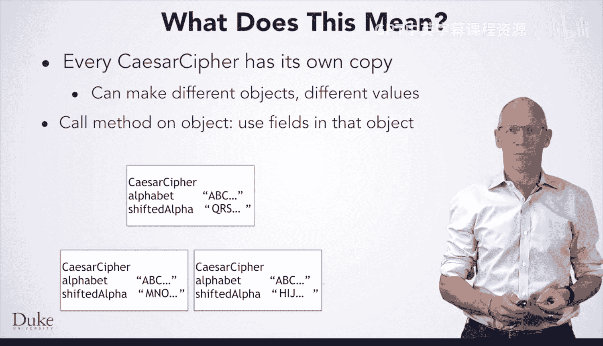

As you begin to design your own classes and think about the fields and methods to put in these classes。

 here are a few design principles you should keep in mind。

The first is that a class name should correspond to a noun。Classes describe things。

Each object you make for a particular class is one of that thing。

Let's think about the classes you've seen so far for this course， strings， pixels， CSV records。

 each of these is a noun， it describes a thing。

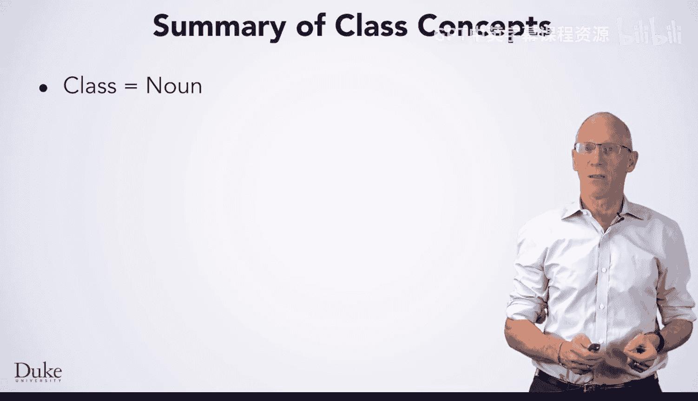

A class could be a car， for example， that's a noun。

 And then the methods and fields would correspond to things that a car can do。

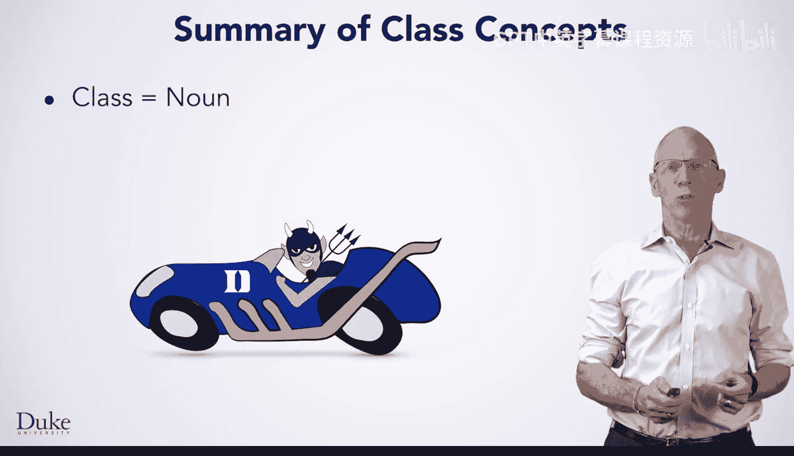

Methods， on the other hand， are verbs。 They are what you do， too， or with an object。

 things like get pixel， set care at or encrypt。Sometimes method names don't sound like verbs。

 such as substr or index of， but these describe actions。

Get a subscreen or find the index of the program has just shortened the name。

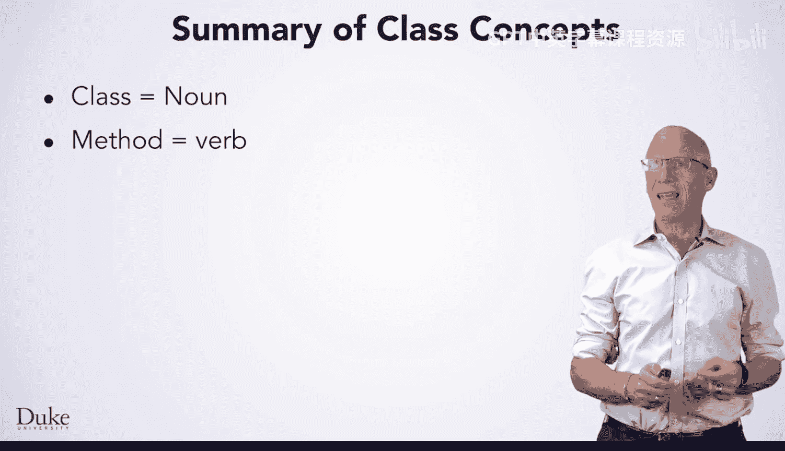

For the car， a method might be accelerate。Or break。 These are These are things a car can do。

 For example， invoking a method would make the car go faster or stop suddenly。

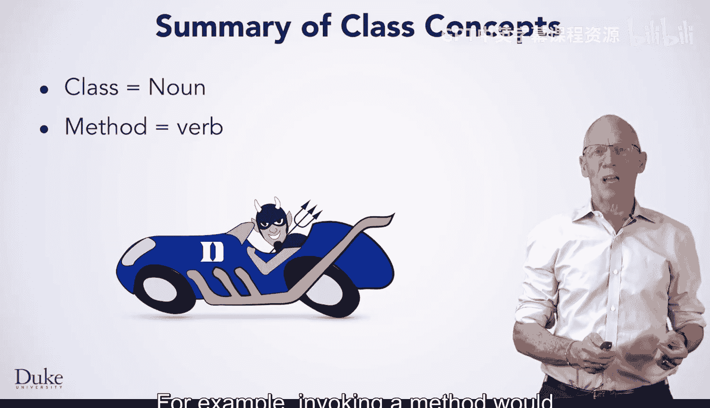

Fields or instance variables are important class concepts。

 Fields are also nouns and should describe things that the class has。

 The string class might have a field for a sequence of characters。

A sequence of characters is a thing。And the string has one of these things。Similarly。

 an image might have many pixels。Fields can also be adjectives as they describe the properties of an object。

 for example， a pixel might have a field or fields describing its color。

That could be an adjective giving more information about the properties of the pixel。

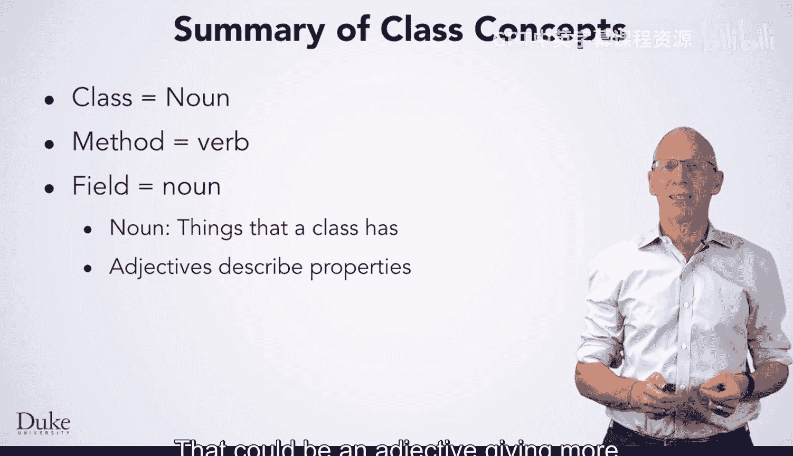

For cars， fields could include things a car has， nouns。

 like an engine with a certain number of cylinders or wheels of a certain size。

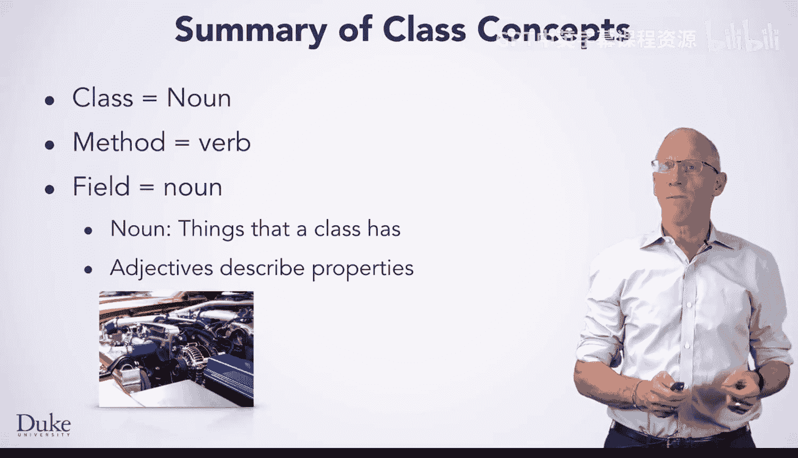

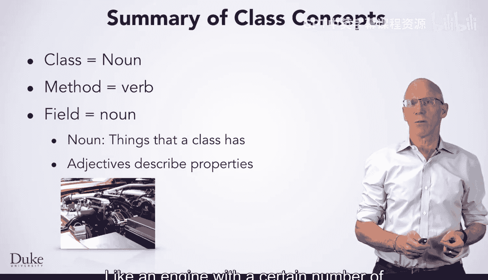

For car's adjectives might describe the color of the car or the kind of engine the car has or the type of wheel。

 As you get started making more complex classes， we will provide guidance on fields and methods you should make。

 But think about these design principles as you write your code。As you gain more experience。

 you want to start designing classes on your own based on these ideas。Happy coding acceleration。

