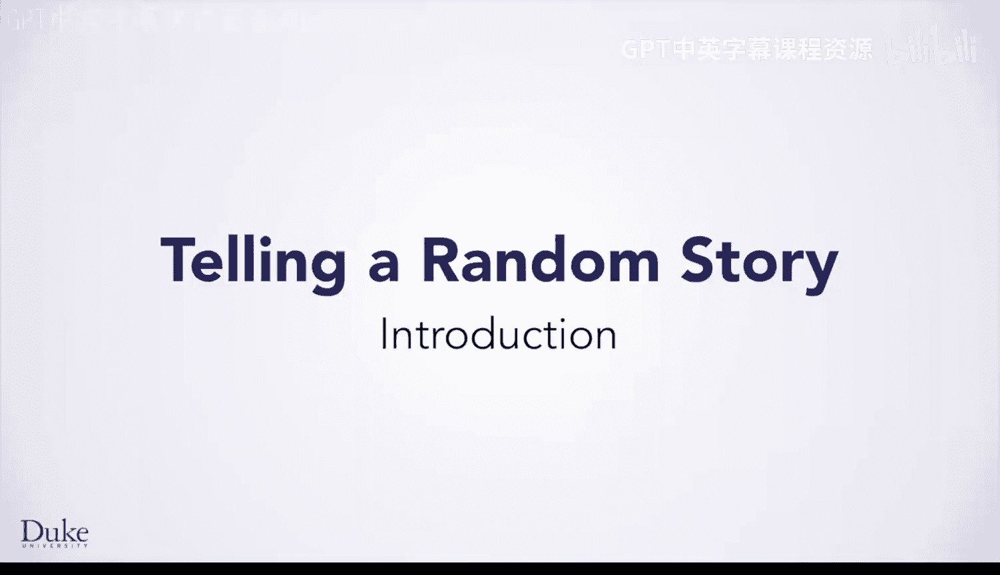
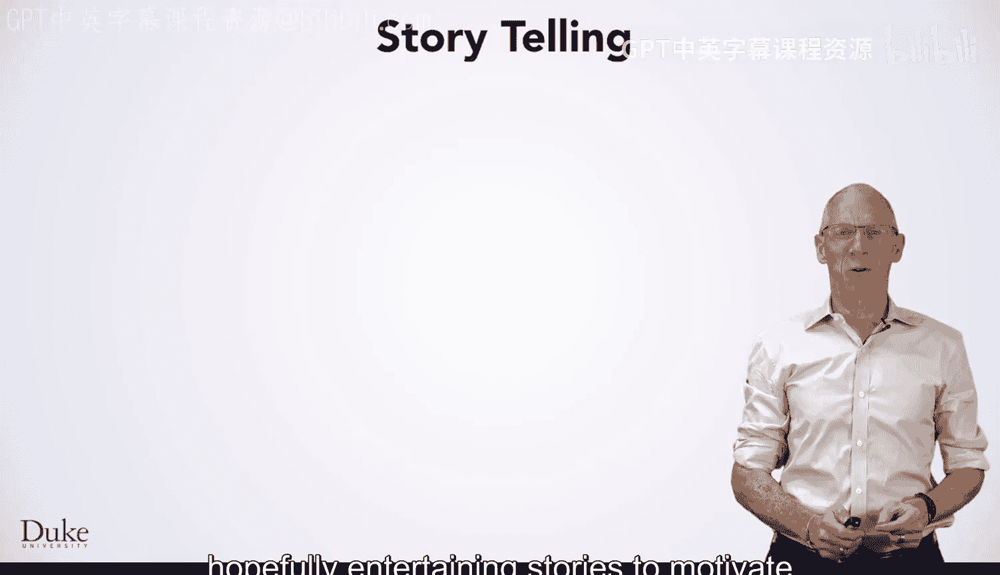
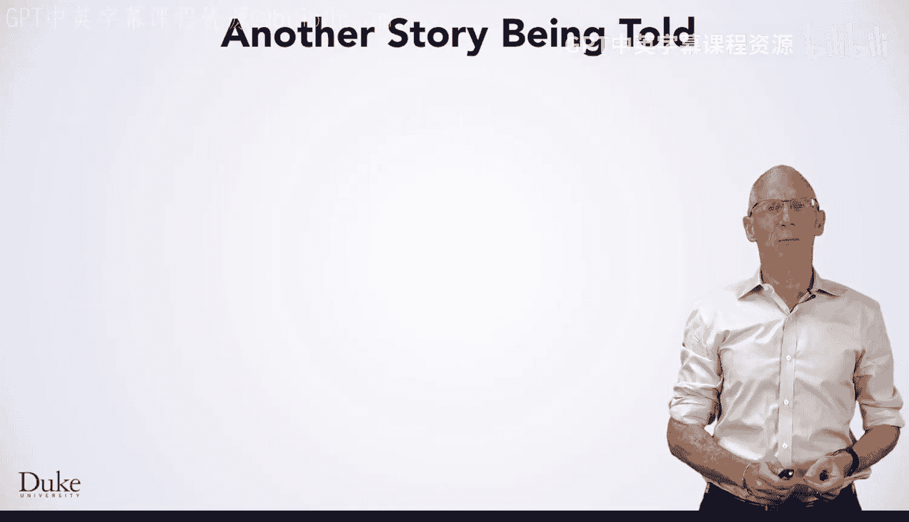
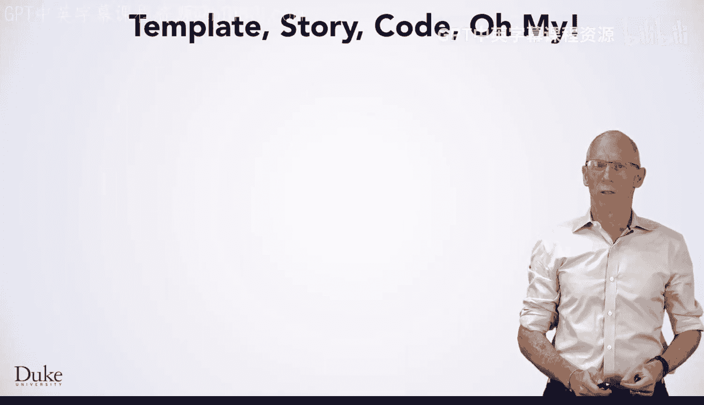
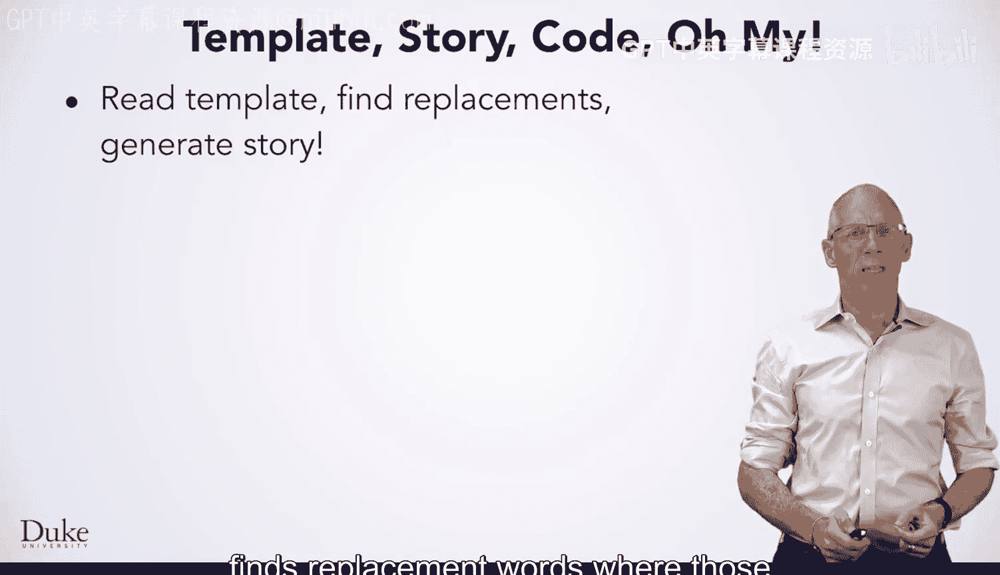

# 杜克大学《Java编程和软件工程基础2-5｜Java Programming and Software Engineering Fundamentals》中英 p89 23_03_02_简介_1.zh_en -BV18U411U729_p89-

Hello。Welcome to this module in which we'll use the idea of creating random。

 hopefully entertaining stories to motivate and explore important Java concepts。😊。

Here's an example of a randomly generated story。 We'll use a couple of these stories to introduce our Java concept。

 Let's look at this first story。My name is Albert， and I live in France。 One day。

 I'd like to travel to Mexico because I've never seen a tiger。

 And I read that they have gigantic slippery ones there。 However。

 because 55 orange gigantic wheelbarrows make it difficult to travel。

 I may have to travel to Ecuador instead。 That would be okay。

 but it might take 305 minutes to get there。We'll look at another story with the same pattern。

 Perhaps you can see some of the similarities to the previous story。

My name is Vivian。And I live in India。One day。I'd like to travel to the United States because I've never seen a pangolin。

And I read that they have furious and funny ones there。 However， because 95 purple slippery houses。😡。

Make it difficult to travel。 I may have to travel to China， instead。That would be okay。

 but might take 445 hours to get there。There are many similarities in these stories。

 which isn't surprising since they were generated by a common template。

You'll be exploring and modifying the Java program that reads the story template。

 finds replacement words where those are needed and generates a story。

The similarities in these stories are captured in parts of this template that are replaced with words chosen randomly from lists of words of different types。

For example， your program might choose a name like Albert or Vivian。And choose a country like India。

 France， China， the United States， and more。Animals chosen could include tigers， pangolins。

 and whatever dragons you might imagine， for example。Your program can choose nouns。

 and as you'll see， the choices can make for interesting stories。

You'll be able to share words that are chosen at random with other learners as you explore these new Java concept。

 Let's get started。