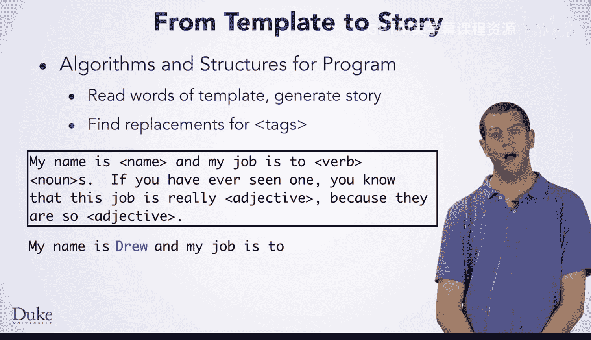
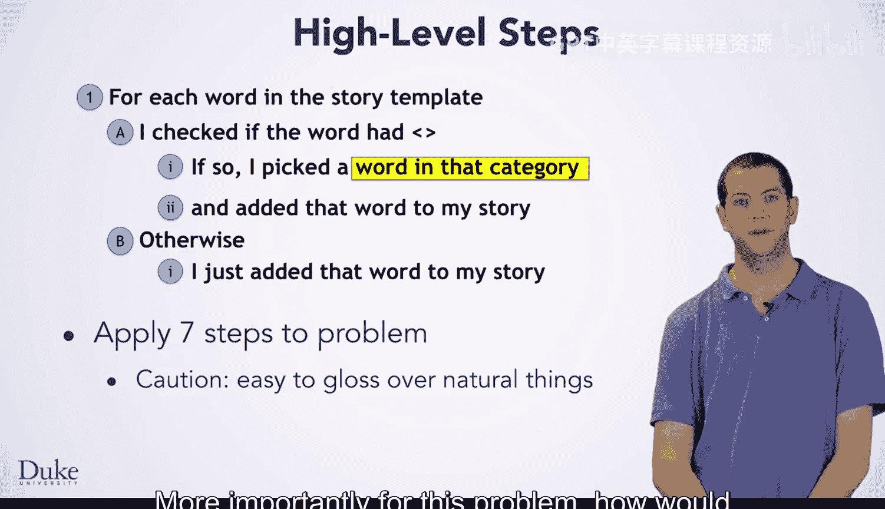
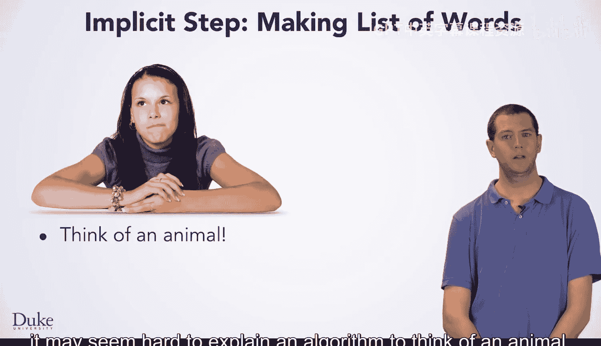
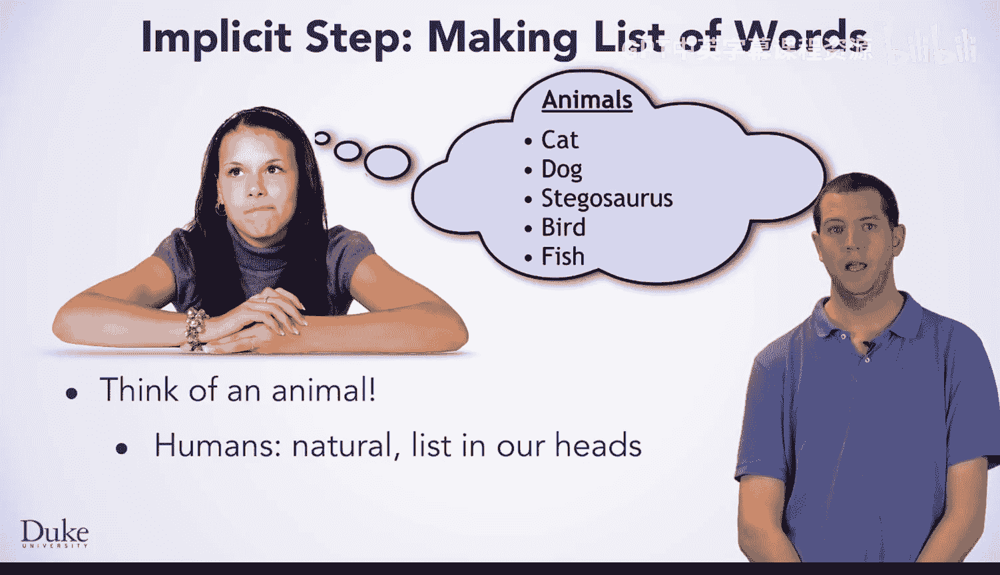
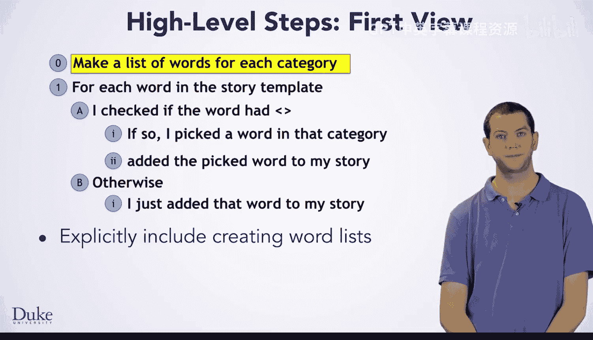
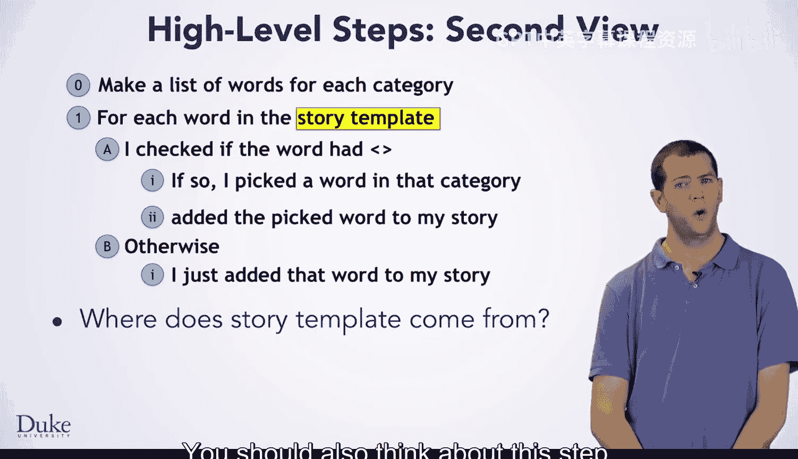
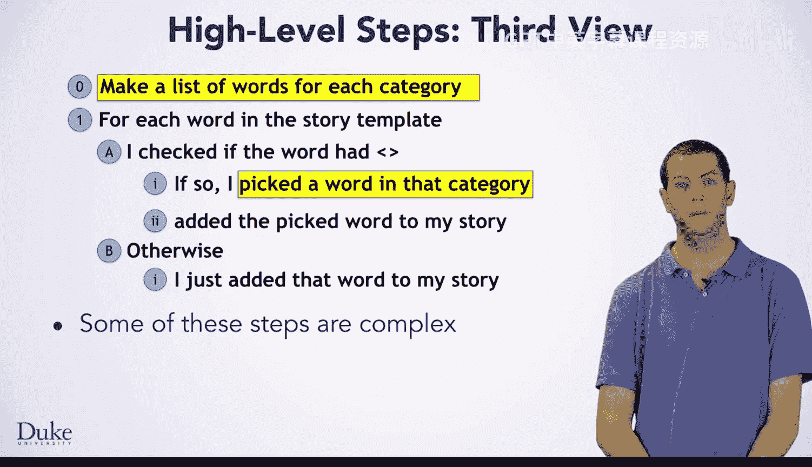
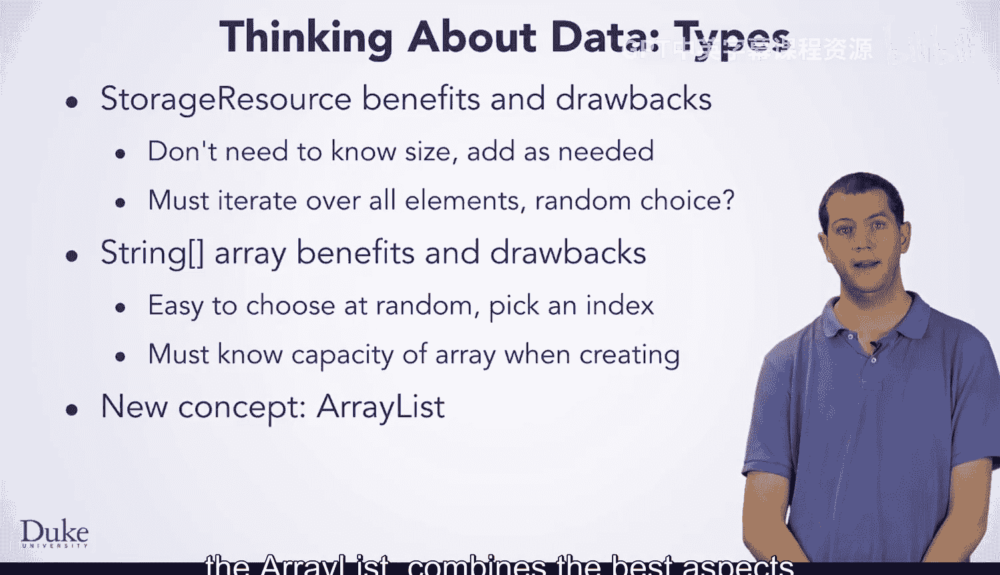

# 杜克大学《Java编程和软件工程基础2-5｜Java Programming and Software Engineering Fundamentals》中英 p90 24_03_03_高层设计概念.zh_en -BV18U411U729_p90-

You're going to think about the design and implementation of a class for generating random stories。

 This problem is a bit larger than the ones you have solved so far。

 So you will need to think about the methods that you need and how they work together。

 The same ideas that you are used to from the seven step process will still guide you through this。

 You will not only need to think about the algorithm。

 but also the data involved and how to represent it。In Java。

 thinking about the data and methods guide you through designing a class。As always。

 you want to work the problem by hand before you do anything else。

 You could use a story template like this with pencil and paper by yourself or with friends。

 This template is similar to one you've seen before。

 It uses words and labels to create an interesting story。

 Let's look at how you might create a story from this template。This story template starts out。

 My name is。 then the template requires a name。 Remember that a label in angle brackets requires replacement。

 Here， we want a name。 So I'll pick my own drew。After that， it goes， my job is to。

And then we need a verb。 I'll let my friend pick a verb。

Ride。And a noun。Dinosaurs。If you have ever seen one of these。

You know that this job is really adjective， entertaining， because they are so。Adjective fluffy， Yep。

 that sounds like a great job to do when I retire。 ride fluffy dinosaurs。😊，Now。

 if you started developing the algorithm for this random story program。

 you might end up with something along these lines。 We read each word。

 saw if it had angle brackets around it， and then if it did picked a random word from that category there are no angle brackets that we just kept the word。

 but as always you need to be careful as it is easily。

 easy to mentally gloss over things that happen naturally for you in particular。

 we picked random words for each category， but how did we do that more importantly for this problem。

 how would you make a computer program do that。

If I ask you to think of an animal， you can just do it。

 and it may seem hard to explain an algorithm to think of an animal。 As a human。

 you just know what animals are。 You implicitly have a mental list of animals in your head and can just name one of them。

 It may not be truly random， but maybe you just saw a cat recently or were thinking about your pet dog。

 but picking some animal as easy for your computer。 however， you need an algorithm。

 and it needs to have data to operate on The program will need an explicit list of animals to choose from。

 which could be written into the program source code or read from a file or from the Internet。

So if you think about these steps， there was a step that was implicit for you but needs to be explicit for the computer。

 making a list of animals， more generally making a list for each template label。

 not just for animals。

You should also think about this step reading each word in the story template。

 where did these words come from， this should be some sort of input like a file or website。

 your program will need to read that file or website。

 which makes use of familiar classes like file resource and URL resource。

You might also notice that some of these steps are a bit complicated。

 making a list of words in each category might require more than a few lines of code。

 though using a file resource or URL resource will help Pick a random word might also require some planning and programming。

It is perfectly fine for your algorithm， And thus your program to end up with complicated steps。

 These steps may be names of other methods you will need to write。 For example。

 you might write a method to pick a random word from a category。 Supp the method were named。

 pick random word。 If you had this method。 The corresponding step in the algorithm is now just one line of code。

 You just call the method pick random word， and it does the work for you。

 Work through the algorithm development helps you figure out what methods to write。

 As you write each of these methods， you may， in turn， find you need yet more methods。

 Don't let this worry you， as you break the large program down into many smaller problems。

 The methods you find， you need to write will often be simpler than the ones you started with。

To make the list of words， you will need some variable to hold the data。

 But how should you store this data， What type are each of these lists of words for template labels。

 You have seen two types that would work。 an array of strings and a storage resource。

 but neither one is ideal for this problem。 Each of these structures has benefits and drawbacks。

 The storage resource class is relatively simple to use。

 Your code can add elements to a storage resource without knowing how many elements are going to be added。

 That is without knowing the number of colors or nouns or names that will be added。

 Accesssing storage resource elements requires using a for loop to iterate over all of them。

 This will make choosing an element at random， a little tricky to code。 On the other hand。

 string arrays have almost the opposite benefits and drawback。

It's simple to choose an element at random。 Pick a random index less than the size of the array and return that element like the。

Element at index 2 or 7。 However， declaring an array variable requires knowing how many elements would be stored。

That makes arrays not always the right choice。 We could use either a storage resource or a string array to implement this program。

 but we'll see that in new concept， The array list combines the best aspects of both arrays and storage resources。

 happy coding。😊。

