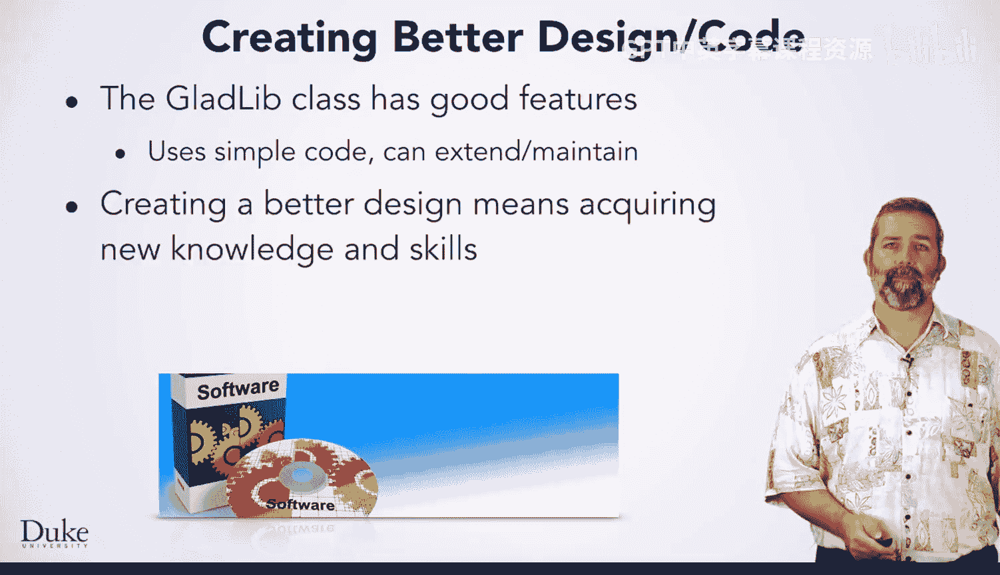
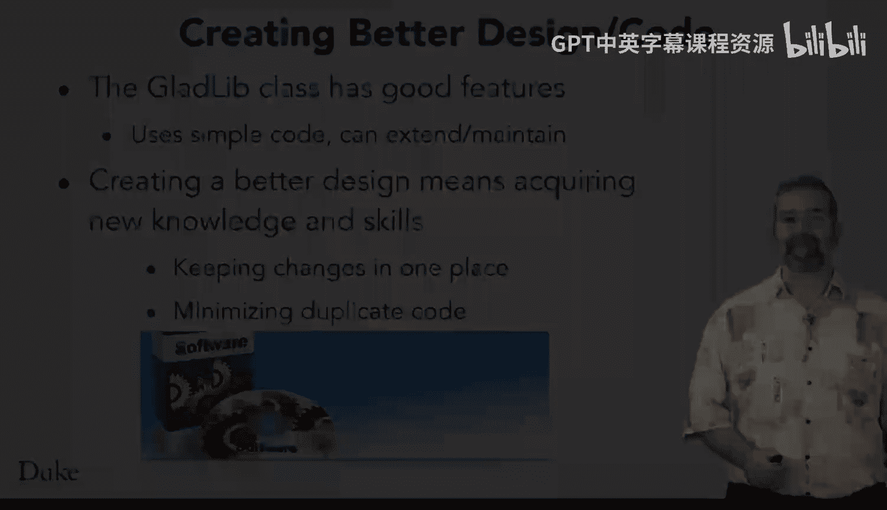

# 杜克大学《Java编程和软件工程基础2-5｜Java Programming and Software Engineering Fundamentals》中英 p96 30_03_02_脆弱代码.zh_en -BV18U411U729_p96-

We'll outline some of the design features of the Gladlib class and talk about software design in general。

Adding a new label like verb means modifying the Gladlibib。

 Java implementation in several different places and requires following a naming convention used in the class。

You'll need to create a new instance variable for the array list that stores examples of verbs like run。

 think， or swim。You'll need to initialize the array list using the method initialized from called from the constructor。

You'll need to get a random verb when needed by modifying the code in the method get substitute。

 You should follow the naming conventions used in the class where the label noun is associated with the instance variable noun list。

 just as the label country is associated with country list。This means。

You should use the name verbalist for a field that's the array list that store strings that are verbs。

As you modify and extend programs and classes， you'll gain experience with many kinds of programming and design。

You'll gain experience that will help you make good decisions when programming and create good designs。

But you'll see that sometimes experience comes from bad judgment or bad designs that nevertheless allow you to reason about the trade offs in doing things in more than one way。

So you might realize that a choice that works can lead to code that's not easy to maintain。

Some software designs are called brittle， meaning that the software or design breaks when you try to extend it or use it in ways that is a little bit different than what's initially intended。

Flexible designs， on the other hand， are are better able to cope with changes in the software。

When you learn about object into design， you might come across a principle that said that says code should be open for extension。

 but closed for modification。 The open closed principle。

The idea is that you should be able to extend software without extensive modifications to the existing code。

That's more possible with Ob oriented design ideas that we won't be able to cover in this course。

 but you can still create designs that are more open than others。

You'll be able to understand a better design after working with this design and implementation。

The Gladlib class does have some good features。It's relatively easy to understand each method。

 and the code works。It is possible to extend the code， as you'll see。

 even if the extension requires changing the code in several places。

You'll be able to create a better design after learning some new Java concepts we'll introduce soon。

But those concepts will be more clear because you'll have this experience with this code and class。

 and you'll understand why the new Java features can make the code simpler。

The new Java features will let you keep changes in one place rather than being sprinkled across three parts of the class。

The new features will also minimize the duplicated code that's in the current implementation。

Have fun making new stories。

