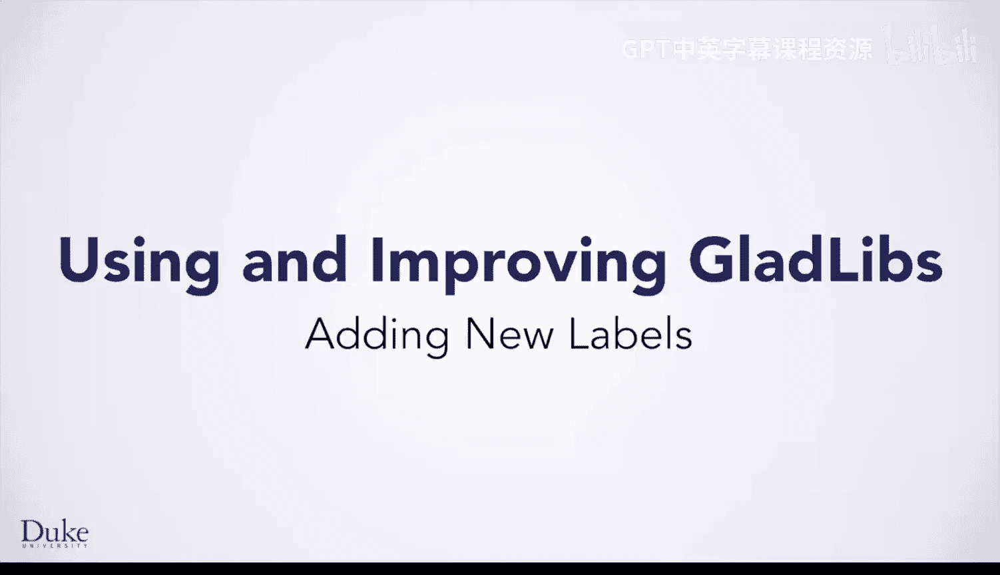
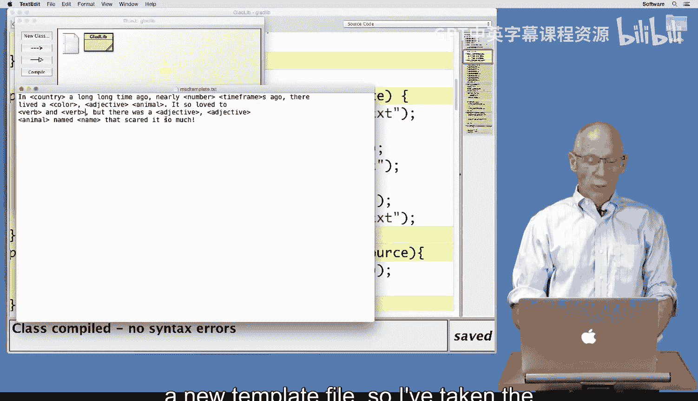
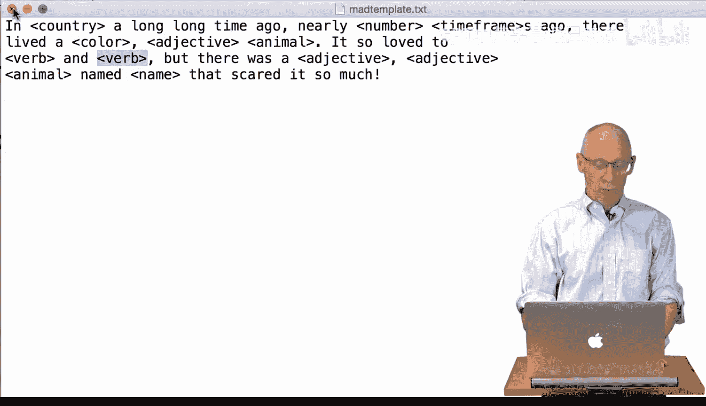
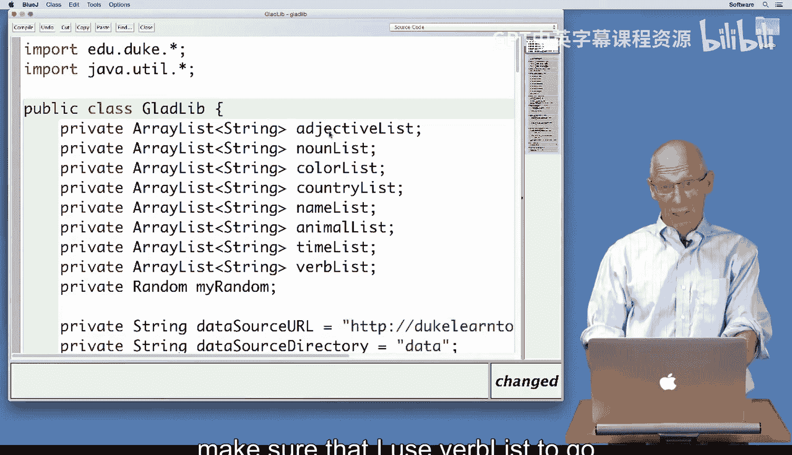
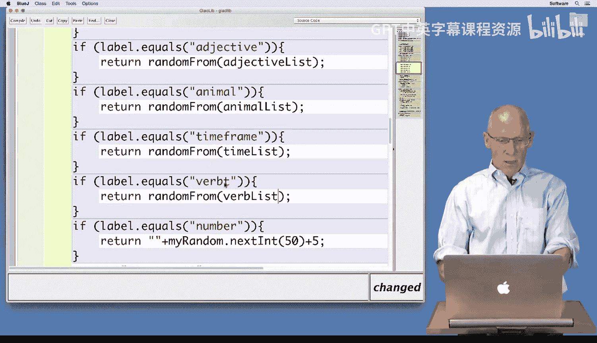
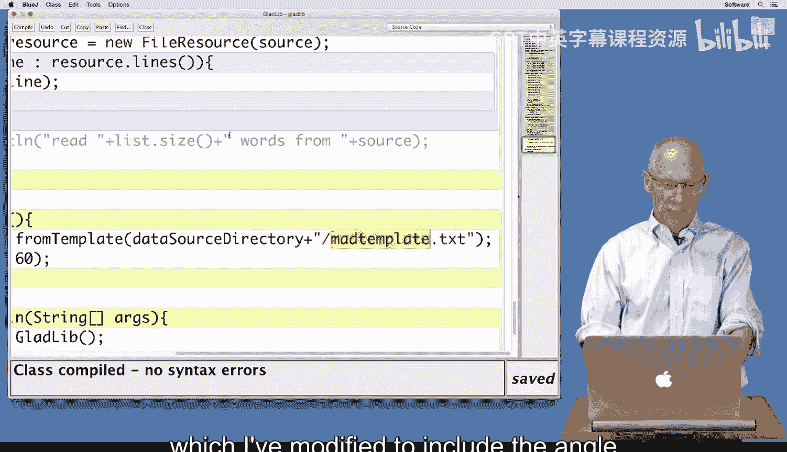
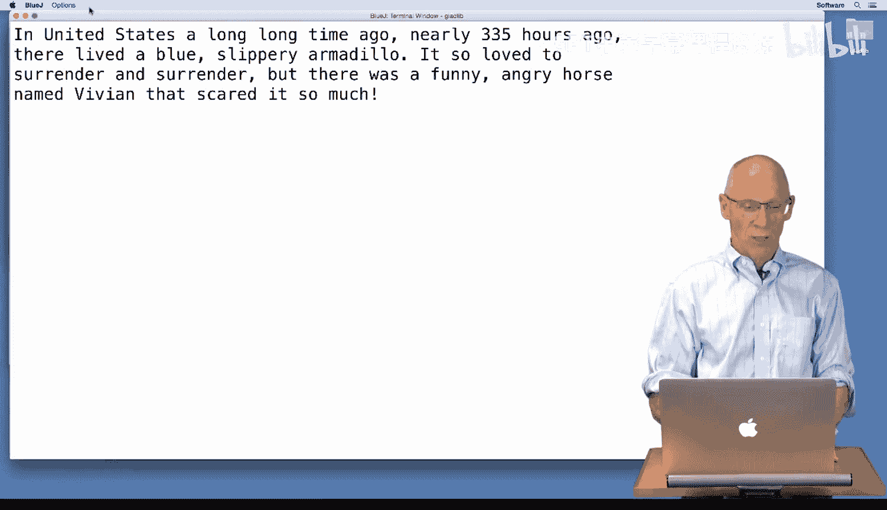

# 杜克大学《Java编程和软件工程基础2-5｜Java Programming and Software Engineering Fundamentals》中英 p97 31_03_03_添加新标签.zh_en -BV18U411U729_p97-

Hi， we're going to walk through the process of adding a new label to the GladlibB。

 Javava program and the Gladlibib class。A new label might be something like verb。

 which would go along with noun， color， and the other labels we have。To do that。

 you've seen part of that process outlined in one of the previous lessons。

 What I'm going to do here is show you that。To add a new label， we need a new template file。

 so I've taken the standard template file that we had before， which was called madtemplate。txt。

 and I've replaced S and danceance the two things that a creature would do in the stories we generated with verb and verb so I'm adding the label verb each to replace S and dance in the original story I've still called this madt。

 Txt you'll use whatever text editing software you have which is usually something like text editit on a Mac or notepad plus plus on a Windows machine。

 but you can use any text editor。

Now I'm going to take the Gladlib program that we've used before。

 and I'm going to walk through the locations where we need to make changes。

 I need to create a new array list to store my verbs。

I'm going to go along with the same conventions that have been used before and make sure that I use verb list to go along with adjective list。

 noun list， etc。

As I scroll through my source code， I see that these。

Araylets are initialized in the initialized from source method。

 It's called from our classes constructor。 I need to initialize verbist。

 and it's going to be initialized by calling， read it。Passing the source。

 which is either a place on my。Computer where it can access files or a URL， this is verb。txt。

I'm going to also have to make one other edition because now my label might be an adjective or an animal or a name。

 but I'm going to need to copy and paste these so that in addition to using timeframe。

 I'm going to use verb， so I'll replace that。Make sure I get the syntax right if the label is verb。

 I'm going to replace the label from verb list。

I'm going to compile my program。I know that in this program it's reading the template from MAtemplate。

txt， which I've modified to include the angle bracket verb angle bracket。

Label， I'm going to create a new Glib。On my object workbench。

And then I'm going to run the make story method。It's so loved to unknown and unknown。

 There was a funny， slippery line named Vivian that scared it so much。

 So if we go back and look at our source code， we'll see that it must have found verb。

 but failed to replace the verb with。The objects that it was replaced with， in this case。

 I've got verb list here。My instance variable。I've initialized it from verb here。

I've made sure that if， oh， look， if label dot equals verb T， I had a misprint when I spelled it。

 now it's got verb。So I'm going to go back and recreate that。Create my glad lib object。

Open it up and make a story。Hey， it's so loved to think and contemplate。

 but there was a gigantic gigantic tiger， let me run that one more time and see if I get something besides think and contemplate。

 it's so loved to ride and surrender。One more time and I'll be convinced that it's actually reading verbs。

It's so loved to surrender and surrender。 We've done nothing to make sure that it can use the same word or verb more than once。

 So just to remind you what we've done， I've used。

This location to change when the label was found。I've made sure that the label was read from the source。

 and I used verb list here， which is the name of my instance variable here， verb list。

 using the same naming conventions we've used in all the other programs。 I compiled my program。

 I tested it。 I created a new text file to hold verbs。And a new text file for the template。

Happy verbing。