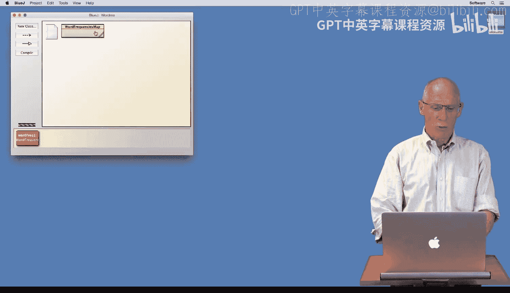
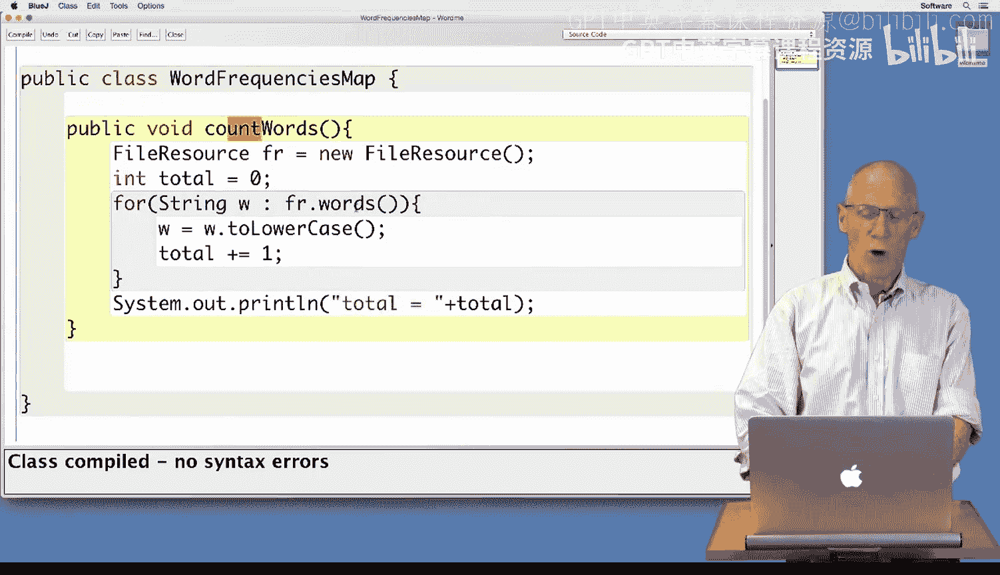
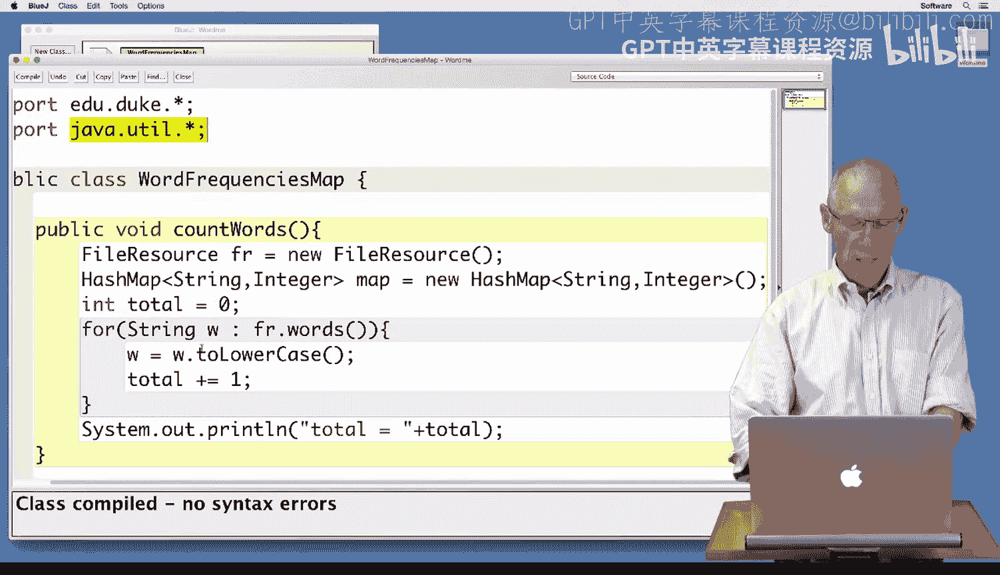
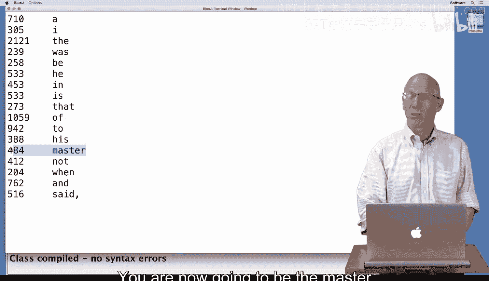
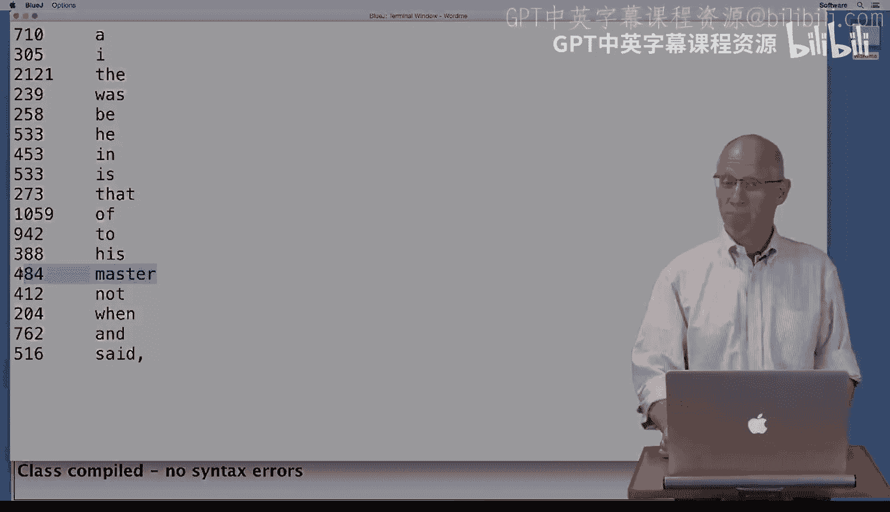

# 杜克大学《Java编程和软件工程基础2-5｜Java Programming and Software Engineering Fundamentals》中英 p99 33_03_06_HashMap用于唯一单词.zh_en -BV18U411U729_p99-

Hi， today， we're going to write some code to find out how many times every word in a file occurs。

 So we'll find out how many times the word the occurs。 how many times the word wonderful occurs。

 And we're going to start with a working program。 Let me show you very quickly what that looks like。

 this count wordss function that we have here。 This method count wordss。

 simply creates a file resource loops over all the words in it and counts how many total words there are。

 If I take this program。 make an object on my workbench， right click and call count wordss。

It will ask me。4。To enter the name of a file， I will use Confucius。

 and it will tell me that there are 34582 words in the works of Confucius。

 rather than knowing the total number of words， I'd like to find out how many times each individual word occurs to do that。

 I'm going to use a map。 So I'm going to need to add another local variable here。 A hash map。

 I'm going to map strings to integers。 Each string will be a word that occurs in my file。

 That's the key in this map。And the value in the map is how many times that word occurs。

So I need to create a new one。I'm allowed to make a hash map because I've imported Java dot ule。

 That's the package in which we find hash map。 Now， as I read the words。

 rather than incrementing the total， I'm going to ask， have we seen W in the map before。

 So I'm going to ask。

Whether the keyet。Associated with the map contains W。The word I'm looking for。And if it does。

I've seen the word before， I'm going to put the value。W back in the map。 It's already there。

 I'm going to get the number of times that word occurs and add once。

 I'll go over again what I'm doing in a minute。 If I've never seen the word before。

Then what I'm going to do is put it in my map。With the number one。

 because the word will have occurred one time。Let me compile and make sure I've got that right。

So let me go over very quickly what I've just done。I've looked to see。

 does this word W that I just read and converted to lowercase， Is it in my keyset。

 Have I ever seen it before？If I have seen it before。

 let me get the integer value associated with it。 That's the number of times that's already occurred。

Add one to that。And put that in the map as a key value pair with the word and an incremented count。

 If I've never seen it before， this is the first time。I've now。Added all the values to the map。

 And I'd like to print them out。 The way I'm going to print them out is to loop over。The keyet。

That's all the words that are keys in my map。And I'm going to get the value associated with it。

 that's the number of occurrencecurs。That's the value associated with my word。

 And if that value is big， And here， I'm going to say if it's bigger than 500。

I'm going to print the words that occur a lot。Which is so I'm going to print the number of occurrences。

A tap character。 and the word itself。So I'm looping over the keyet that allows me to find every key。

I'm getting the value associated with that key in the map。And if that's big， I'm going to print it。

Big in this case， is bigger than 500。So I'm going to right click and create a new object。

And I'm going to invoke the method count words， which before used to count the total number of words。

 And now it's going to count all the individual words in Confucius。

 And here we can see that in the file， Confucius。 there are not that many words that occur more than 500 times。

 the occurs more than 2000 times。 and occurs 762。 If I want to see a little more in the way of words。

 I'll say 200， just to make sure that I'm getting something more。And I'll make a new version。Of this。

That sits on the object workbench。 I'll right click and call count words。I'll once again。

 count Confucius。 And you can see there are more words。 Master occurs 484 times。

 Confucius was the master of many things。 You are now going to be the master of programming as you use maps to map keys to values to solve many problems。

 Have fun coding。

