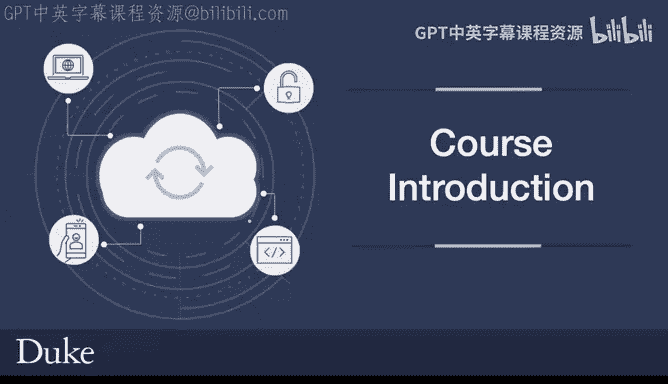
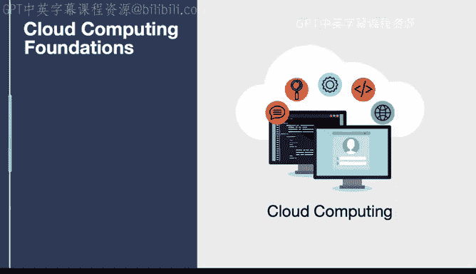
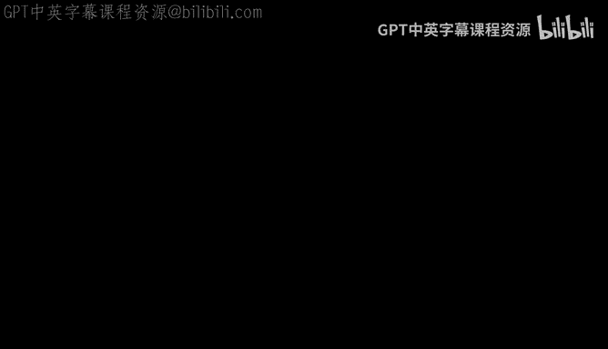

# 002：课程介绍 🚀

在本节课中，我们将概述《云计算基础》课程的核心学习目标。你将了解本课程涵盖的关键主题，包括技术沟通、项目管理、持续交付管道构建、多种云服务模型的应用，以及DevOps原则和基础设施即代码的实践。

## 课程学习目标

上一段我们介绍了课程的整体框架，接下来，我们将详细拆解本课程的具体学习目标。以下是你在完成本课程后将掌握的核心技能：

1.  **应用沟通原则**：你将学习在技术讨论中应用相关的沟通原则、概念和方法。
2.  **执行技术项目管理**：你将学习使用多种工具来规划和执行有效的技术项目管理。
3.  **构建持续交付管道**：你将在三大主流云平台（AWS、Azure和GCP）上，使用Python为数据工程和机器学习项目构建持续交付管道。
4.  **创建多种云服务网站**：你将学习使用多种不同的云服务模型创建网站，包括：
    *   使用S3创建静态网站。
    *   使用Lambda创建无服务器架构网站。
    *   使用Azure App Services、AWS Elastic Beanstalk和GCP App Engine创建平台即服务（PaaS）网站。
5.  **评估与选择云服务模型**：你将学习评估不同的云服务模型，以便有效地选择正确的抽象层级，包括基础设施即服务（IaaS）、裸机即服务（MaaS）、平台即服务（PaaS）和无服务器（Serverless）。
6.  **应用DevOps原则**：你将学习将DevOps原则应用于云计算、数据工程和机器学习领域。
7.  **实践基础设施即代码**：你将学习结合使用基础设施即服务（IaaS）和基础设施即代码（IaC）来以可重复且幂等的方式管理和配置云资源。
8.  **评估最佳实践**：你将学习评估在云计算中实施解决方案的最佳实践。

## 总结

本节课中，我们一起学习了《云计算基础》课程的完整学习路径。从技术沟通与项目管理的基础，到在三大云平台上构建实际的数据与机器学习管道，再到深入理解和应用从IaaS到Serverless的各种服务模型，最后通过DevOps和基础设施即代码实现高效、可靠的云运维。现在，让我们正式开始学习之旅。