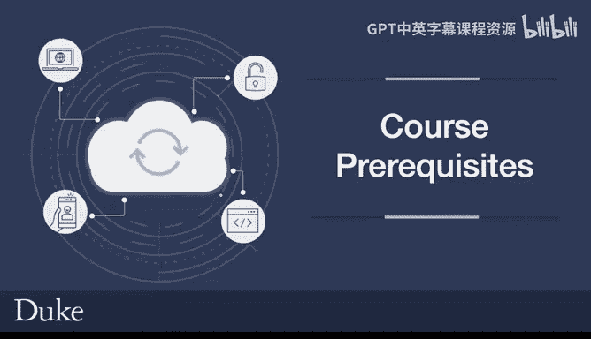
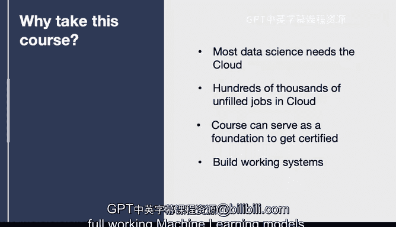

# 003：课程先修要求 📚

在本节课中，我们将要学习成功学习本课程所需具备的先修知识与技能。了解这些要求将帮助你评估自己是否已做好准备，并明确在课程开始前可能需要补充学习的领域。

## 先修知识概述

为了能够顺利地跟随本课程并充分理解其内容，学员需要具备以下几方面的基础知识。这些技能是构建后续复杂云计算解决方案的基石。

以下是本课程的核心先修要求列表：

*   **Python编程能力**：需要具备中级水平的Python知识。这意味着你需要能够**构造语句**、**理解变量**，并能够**编写小型脚本**。
*   **Linux基础知识**：需要掌握基本的Linux操作技能，包括**在文件系统中导航**以及**运行Shell命令**。
*   **IT基础设施概念**：需要理解关键的IT基础设施组件，例如**虚拟机（Virtual Machine）** 和**数据库（Database）** 的基本概念。
*   **数据格式理解**：需要能够理解**JSON**和**YAML**文件格式及其结构。这是控制云生态系统的关键，因为传递JSON（本质上类似于Python字典）或YAML数据是云操作中的常见任务。

## 学习本课程的意义

上一节我们介绍了课程的技术先修要求，本节中我们来看看为什么值得投入时间学习这门课程。掌握云计算技能在当今的科技行业中具有重要价值。

以下是学习本课程的主要意义：

*   **满足数据科学需求**：大多数数据科学项目最终都需要云平台。虽然可以在笔记本电脑上进行小型项目，但笔记本不具备近乎无限的计算和存储扩展能力，而云服务正好提供了这种可扩展性。
*   **巨大的职业机会**：根据亚马逊云科技（AWS）的研究，市场上有数十万个未填补的云计算相关职位。行业存在巨大的人才需求缺口，快速接受相关培训至关重要。
*   **获取认证的基础**：本课程可以作为考取三大主流云平台（AWS、GCP、Azure）认证的基础。你可以先通过本课程打下坚实基础，再决定向哪个平台深入发展。
*   **构建实际系统**：本课程非常注重职业技能培养，你将学习如何构建可工作的系统，范围涵盖从命令行工具、Web应用程序到完整的可运行机器学习模型。

本节课中我们一起学习了本课程所需的先修技能以及学习它的重要意义。确认你已掌握或计划学习这些先修知识，将帮助你更好地开启构建大规模云计算解决方案的旅程。