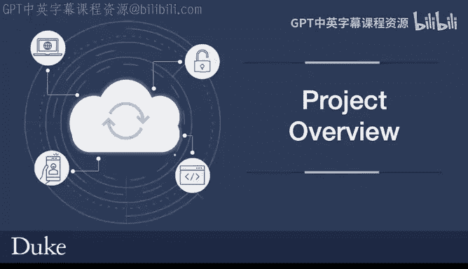
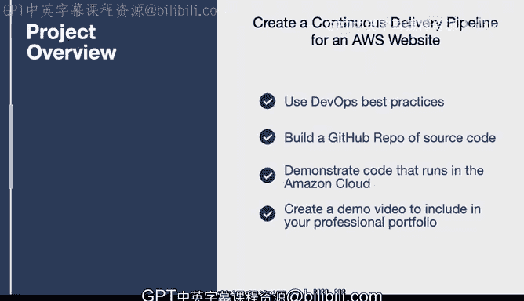

# 005：项目概览

在本节课中，我们将介绍课程一的最终项目。该项目将引导你构建一个基于AWS的静态网站，并为其配置一个持续交付流水线。通过完成这个项目，你将能够展示在AWS云环境中部署和交付代码的实际操作能力。

## 项目简介

上一节我们介绍了课程的整体目标，本节中我们来看看具体的实践项目。该项目的核心是创建一个基于Hugo框架的静态网站。

这个网站将由AWS S3托管，并通过AWS CodePipeline实现持续交付。你的源代码将存放在GitHub仓库中。

## 项目架构与流程

你的网站将被静态部署到一个名为Amazon S3的云原生环境中。当你通过GitHub进行推送或更改时，此事件将触发一个在AWS CodePipeline持续交付系统上运行的持续交付流程。

不必担心这些术语可能让你感到困惑，我们将在课程中逐步深入讲解。

## 你将如何构建

接下来，我们谈谈你将如何构建这个项目。你将运用本课程中涵盖的最佳实践，以及构建持续交付系统的技能。

以下是项目完成后你将获得的具体成果：
*   一个包含你源代码的GitHub仓库，证明你能够交付可在亚马逊云中运行的代码。
*   一段展示部署过程和可运行网站的演示视频。

我们设计这个项目的目的，是帮助你构建一个丰富的作品集，以展示你具备成为一名云架构师所需的实践技能。

## 总结

本节课中我们一起学习了课程一最终项目的概览。我们了解到，该项目将结合Hugo静态网站生成器、GitHub、AWS S3和AWS CodePipeline，构建一个完整的持续交付流水线。在接下来的课程中，我们将逐步深入每个环节，帮助你掌握构建云解决方案的核心技能。