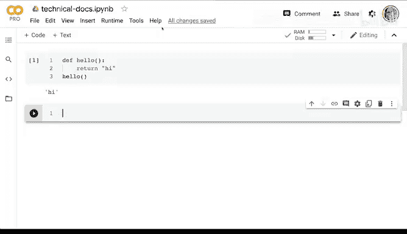
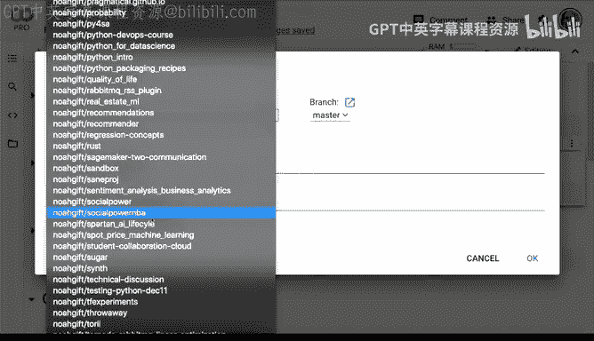
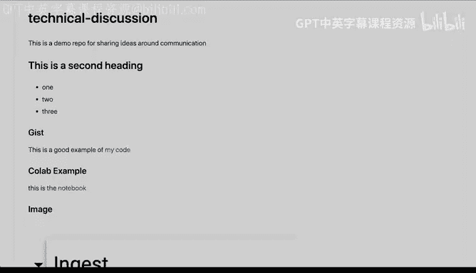

# 007：使用Markdown、GitHub和Jupyter Colab进行技术讨论 📝

在本节课中，我们将学习四种快速进入有效技术讨论的方法。我们将重点介绍如何使用GitHub、Markdown、Gist和Jupyter Colab来创建可重复、结构清晰的技术文档和讨论。这些工具能帮助你清晰地分享代码、想法和项目进展。

---

## 使用GitHub和Markdown创建技术讨论

上一节我们介绍了课程目标，本节中我们来看看第一种技术：使用GitHub和Markdown。

GitHub是一个用于进行源代码版本控制并与他人共享代码的平台，它内置了强大的协作功能。Markdown是一种轻量级标记语言，能让你轻松地编写格式化的文档。

以下是创建GitHub仓库和Markdown文档的步骤：

1.  **创建新仓库**：在GitHub上创建一个新的仓库（Repository），用于存储你的工作。例如，可以将其命名为“technical discussion”。
2.  **添加描述**：为仓库添加描述，例如“A demo repo for sharing ideas around communication”。
3.  **初始化文件**：创建时，建议勾选“Add a README file”选项，这样就能立即开始基于Markdown的文档编写。同时，可以添加一个`.gitignore`文件（例如选择Python模板），以避免将编译产生的临时文件（如`.pyc`）提交到仓库中。
4.  **编辑文档**：在仓库中，点击README文件旁的铅笔图标进行编辑。你可以使用Markdown语法来格式化内容。
    *   使用`#`创建标题。
    *   使用`##`创建二级标题。
    *   使用`*`或`-`创建项目符号列表。
5.  **预览与保存**：编辑时，可以随时预览渲染后的效果。完成后提交更改。

Markdown的优点是直观且可移植。你编写的原始Markdown文本可以轻松地放入书籍、网站或其他支持Markdown的平台中，因此它是进行技术讨论的理想格式。

---

## 使用Gist分享代码片段

我们已经学会了如何创建README文件来进行技术讨论。接下来，让我们看看第二种方法：使用Gist分享小型代码片段。

Gist是GitHub提供的一项功能，专门用于分享单文件或少量文件的代码片段。它的优势在于能自动进行语法高亮，并且易于嵌入或链接到其他讨论中。

以下是使用Gist的步骤：

1.  **访问Gist**：在GitHub主页或通过 `gist.github.com` 访问Gist功能。
2.  **创建Gist**：输入代码片段描述、文件名（如`hello.py`）和代码内容。
    ```python
    def hello(x, y):
        return x + y
    ```
3.  **选择可见性**：你可以创建公开（Public）或秘密（Secret）的Gist。公开Gist可以被任何人查看。
4.  **分享链接**：创建后，你会获得一个唯一的URL。你可以将这个链接复制到你的技术讨论文档中。
    *   例如，在Markdown中：`[这是一个Gist示例](https://gist.github.com/your-gist-id)`

使用Gist分享代码，能确保对方看到正确的语法高亮和格式，避免了因直接粘贴代码到聊天工具（如Slack）可能引入的乱码或格式错误问题。此外，其他人还可以在你的Gist上添加评论。

---

## 使用Jupyter Colab创建交互式笔记本

接下来，让我们深入了解第三种强大的工具：Jupyter Colab。



Jupyter Colab是Google提供的托管版Jupyter Notebook服务。它允许你创建包含可执行代码、可视化结果和格式化文本的交互式文档，非常适合进行复杂的数据分析、机器学习项目演示或技术教程。

以下是使用Colab的核心步骤：

1.  **访问与创建**：访问 [colab.research.google.com](https://colab.research.google.com) 并创建一个新的笔记本。使用Google账号即可免费使用。
2.  **混合编写**：在单元格（Cell）中，你可以编写代码并直接运行。
    ```python
    def greet(name):
        return f"Hello, {name}!"
    print(greet("World"))
    ```
    你也可以将单元格类型切换为“文本”，使用Markdown编写格式化的说明文档。
3.  **结构化项目**：你可以用Markdown标题将笔记本组织成清晰的章节，例如：
    *   `## 1. 数据获取`
    *   `## 2. 探索性数据分析`
    *   `## 3. 模型构建`
    *   `## 4. 结论`
4.  **利用硬件加速**：在“运行时”菜单中，你可以选择使用GPU或TPU来加速计算密集型任务。
5.  **分享与保存**：
    *   **分享链接**：点击右上角的“共享”按钮，可以生成链接，像共享Google文档一样与他人协作。
    *   **保存至GitHub**：通过“文件” -> “在GitHub中保存副本”，可以将笔记本直接保存到你的GitHub仓库中。这会将`.ipynb`文件提交到仓库，他人不仅可以查看代码，还可以通过Colab链接打开并运行它。

将Colab笔记本保存到GitHub，结合了交互式编程和版本控制的优点，是进行可复现技术讨论最有效的方式之一。

---

## 在Markdown中嵌入图片的技巧



最后，我们来学习一个实用的小技巧：如何在Markdown文档中便捷地嵌入图片。

这个方法适用于GitHub README、Jupyter Notebook的Markdown单元格以及任何支持Markdown的平台。核心是利用GitHub Issues作为免费的图床。

以下是具体操作步骤：

1.  **在GitHub仓库中新建Issue**：进入你的仓库，点击“Issues”标签页，然后点击“New issue”。
2.  **拖拽上传图片**：在Issue的编辑框中，直接将本地截图或图片文件拖拽进去。GitHub会自动上传图片并生成一个Markdown格式的图片链接，例如：
    ``
3.  **提交Issue**：提交这个Issue，图片链接就会永久生效（只要该Issue存在）。
4.  **在文档中引用**：复制生成的图片链接，粘贴到你的README文件或Colab笔记本的Markdown单元格中。

通过这种方式，你可以轻松地在技术文档中插入图表、截图或示意图，使说明更加直观。

---

## 总结

本节课中我们一起学习了四种进行有效技术讨论的工具和方法：

1.  **GitHub与Markdown**：用于创建结构化、可版本控制的文档。
2.  **Gist**：用于分享和讨论独立的代码片段，并保证格式正确。
3.  **Jupyter Colab**：用于创建交互式、可执行且易于分享的代码笔记本，是实现复杂项目演示和可复现研究的利器。
4.  **图片嵌入技巧**：利用GitHub Issues作为图床，在Markdown文档中方便地插入图片。




综合运用这些工具，你可以构建出清晰、专业且易于他人理解和参与的技术讨论内容。