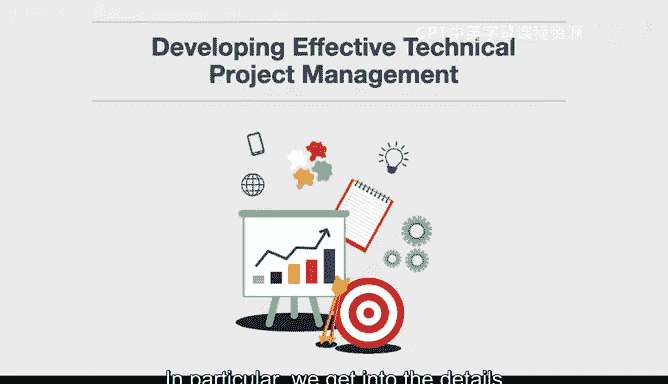
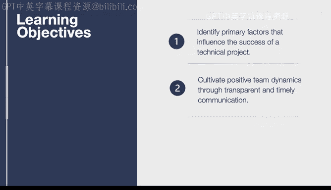
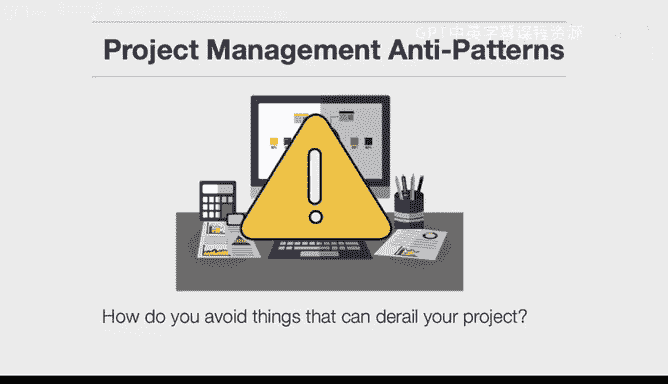
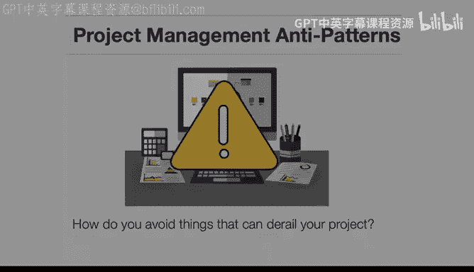

# 013：技术项目管理介绍 🚀

在本节课中，我们将学习如何开展有效的技术项目管理。我们将深入探讨一些能极大简化工作流程的高效工具，并了解影响项目成败的关键因素。

上一节我们介绍了课程的整体目标，本节中我们来看看技术项目管理的具体内容。

## 识别影响技术项目成功的主要因素

首先，我们需要明确哪些是决定技术项目成败的核心要素。成功的项目通常优化了这些方面，而失败的项目则往往在这些方面存在不足。

## 通过透明及时的沟通培养积极的团队动力

其次，我们将学习如何通过透明和及时的沟通来建立积极的团队协作氛围。这意味着要利用最佳的异步协作技术和高效的软件工具，而非低效、粗糙的沟通方式。

接下来，我们将介绍几个具体的工具和方法。

以下是本课程将涵盖的三个核心工具与实践：

1.  **使用 Trello 进行工单跟踪**：Trello 是一个极简的工单跟踪系统。我们将展示如何使用它来建立一个简单的工作流，从而消除许多无用的沟通（如临时打扰或本可异步进行的周会）。
2.  **使用电子表格进行项目管理**：电子表格是一项古老的技术，自20世纪80年代初就已存在，但在项目管理中依然极其有效。我们将用它来构建项目结构。这是一个在许多百万美元级别的项目中都被验证过的高效工具。
3.  **识别并避免项目管理中的反模式**：我们将讨论如何避开那些可能导致项目脱轨的陷阱。这些做法可能在当时看起来不错，但一旦实施却可能带来灾难性后果。

---

本节课中我们一起学习了技术项目管理的基础，包括影响项目成功的关键因素、促进团队协作的沟通原则，以及 Trello、电子表格等实用工具的介绍。在接下来的课程中，我们将逐一深入这些工具的具体使用方法。