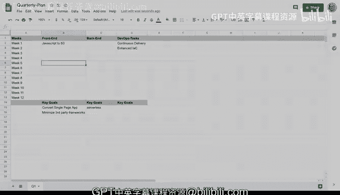

# 016：使用电子表格进行项目规划 📊

在本节课中，我们将学习如何使用电子表格工具（如 Google Sheets）来制定初步的项目规划。这是一种经典且高效的项目管理方法，尤其适合在项目初期梳理思路、设定目标并规划时间线。

上一节我们介绍了项目规划的重要性，本节中我们来看看如何利用电子表格这一具体工具来落地执行。

## 创建季度计划模板

首先，我们打开一个电子表格（例如 Google Sheets）来创建一个季度计划模板。我们将这个工作表命名为 **`Q1`**，代表第一季度的计划。

接下来，我们设置表格的初始列。在 **A列**，我们可以将其定义为“周数”。随后的几列可以用来代表项目的不同交付部分，例如：

*   **B列**：前端开发
*   **C列**：后端开发
*   **D列**：DevOps 任务

我们可以调整列宽，使表格看起来更清晰、更易于阅读。

## 规划时间线与关键目标

在设置好列标题后，我们可以在第一行填入时间线。例如，A2单元格可以是“第1周”，你可以填入具体日期，也可以使用“第1周”这样的占位符。我们的目标是规划出一个季度（通常是12周）的时间框架。

在时间线下方，我们可以构建一个灵活的结构来列出每个部分的关键目标。例如：

*   在前端部分，一个关键目标可能是：**将应用转换为单页面应用（SPA）**。
*   另一个目标可能是：**尽量减少对第三方框架的依赖**。
*   在后端部分，一个目标可能是：**采用无服务器技术**。

## 制定周度任务计划

有了关键目标后，我们就可以开始规划每周的具体任务了。这是一个逐步细化的过程。

以下是逐周规划任务的示例：

*   **第1周**（后端）：建立持续交付（Continuous Delivery）流水线。
*   **第2周**（后端）：创建增强型的基础设施即代码（Infrastructure as Code）模板。
*   **第2周**（前端）：将 JavaScript 代码部署到 S3，让初始原型运行起来。

通过这种方式，你可以一步步地将宏观目标分解为可执行的周度任务。

## 电子表格规划的优势与价值

这种电子表格规划方法的核心价值在于，它允许你将想法可视化，并建立一个初步的行动路线图。它并不意味着计划会一成不变地发生，但远比没有任何规划要好得多。

根据我多年的项目管理经验，无论是管理5人的小团队还是遍布全球的数百人大型项目，我都是从这样一个季度计划开始的。它帮助我理清思路，估算可行性。

将计划写下来有诸多好处：
1.  它帮助你在规划每周工作时保持清晰的方向。
2.  它确保你对自己负责，避免尝试构建不可行的目标。
3.  它能极大地辅助你进行项目估算。

因此，尽管电子表格已经存在了几十年，但它仍然是你可以使用的最有效的项目管理工具之一。完成这里的初步规划后，你可以将其中的任务逐步导入到 Trello、Jira 或其他专业的工单系统中进行跟踪管理。

---

本节课中我们一起学习了如何使用电子表格来创建项目季度计划。我们掌握了从建立模板、设定关键目标到分解周度任务的完整流程。记住，有效的规划是成功项目管理的基石，而电子表格是一个简单而强大的起点。