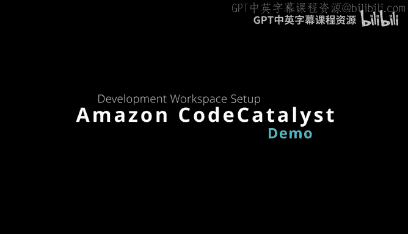
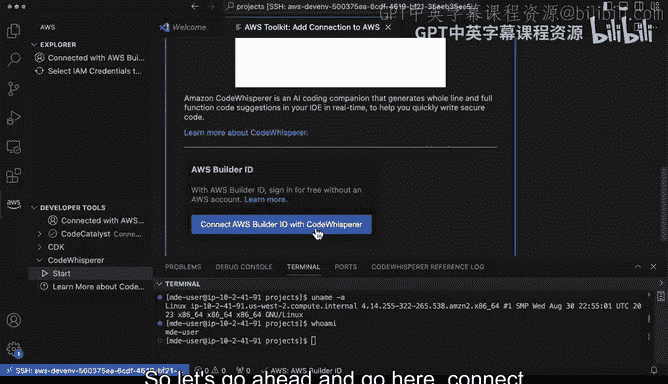
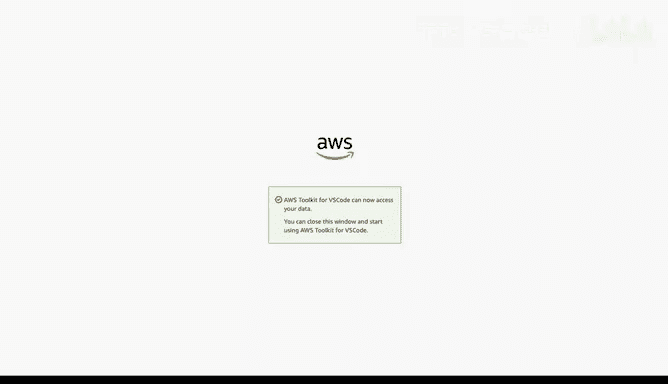
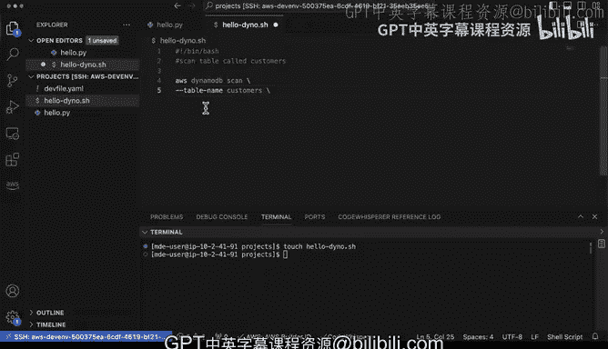

# 023：设置 Amazon CodeCatalyst 🚀



在本节课中，我们将学习如何设置并使用 AWS 提供的一款令人兴奋的开发工具——Amazon CodeCatalyst。我们将从登录开始，逐步创建一个云端开发环境，并集成强大的 AI 编程助手 CodeWhisperer，让你体验无缝的云端开发流程。

---

## 登录与访问

首先，在 AWS 工具包中，我们可以看到包括 CDK、CodeWhisperer 以及 CodeCatalyst 在内的多个工具。要开始使用 CodeCatalyst，我们需要登录到构建者账户。

以下是具体步骤：
1.  在工具包中选择 CodeCatalyst 并点击“开始”。
2.  系统会提示我们连接 AWS 构建者 ID。点击“连接 AWS 构建者 ID 与 CodeCatalyst”。
3.  这将打开一个配置文件页面，完成登录流程后，工具包中就会显示已登录状态。

登录成功后，我们便可以进行克隆代码仓库、打开或创建开发环境等操作。

---

## 创建开发环境

上一节我们完成了登录，本节中我们来看看如何创建一个全新的云端开发环境。

在 CodeCatalyst 界面中，点击创建新开发环境的按钮。系统会提供几个选项：
*   **使用现有的 CodeCatalyst 代码仓库**：如果你已有项目。
*   **创建一个空的开发环境**：这是探索和起步的推荐方式。

创建时，需要选择一个可用的“空间”和“项目”。我们可以将其作为一个临时项目，并为其设置一个别名（例如“delete-me”，以便后续识别和删除）。默认配置提供了 2 个 vCPU、4GB 内存、16GB 存储空间，并会在闲置 15 分钟后自动超时停止，这是一种节省成本的贴心设计。

**注意**：如果你为 CodeCatalyst 账户启用了计费，还可以选择启动配置更高的“大型环境”。为了演示，我们可以选择创建一个更大的环境。点击“创建开发环境”后，系统会自动打开一个新的 Visual Studio Code 窗口。

---

## 连接与验证

创建过程非常迅速和流畅。新窗口会自动建立 SSH 连接到远程机器。我们只需信任该连接即可。

环境准备就绪后，一个很好的习惯是打开终端进行验证。在终端中输入以下命令：

```bash
uname -a
```

此命令会显示系统信息，我们可以看到它运行的是 Amazon Linux。我们还可以输入：

```bash
whoami
```

来确认当前用户，它会显示与本地操作系统不同的云端用户身份。

---

## 集成 CodeWhisperer



现在我们已经有了一个可用的开发环境，接下来让我们集成 AWS 的 AI 编程助手 CodeWhisperer，以提升开发效率。

在 AWS 工具包中，找到 CodeWhisperer 并点击连接按钮。系统会再次引导我们完成登录授权流程：
1.  点击“连接 AWS 构建者 ID 与 CodeWhisperer”。
2.  在浏览器中确认并允许访问。
3.  关闭授权窗口，回到开发环境。



完成设置后，工具包中 CodeWhisperer 的图标会显示为已激活状态。现在，我们就可以开始使用它了。

---

## 开始云端开发

一切就绪，让我们开始编写一些简单的代码来体验这个组合的强大功能。

首先，创建一个新文件，例如 `hello.py`。在文件中，我们可以尝试输入一些注释或代码开头，CodeWhisperer 会自动提供建议。

例如，输入：
```python
# hello world python
def hello():
```
CodeWhisperer 很可能会自动补全一个 `print("Hello World")` 的函数体。这样，我们就快速得到了一个完整的 “Hello World” 示例。

同样，我们也可以尝试编写 Bash 脚本。新建一个文件，输入：
```bash
#!/bin/bash
# scan dynamodb table called customers
aws dynamodb scan
```
根据注释的上下文，CodeWhisperer 会帮助我们补全更具体的命令参数。

可以看到，**CodeCatalyst 提供的云端开发环境与 CodeWhisperer 的 AI 辅助编程相结合，是一个强大的组合**。它设置简单，在免费套餐中即可使用，同时也支持按需启动更强大的机器来满足大型项目的开发需求。

---



本节课中，我们一起学习了如何设置 Amazon CodeCatalyst 云端开发环境，从登录、创建环境到集成 CodeWhisperer AI 助手。这个工具组合让开发者能够快速获得一个配置好的、可随时访问的云端工作站，并借助 AI 提升编码效率，是进行现代云端应用开发的利器。