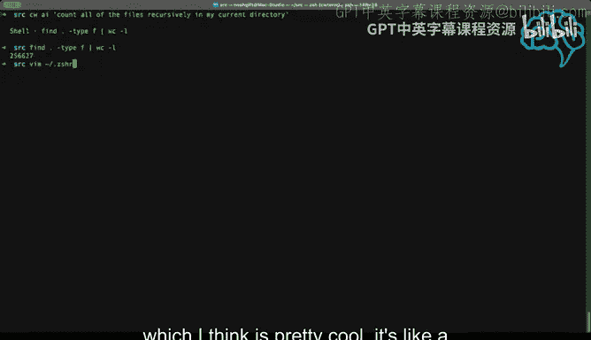
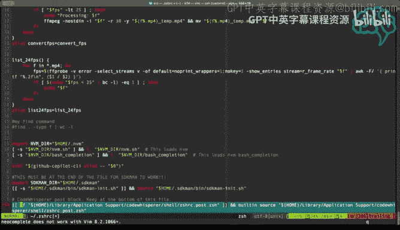
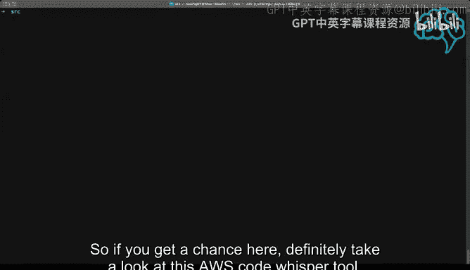

构建大规模云计算解决方案：1-2：AWS CodeWhisperer：自然语言转Bash CLI

在本节课中，我们将学习如何使用AWS CodeWhisperer工具，通过自然语言指令来生成并执行Bash命令行操作，从而提升在Shell环境中的工作效率。

AWS CodeWhisperer不仅是一个代码助手，它还能直接理解你的自然语言描述，并为你生成相应的Shell命令。这对于执行复杂查询或学习新命令非常有帮助。

接下来，我们将通过几个具体示例来演示其功能。

首先，我们可以在Shell中直接输入一个以`#`开头的自然语言问题。

例如，我们可以询问如何递归地统计当前目录下的所有文件数量。

输入指令后，按回车键，CodeWhisperer会提供一个命令建议。

我们可以执行它生成的命令：`find . -type f | wc -l`。

执行结果显示当前工作目录下共有256,000个文件。

这个工具的另一个优点是它具有教育意义。

你可以将生成的常用命令保存为别名（alias）或函数，集成到你的Shell配置文件中。

例如，你可以将统计文件的命令保存为一个别名，方便日后快速调用。

这样不仅能即时解决问题，还能帮助你系统地学习和积累Shell知识。

除了使用`#`提示符，CodeWhisperer还支持另一种更详细的提问方式。

你可以输入`cw ai`来启动一个更长的交互会话。

在这种模式下，你可以提出更复杂的问题。

例如，你可以询问如何查找所有CPU使用率超过10%的进程。

CodeWhisperer会生成一个相应的复杂命令，例如`ps aux | awk ‘$3 > 10 {print $0}’`。

执行该命令后，屏幕上会列出所有符合条件的进程信息。

在我看来，这个功能非常宝贵。

以下是使用AWS CodeWhisperer的几个主要优势：

*   **直接生成命令**：无需离开终端去搜索谷歌或Stack Overflow。
*   **辅助学习**：通过观察生成的命令，你可以逐步构建自己的命令行知识。
*   **提升效率**：它不仅仅是一个助手，更能实质性地让你变得更高效。

因此，如果你有机会，一定要尝试一下AWS CodeWhisperer这个工具。

它非常强大。其CLI功能可能是一个尚未被广泛认知的“隐形”利器。

你可以免费使用它，并在macOS等系统上通过原生扩展轻松安装。

本节课中，我们一起学习了如何利用AWS CodeWhisperer，通过自然语言指令来生成和执行Bash命令。我们看到了它如何将复杂的查询转化为可执行的命令行操作，以及如何通过保存别名来积累知识。这是一个能显著提升在Shell环境中工作效率和学习速度的强大工具。