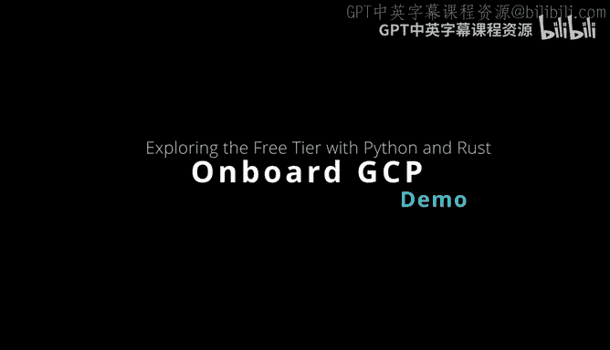
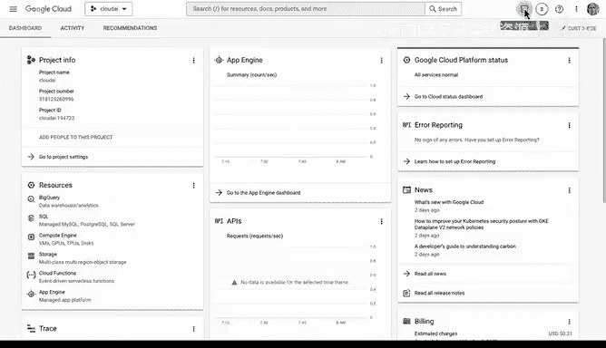
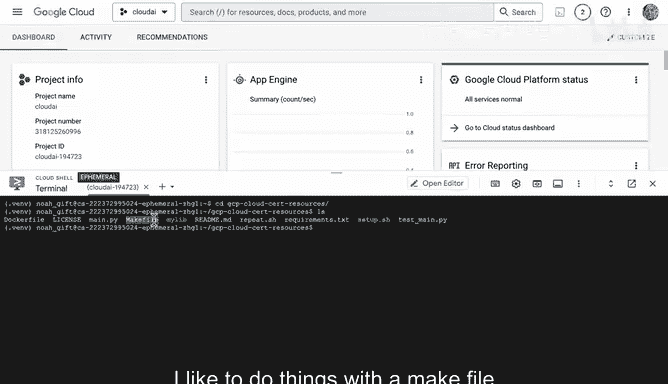
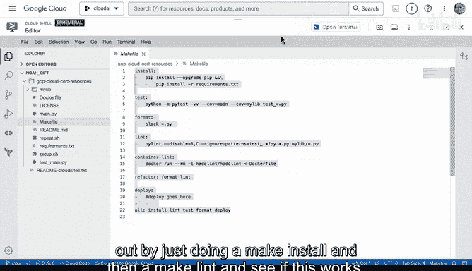
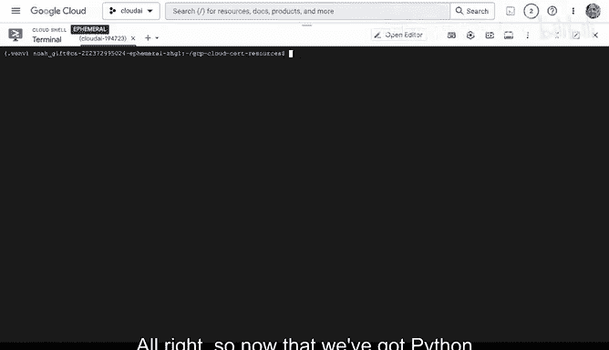
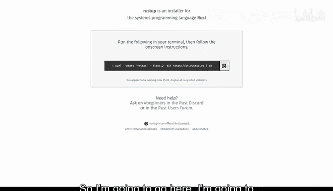
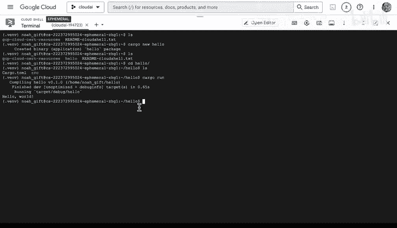
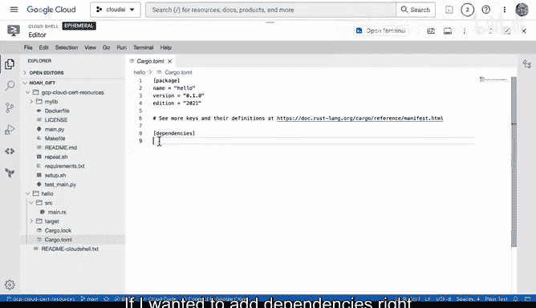
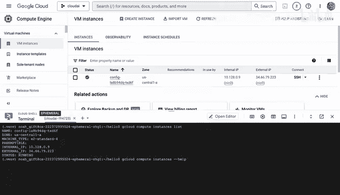
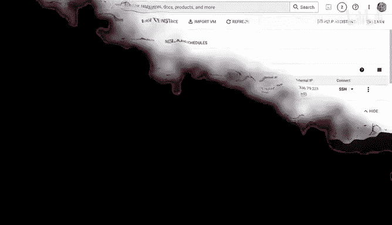

# 030：GCP开发环境入门 🚀



在本节课中，我们将学习如何开始使用Google Cloud Platform（GCP）的免费套餐，并设置一个基础的开发环境。我们将涵盖从访问控制台、使用Cloud Shell，到配置Python和Rust开发环境，以及管理虚拟机实例的完整流程。

---

## 了解Google Cloud免费套餐

首先，我们来了解Google Cloud的免费套餐。注册免费套餐后，你可以访问20多种免费产品，并获得300美元的免费信用额度。这些信用额度需要在三个月内使用。免费套餐包含的部分产品有：Compute Engine、Cloud Storage、BigQuery、Kubernetes、App Engine、Cloud Run、Cloud Build、Stackdriver、Filestore、Pub/Sub、Cloud Functions、Vision AI、Speech-to-Text、Natural Language API、AutoML等。实际上，这里提供了非常丰富的免费服务。

---

## 访问云控制台

现在，让我们开始操作。首先进入云控制台仪表板。在这里，你可以看到所有内容的概览。首先是项目信息，在这里你可以决定如何添加项目成员、配置项目设置等。仪表板中间区域显示了你最近访问的一些服务。右侧还有一个资源选项卡，可以切换查看不同的资源，例如，如果你想启动一台虚拟机。右侧还显示了状态信息。当你使用GCP时，这个仪表板将是你最常使用的起点。请注意，我在这里选择了一个项目。如果我想创建一个新项目，可以点击“选择项目”并创建新项目。



---

## 启动Cloud Shell

对于GCP的初学者，我建议首先启动Cloud Shell。Cloud Shell非常方便，因为它允许你立即开始构建解决方案，并在这个环境中尝试各种想法。

上一节我们介绍了如何访问控制台，本节中我们来看看如何利用Cloud Shell搭建开发环境。

以下是启动Cloud Shell后的第一步操作：

1.  **创建Python虚拟环境**：我喜欢做的第一件事是创建一个Python虚拟环境，以便在Cloud Shell中测试和运行Python项目。使用以下命令：
    ```bash
    python3 -m venv .venv
    ```
    这将在主目录下创建一个隐藏的虚拟环境目录。

2.  **配置环境自动激活**：接下来，我喜欢编辑我的`.bashrc`文件。在文件底部添加一行，以便每次打开环境时自动激活Python虚拟环境：
    ```bash
    source .venv/bin/activate
    ```
    这是一个实用的小技巧，可以避免许多与Python相关的奇怪问题。





3.  **克隆代码仓库**：如果我想访问一个包含代码的仓库（例如，这里有一些Python代码），并且不想推送更改回去，我可以直接在这个环境中使用`git clone`命令。例如：
    ```bash
    git clone <仓库URL>
    ```
    克隆后，我可以进入该仓库目录。

4.  **使用Makefile**：我喜欢使用Makefile，因为它能让我使用快捷命令。我们可以打开编辑器查看代码，这是GCP内部一个很好的资源。在目录中，我们可以看到Makefile，其中包含了`install`、`test`、`format`、`lint`、`container`、`refactor`等常见操作命令。这在GCP环境中工作时非常普遍，教程中也会看到类似的内容。

5.  **测试环境**：让我们通过运行`make install`和`make lint`来测试一下。`make install`会根据`requirements.txt`文件安装所有必需的包。安装完成后，运行`make lint`来检查代码格式。如果成功，说明我们的环境配置正确。我们还可以查看`main.py`文件，了解这个简单应用程序的结构。





---

## 安装Rust开发环境

现在我们已经让Python正常运行了，接下来还能做什么呢？我们还可以安装Rust。Rust是一门系统编程语言，其性能根据任务不同，可能比Python快40倍到1000倍。因此，如果你需要进行高性能计算，Rust是一个非常好的选择。

以下是安装Rust的步骤：

1.  访问`rustup.rs`网站，复制安装命令。
2.  在Cloud Shell中粘贴并运行该命令。这将下载并安装Rust环境，包括`cargo`（Rust的包管理器）和`clippy`（代码检查工具）。安装程序会自动将其添加到系统路径中。
3.  安装完成后，我们可以创建一个新的Rust项目来测试。使用命令：
    ```bash
    cargo new hello
    ```
    这会在当前目录创建一个名为`hello`的示例项目目录。
4.  进入项目目录，与Python不同，你几乎不需要任何额外步骤，直接运行：
    ```bash
    cargo run
    ```
    程序会被编译并运行，输出“Hello, world!”。
5.  我们可以查看项目结构，里面有一个非常简单的`main.rs`文件。如果需要添加依赖（例如GCP SDK），可以在`Cargo.toml`文件中进行配置。



---



## 管理虚拟机实例

最后，我们将学习如何启动和管理虚拟机实例。在GCP控制台中，我们可以进入Compute Engine部分。如果我想创建一个新实例，可以点击“创建实例”并选择机器类型。例如，启动一个微型实例时，界面会显示预估的月度费用（实际上按小时计费），这让你对成本有清晰的了解。如果选择一个大型机器（例如32核），月度费用可能高达500美元。因此，在启动机器时，务必注意查看不同的配置和费用指标。

由于我已经有一个正在运行的实例，我可以通过命令行来查看和管理它。在GCP教程中，使用命令行列出和管理机器是非常常见的操作。

以下是使用命令行管理实例的方法：

1.  你可以通过运行`history`命令查看最近使用过的命令，找到类似`gcloud compute instances list`的命令。
2.  运行`gcloud compute instances list`可以列出当前项目中的所有虚拟机实例。
3.  你还可以使用`gcloud compute instances`命令来执行更多操作，例如启动或停止实例。使用`--help`参数可以获取特定命令的更多信息。

GCP在很大程度上是一个面向命令行的服务，因此，如果你熟悉命令行操作，在使用Google Cloud时将获得极佳的体验。

---





本节课中我们一起学习了如何利用GCP免费套餐入门，包括访问控制台、设置Cloud Shell开发环境（配置Python和Rust），以及通过控制台和命令行两种方式管理Compute Engine虚拟机实例。这些是开始使用Google Cloud进行开发的基础步骤。