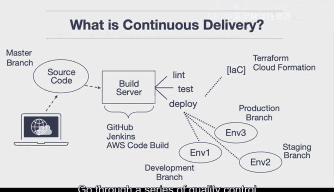

# 031：持续交付介绍 🚀

在本节课中，我们将要学习持续交付（Continuous Delivery）的核心概念。这是一种现代软件开发的最佳实践，旨在确保代码始终处于可部署状态，无论是应用程序本身还是运行它所需的基础设施。

## 什么是持续交付？

如果你曾接触过软件团队，你很可能听说过“持续交付”这个术语。这个术语意味着代码始终处于可部署状态，这既包括应用程序软件，也包括运行代码所需的基础设施。对于需要部署到云端的代码而言，这确实是一种现代最佳实践。

在过去，由于只有物理服务器，想要实现完全自动化的基础设施非常困难。如果你想拥有另一个版本的基础设施，就必须购买另一台服务器。而在云端，一切都是虚拟化的，因此你可以使用**基础设施即代码**来自动化并创建几乎无限数量的新环境。

如果构建服务器被设置为监听你的源代码控制仓库，代码就可以经历一系列操作：一个测试阶段、一个Lint阶段，可能还有一些负载测试。然后，你的**基础设施即代码**会检查基础设施，确保其设置正确，并最终部署该代码。

因此，这确实是云原生应用程序的现代软件工程最佳实践，所有公司都应该采用类似的方法。

## 持续交付的工作原理

上一节我们介绍了持续交付的理论概念，本节中我们来看看它的具体工作细节。

其工作方式如下：作为用户的你，可能在笔记本电脑上开发代码，然后将代码检入一个源代码控制仓库。通常，你会有一个主分支（例如 `master`），这是默认分支。GitHub（或类似平台）是将其连接到特定环境的地方。

这意味着当你做出更改时，一个构建服务器（这可以是多种类型，例如 GitHub Actions、Jenkins 或 AWS Code Build 等云原生服务）会开始工作。这里的核心思想是，所有工作都在这个构建服务器中完成。

以下是构建服务器执行的主要步骤序列：

1.  **检出代码**：构建服务器检出你告知特定任务要监听的分支。
2.  **代码检查与测试**：服务器对你的代码进行 Lint 检查（代码风格和质量检查）和测试。
3.  **基础设施即代码检查**：服务器查看**基础设施即代码**配置（这可能是 Terraform、CloudFormation 或其他如 Pulumi 等工具）。
4.  **环境更新或创建**：**基础设施即代码**允许你动态更新现有环境，甚至创建一个全新的环境。

通常，这个环境会直接映射到你源代码控制中的分支。例如：

*   **开发分支**：映射到开发环境。
*   **预发布分支**：映射到预发布环境。
*   **生产分支**：映射到生产环境。

这种做法的好处是，你可以将代码推送到开发分支（这可能是你大部分时间工作的地方）。当你准备好测试一个将来要上生产环境的变更时，可以将其合并到预发布分支。系统会自动执行 Lint 检查、测试代码，并将其部署到预发布环境。然后，你可以进行非常广泛的负载测试，以验证你的 Web 应用程序是否可以扩展到 10 万用户。

测试完成后，你可以决定将其合并到生产分支。合并后，系统会执行相同的流程：从预发布合并到生产的代码会经历 Lint 检查、测试，然后部署到生产环境。

## 核心思想与总结

本节课中我们一起学习了持续交付的机制。其核心思想是，你正在构建一个“软件工厂”。这个工厂就像任何其他工厂一样，你需要质量控制，需要自动化。只不过在这个案例中，工厂生产的是软件，而部署目标是云端的基础设施。

因此，**持续交付意味着你的代码始终处于可部署状态**。这并不一定意味着你必须自动将其推送到生产环境，因为你可以将其暂存在预发布环境中。但当确实需要推送到生产环境时，你可以通过将代码合并到生产分支来自动完成这一过程，使其经过一系列质量控制测试，然后实际部署出去。

简而言之，持续交付通过自动化构建、测试和部署流程，将软件发布变得可重复、可靠且高效，是云时代软件开发的关键实践。