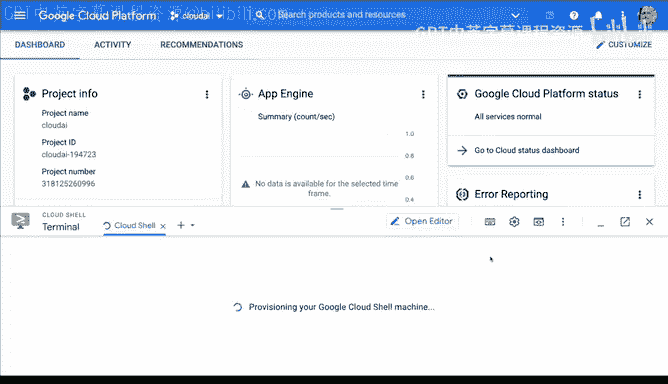
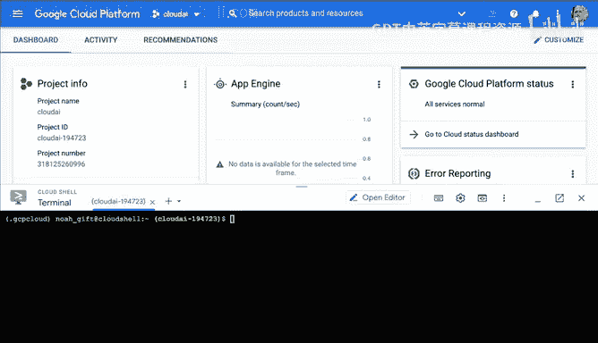
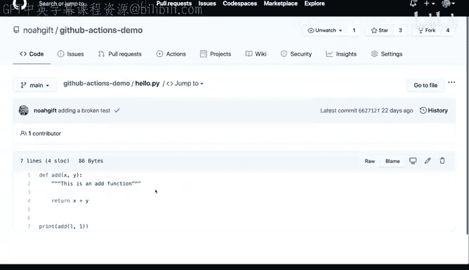
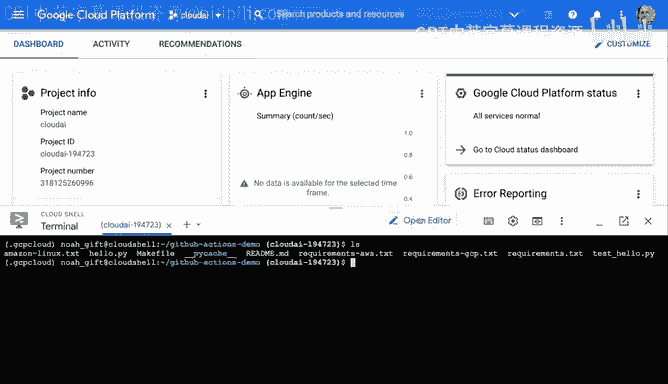
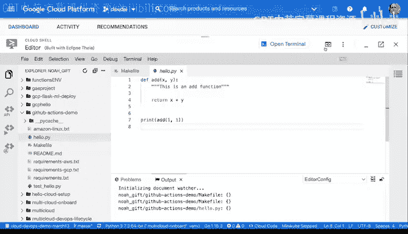
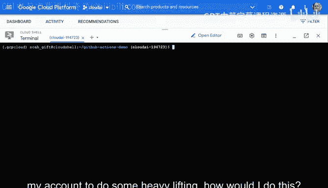
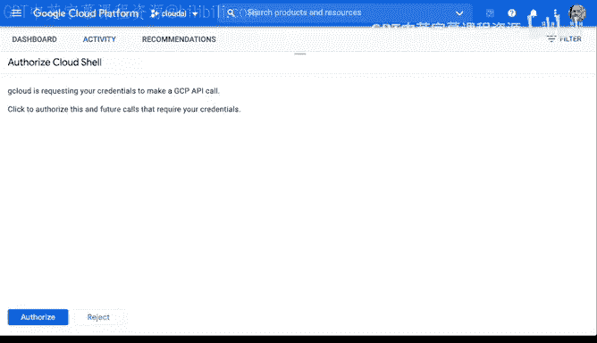
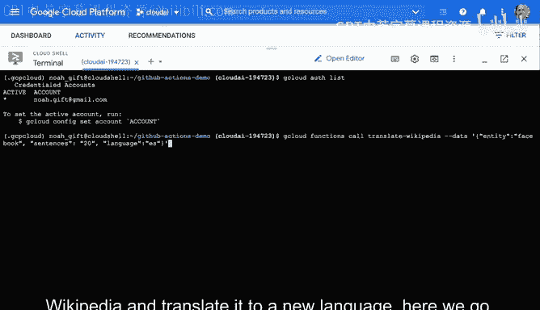
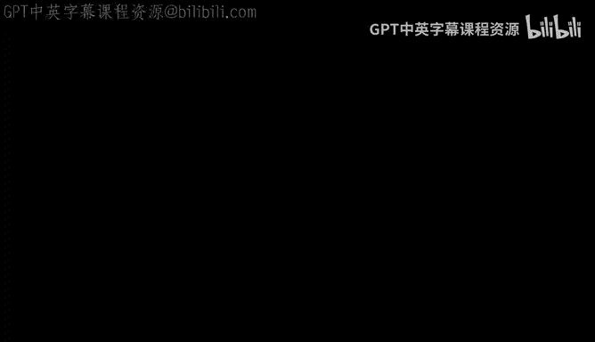

# 032：使用Google Cloud Shell进行云开发 🚀

## 概述
在本节课中，我们将学习如何使用Google Cloud Shell进行云开发。Google Cloud Shell是一个基于浏览器的命令行环境，预装了开发工具，并直接集成在Google Cloud Console中，是开始云上项目的理想起点。

## 启动与探索Cloud Shell
上一节我们介绍了云平台的基本概念，本节中我们来看看如何启动并使用Google Cloud Shell。

这是Google Cloud Platform控制台。与其他云平台类似，它也提供了一个Cloud Shell环境。对于Python开发者，尤其是在该云平台上开始工作时，我推荐使用这个环境。你可以通过点击控制台右上角的图标并选择“激活Cloud Shell”来找到它。

点击后，系统将启动一个云端终端。该终端预装了一些非常有用的工具，例如特定版本的Python和一些Google Cloud Platform的命令行工具，这些工具可用于执行管理任务。这确实是云Shell环境如此重要的核心功能之一。可以说，这是大多数项目的默认起点。

激活并打开Shell后，我首先建议进行一些简单的探索。

以下是你可以尝试的几个步骤：
*   输入 `which python` 命令，查看系统中Python的安装位置。
*   运行 `python` 命令，启动Python解释器。注意，当前环境可能默认是Python 2。
*   运行 `python3` 命令，检查是否安装了Python 3。

## 配置Python开发环境
了解了基本环境后，接下来我们需要配置一个独立的Python开发环境。

我建议创建一个虚拟环境。在Google Cloud Shell中，你可以通过两种方式之一来完成。系统已预装了名为 `virtualenv` 的工具。因此，我可以输入 `virtualenv` 命令来创建新环境。

以下是创建和激活虚拟环境的步骤：
1.  运行命令 `virtualenv ~/.gcp-cloud` 来创建一个名为 `.gcp-cloud` 的隐藏虚拟环境。
2.  运行命令 `source ~/.gcp-cloud/bin/activate` 来激活这个虚拟环境。

## 从GitHub克隆并运行项目
环境配置好后，我们就可以开始实际的开发工作了。下一步通常是获取代码并运行它。

我将开始处理一个GitHub仓库。我会导航到我已设置好的一个仓库，并克隆它。这个仓库包含了我所需的一切：用于测试代码的GitHub Actions工作流，以及一个非常简单的“hello”文件，它只是将一些数字相加。

以下是克隆和设置项目的流程：
*   在首次与GitHub通信前，你需要创建SSH密钥。可以使用命令 `ssh-keygen -t rsa` 来生成，然后连续按回车键接受默认设置。生成公钥后，需要将其添加到你的GitHub账户中。
*   在GitHub仓库页面，点击“Code”按钮，确保选择“SSH”选项，复制仓库的SSH地址。
*   在Cloud Shell中，使用 `git clone <仓库SSH地址>` 命令克隆仓库。
*   进入克隆的目录，使用 `git pull` 命令检查并拉取任何更新。

现在，如何运行这些代码呢？因为我喜欢使用Makefile，所以可以输入 `make install` 命令。这个命令会检查并安装任何需要的新软件包。系统会开始安装这些更新。

## 使用云端集成开发环境
如果你不太喜欢在命令行中完成所有工作或使用命令行编辑器，Cloud Shell还提供了一个完整的IDE。

我可以点击“打开编辑器”图标，然后调整窗口，就能访问一个功能齐全的IDE。我可以在这里进行各种操作，构建完整的项目。

让我们找到我正在处理的项目。它叫做“GitHub actions demo”。如果我选择Makefile，就能看到它的内容。如果我打开“hello”文件，也能看到其中的代码。如果需要，我可以在这里直接修改文件。

这里的主要收获是：就像你的笔记本电脑一样，Google Cloud Platform中的云环境拥有你所需的一切。它既有编辑器，也有终端。此外，我还可以运行像 `gcloud` 这样的命令，这些是内置的、用于管理Google Cloud Platform的工具。

## 与云服务交互
真正的关键在于，与大多数云平台一样，你可以在一个项目中调整一切，进行探索和运行。我还想展示一个实用的小技巧。

如果我想登录我的账户以执行一些需要权限的操作，该怎么做呢？例如，我可以输入 `gcloud auth list` 来查看当前授权账户。要登录，系统会弹出一个授权窗口，允许我进行API调用。

授权完成后，我现在可以运行一个我之前构建的云函数。这个函数可以从维基百科获取文本并将其翻译成另一种语言。

你可以看到，我不仅可以在Cloud Shell中构建自己的项目，还能直接调用云环境中的服务。这正是基于云的环境的关键优势：它与所有其他云服务紧密集成。

## 总结
本节课中，我们一起学习了如何使用Google Cloud Shell进行云开发。我们从启动和探索Cloud Shell开始，接着配置了Python虚拟环境，然后从GitHub克隆并运行了一个示例项目。我们还体验了内置的云端IDE，并演示了如何通过命令行工具与Google Cloud服务进行交互。Cloud Shell提供了一个功能齐全、集成度高的开发环境，是快速开始在Google Cloud上构建项目的强大工具。