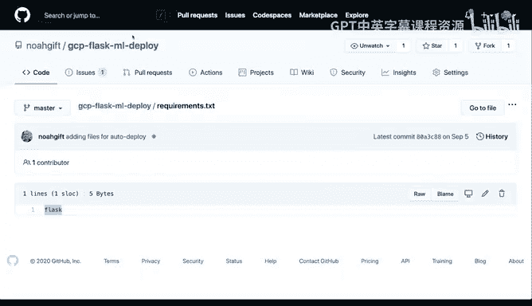
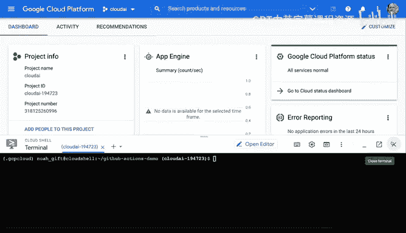
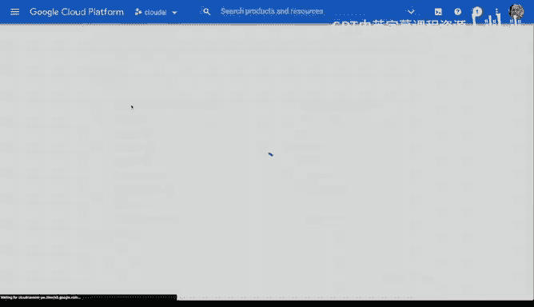
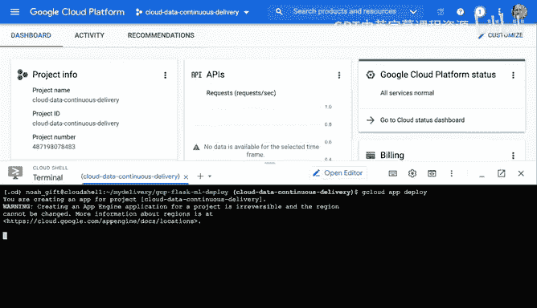
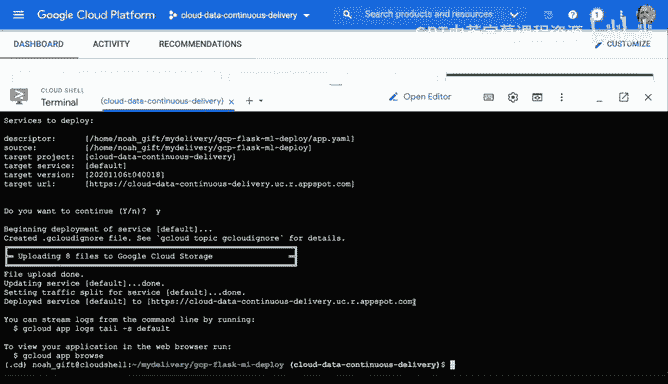
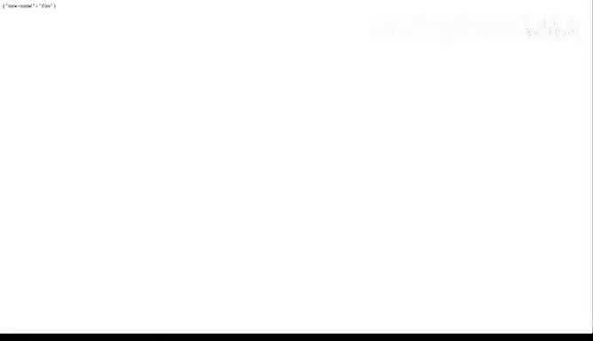
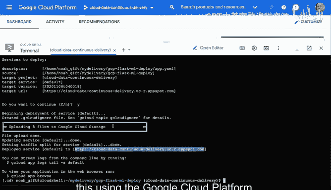

# 033：GCP Google App Engine从零开始持续交付 🚀

在本节课中，我们将通过一个实际项目，学习如何在Google Cloud Platform上为Google App Engine应用设置一个完整的持续交付流程。我们将从创建项目、部署应用到配置自动化部署，一步步构建一个自动化的发布管道。

---

## 概述

持续交付是一种软件开发实践，旨在通过自动化流程，确保代码变更可以快速、可靠地发布到生产环境。本节我们将利用GCP的核心服务，为一个小型Flask应用搭建这样的自动化流程。



---

## 核心组件

要理解GCP上的持续交付，首先需要了解几个核心配置文件。

以下是实现持续交付所需的关键文件：





1.  **`app.yaml` 文件**：此文件定义了应用的运行时环境。例如，对于Python应用，它会指定Python版本。
    ```yaml
    runtime: python39
    ```

2.  **`cloudbuild.yaml` 文件**：此文件指示Cloud Build服务器如何构建和部署应用。一个最简单的部署命令如下：
    ```yaml
    steps:
    - name: 'gcr.io/cloud-builders/gcloud'
      args: ['app', 'deploy']
    ```

3.  **应用源代码**：一个简单的Web应用。我们使用一个Flask应用，它包含两个路由：一个返回“Hello World”，另一个回显传入的名称。

4.  **`requirements.txt` 文件**：此文件列出了应用所需的所有Python依赖包。

准备好这些文件，就完成了基础设置。

---

## 项目初始化与本地测试



上一节我们介绍了核心配置文件，本节中我们来看看如何初始化项目并在本地运行。

首先，我们需要在Google Cloud上创建一个新项目。



1.  访问Google Cloud控制台，创建一个全新的项目，命名为 `cloud-data-continuous-delivery`。
2.  创建完成后，在Cloud Shell中激活这个新项目。
3.  将包含上述配置文件和源代码的Git仓库克隆到本地目录。
4.  进入项目目录，创建一个Python虚拟环境以隔离依赖：
    ```bash
    virtualenv ~/.cd_env
    source ~/.cd_env/bin/activate
    ```
5.  安装应用依赖：
    ```bash
    pip install -r requirements.txt
    ```
6.  在本地运行应用进行测试：
    ```bash
    python main.py
    ```
    应用将在本地端口8080启动。使用Cloud Shell的“网页预览”功能，可以访问 `http://localhost:8080` 并看到“Hello World”的返回信息，这验证了应用在本地运行正常。


---

## 首次部署到Google App Engine

成功在本地运行应用后，下一步就是将其部署到Google App Engine的生产环境。





在Cloud Shell中，使用 `gcloud` 命令行工具进行部署：
```bash
gcloud app deploy
```
执行此命令后：
*   系统会提示选择部署区域（例如 `us-central`）。
*   `gcloud` 工具会自动读取项目中的 `app.yaml` 文件，根据指定的运行时配置环境，并将应用部署上线。

部署完成后，命令行会提供一个生产环境的URL。访问该URL，即可看到线上运行的应用。我们还可以测试 `/echo/<name>` 路由，确认功能完整。

---

## 配置自动化持续交付管道

手动部署已经完成，但真正的威力在于自动化。本节我们将配置Cloud Build，实现代码变更后的自动部署。

目标是：每当向代码仓库的主分支推送新更改时，自动触发构建并将应用重新部署到App Engine。

以下是配置自动触发器的步骤：

1.  在GCP控制台导航到 **Cloud Build** 服务。
2.  点击 **“触发器”**，然后点击 **“创建触发器”**。
3.  为触发器命名（例如 `cloud-delivery-auto-deploy`）。
4.  选择触发条件为 **“推送到分支”**，并指定分支为 `master`（或您的主分支名称）。这意味着每次向该分支推送代码时都会触发构建。
5.  连接到您的GitHub仓库，并选择对应的项目仓库。
6.  在构建配置中，选择 **“cloudbuild.yaml”** 文件，它位于您的仓库根目录。

在创建触发器前，需要确保以下两项服务已启用：

*   **App Engine Admin API**：允许Cloud Build服务代表您调用App Engine的部署API。
*   **Cloud Build 服务账户权限**：需要确保Cloud Build使用的服务账户拥有部署到App Engine的权限。通常需要在IAM中为 `[PROJECT_NUMBER]@cloudbuild.gserviceaccount.com` 账户添加“App Engine Deployer”角色。

完成这些设置后，自动化管道就配置完毕了。

---

## 测试持续交付流程

管道配置完成后，我们可以通过一个简单的修改来测试整个流程是否工作。

1.  编辑 `main.py` 文件中的“Hello World”消息，例如将其改为“Hello World! Testing Continuous Delivery.”。
2.  将这次更改提交并推送到GitHub仓库的 `master` 分支。
3.  推送完成后，立即转到GCP控制台的 **Cloud Build** 历史记录页面。您将看到一个新的构建任务自动开始运行。
4.  Cloud Build会自动执行 `cloudbuild.yaml` 中定义的步骤：拉取最新代码、执行部署命令。
5.  等待构建状态显示“成功”。然后，刷新您的App Engine生产环境URL。页面上的问候语应该已经更新为您刚才提交的新消息。

这证明从代码提交到生产环境部署的整个流程已经完全自动化。

---

## 总结

本节课中我们一起学习了如何在Google Cloud Platform上为App Engine应用搭建持续交付管道。

我们首先了解了核心的配置文件（`app.yaml`, `cloudbuild.yaml`）。接着，我们从零开始创建项目、部署应用，并验证其功能。最后，我们配置了Cloud Build触发器，实现了代码推送后的自动构建与部署。


整个过程清晰展示了在云环境中设置自动化部署的简便性。对于使用Flask等框架的项目，这已成为一种最佳实践。您可以通过复刻示例仓库，快速在自己的GCP项目中体验这一流程。