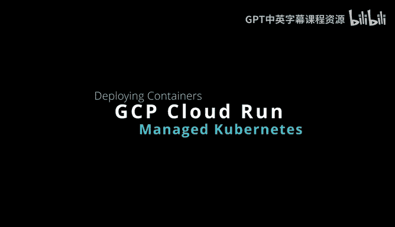
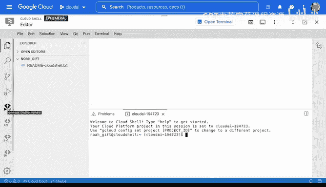
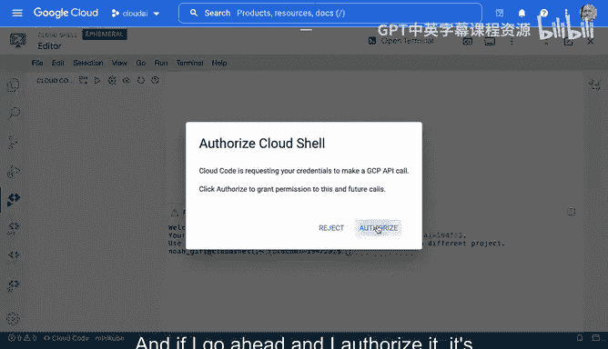
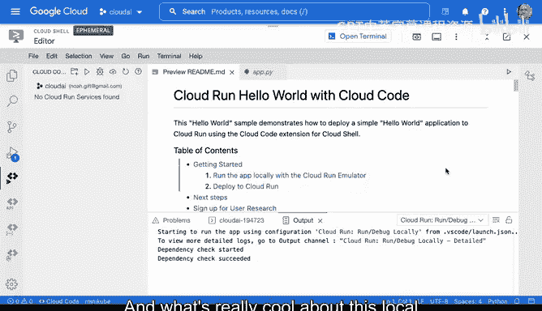
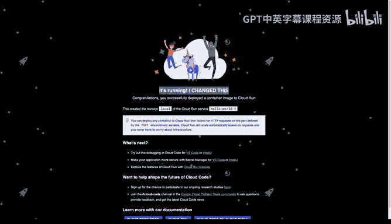
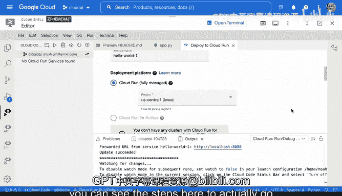

# 034：使用GCP Cloud Run构建微服务 🚀

在本节课中，我们将学习如何使用Google Cloud Platform的Cloud Run服务来构建和部署一个容器化的微服务。我们将从零开始，在云端开发环境中创建应用，在本地模拟器中测试，最后将其部署到生产环境。

---

上一节我们介绍了Cloud Run作为运行容器的全托管平台。本节中，我们来看看如何从零开始创建一个Cloud Run应用。

在Google Cloud控制台中，你可以直接点击按钮开始使用Cloud Run。另一个有趣的选项是从头开始创建。我们可以激活Cloud Shell，它会提供一个专为构建容器应用而定制的完整IDE，并可以将应用推送到生产环境。

在Google Cloud编辑器中，有许多便捷功能，包括启动终端进行操作。这些基于云的开发环境更有趣的一点是，你可以通过菜单选择不同的服务并以原型化的方式构建它们。

我们选择Cloud Run并授权，它将为我们设置一个用于原型化Cloud Run应用的环境。

---

进入环境后，我们可以创建一个新的Cloud Run应用。

以下是创建步骤：
1.  选择“创建新的Cloud Run应用”。
2.  选择一个模板，例如“Python Cloud Run”。
3.  点击“创建新应用”。

环境会为我们下载并设置好一切。在这个环境中，我们拥有文档、初步设置，甚至一个已经构建好的Dockerfile。这是学习如何构建应用的好方法，因为Google的专家展示了具体该怎么做。他们甚至使用了非常精简的Alpine容器。

我们还可以查看这里的样板代码，它是一个非常简单的服务，但之后会被推送到一个托管的容器编排服务中，我们无需进行任何运维工作。

---

上一节我们创建了应用的基础框架。本节中，我们来看看如何让这个应用运行起来。

首先，我们使用云模拟器在本地运行应用，然后将其部署到Cloud Run。这是入门的最佳方式之一。

具体操作是：点击云状态栏，选择“在云模拟器上运行”。这会在本地运行一个迷你版的Cloud Run环境。

我们转到状态栏，选择我们的Cloud Run应用，然后点击“在本地Cloud Run模拟器上运行应用”。让我们看看它是如何工作的。

它显示“构建环境：本地”。我们继续操作，它会询问一些设置。这个本地服务的酷炫之处在于，当我实际修改代码原型时，它可以自动重启。这是一种非常流畅的开发容器化应用的方式，我可以实时编辑，它会为我重建容器。如前所述，当我想部署时，它可以直接推送到生产环境。

加载需要一点时间。设置完成后，它会“监视更改”。一方面，我还可以预览它。将鼠标悬停其上，我们可以查看，非常酷，一个应用正在运行。

如果我想在本地调试，一个很酷的功能是：我可以看到它正在运行。如果我更改代码并保存，它会自动重启。我再次回到服务URL查看，更改已经生效。这是一个用于原型化云服务的绝佳环境。

---

上一节我们在本地成功运行并测试了应用。本节中，我们来看看如何将其部署到生产环境。

现在，让我们回到控制面板，停止本地服务。然后，我们可以将其部署到生产环境。

为此，我可以选择“部署到Cloud Run”。这将直接把应用推送到生产环境。实际上，一旦你拥有了一个容器，使用Cloud Run这样的服务来设置微服务就变得非常直接。你可以看到这里列出了部署其余代码的步骤。

---

本节课中，我们一起学习了使用GCP Cloud Run构建微服务的完整流程。我们从在云端开发环境中创建Python应用开始，接着使用本地模拟器进行测试和实时调试，最后将容器化应用一键部署到生产环境。这个过程展示了Cloud Run如何简化容器化微服务的开发、测试和部署，让开发者能够专注于代码本身。