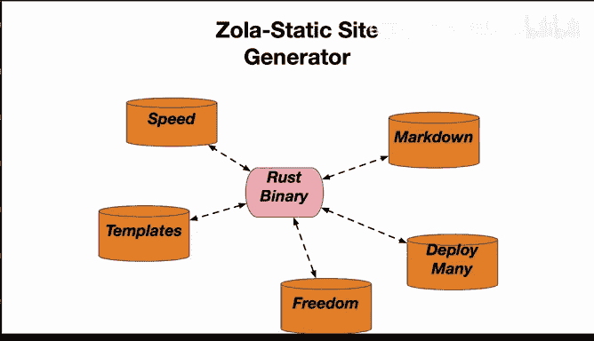
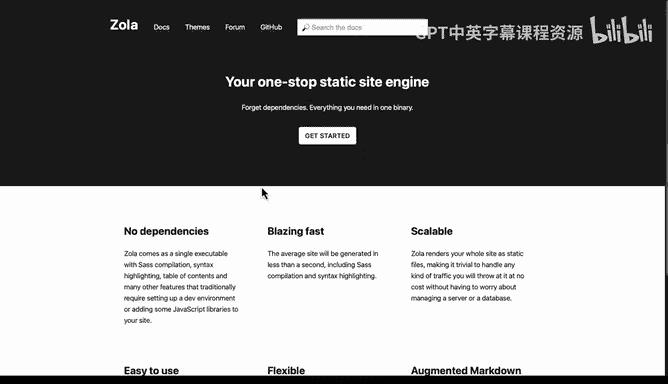

# 045：使用Zola构建静态网站 🚀

在本节课中，我们将学习如何使用Zola这一静态网站生成器来构建网站。我们将了解其核心优势、基本工作原理以及快速上手的步骤。

Zola是一个用Rust语言编写的静态网站生成器。它是一个可以下载的Rust二进制文件。这使得它易于上手，并且可以跨多种不同平台移植，在不同环境中安装也非常简单。

## 速度优势 ⚡

首先我们来谈谈速度。由于内容被预构建成静态HTML文件，Zola能够极其快速地生成网站。这比动态内容管理系统的生成速度要快得多。

## 核心特性与优势 ✨

以下是Zola的一些核心特性和优势：

*   **模块化模板**：这些模板是可复用的，有许多优秀的模板可供直接使用或在其基础上构建。
*   **基于Markdown**：这是一个巨大的优势。你只需编写易于人类阅读的Markdown文件，它就能自动转换为外观精美的网站。
*   **支持高级功能**：它支持Sass和CSS等高级功能，这些Sass编译器能为设计师实现更复杂的效果。
*   **易于发布和部署**：你可以轻松地将网站部署到GitLab Pages、AWS或其他云环境中。
*   **自由度高**：这一点非常重要。许多公司提供“点击即用”的网站生成器，但你需要为此付费，并且需要赌这家公司能长久运营。如果你自己拥有静态网站，你可以将其迁移到任何地方，甚至可以将文件离线交给他人。

使用静态网站生成器有许多优点。Zola是一个“一体化”的静态站点引擎，没有外部依赖，速度极快，可扩展性强，并且非常易于使用。

## 快速入门指南 🛠️

上一节我们介绍了Zola的优势，本节中我们来看看如何快速开始使用它。文档中会指导你完成一些常见的必要步骤。

以下是开始构建网站的基本流程：

1.  **构建初始结构**：创建网站的基本目录和文件结构。
2.  **构建网站**：将你的静态文件（如Markdown）转换为最终的HTML网站。
3.  **本地服务**：在本地启动一个服务器来预览网站效果。
4.  **检查**：对网站进行语法或链接检查。

需要注意的是，大多数人可能希望从一个主题开始。你可以直接下载一个主题，然后就可以开始使用了。这使得Zola的入门变得非常简单。

## 总结 📝

本节课中我们一起学习了Zola静态网站生成器。它拥有速度快、基于Markdown、模板丰富、部署简单等诸多优点。在所有这些能力中，最重要的或许是它带来的**自由**——你不会被锁定在某个可能因资金撤出而关闭的平台上，你可以完全掌控自己的内容。使用静态网站生成器能带来许多基于自由度的优势。