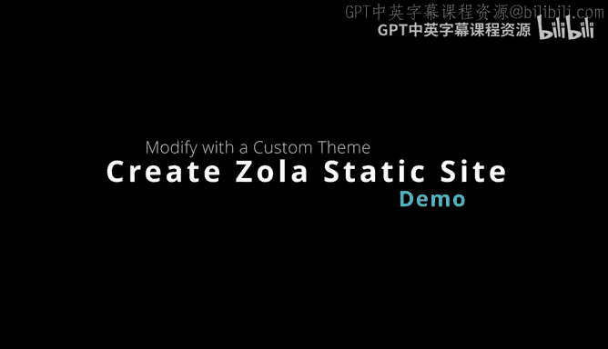
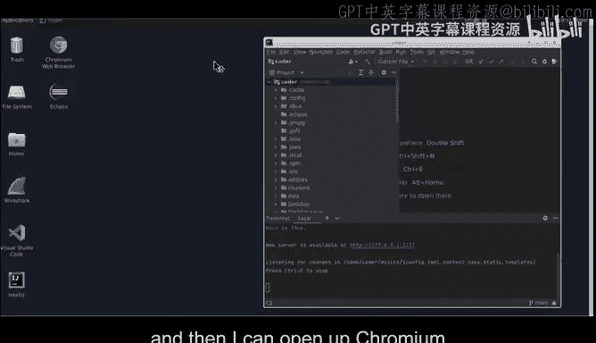
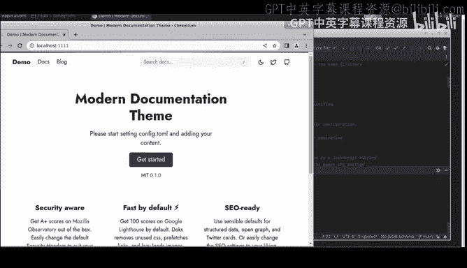

# 046：自定义Zola主题 🎨



在本节课中，我们将学习如何使用静态网站生成器Zola，并为其应用一个自定义主题。我们将从初始化一个Zola站点开始，然后集成一个主题，最后进行简单的配置修改以验证我们的工作。

---

## 启动Zola并初始化站点

首先，我们在一台Ubuntu桌面机器上启动Zola。我们将打开一个代码工作空间，并确保有一个终端窗口来辅助我们的工作流程。

进入工作空间后，我们首先列出目录内容，确认Zola已安装。接着，我们使用 `zola init` 命令来初始化一个新的站点。

```bash
zola init my_site
```

在初始化过程中，我们通常选择所有默认选项以快速完成设置。初始化完成后，我们可以进入站点目录并运行Zola的本地服务器。

```bash
cd my_site
zola serve
```

服务器启动后，我们可以在浏览器中访问 `http://localhost:1111` 来查看默认的站点页面。



---

## 集成自定义主题

上一节我们成功运行了基础的Zola站点，本节中我们来看看如何为其添加一个自定义主题。

以下是集成主题的步骤：

1.  **复制主题文件**：将准备好的主题文件夹复制到站点的 `themes` 目录下。
    ```bash
    cp -r ../a80_idoks_theme ./themes/a80_idoks
    ```
2.  **更新配置文件**：将主题自带的示例配置文件复制为站点的主配置文件。
    ```bash
    cp themes/a80_idoks/config.toml.example ./config.toml
    ```

完成这些步骤后，重新运行 `zola serve`，刷新浏览器页面，即可看到应用了新主题的网站。

---

## 验证与自定义修改

成功应用主题后，我们可以通过修改配置文件来验证一切工作正常，并进行简单的自定义。

例如，我们可以打开 `config.toml` 文件，找到 `title` 字段并将其修改为“Demo”。

```toml
title = "Demo"
```

保存文件后，Zola服务器会自动检测到更改并重新构建。刷新浏览器，可以看到浏览器标签页的标题已更新为“Demo”。这证明了我们的配置修改已生效。

使用Zola这类静态网站生成器的优势在于它们速度极快、易于使用，并且通常以二进制文件形式分发，可以快速部署。构建好的静态文件可以轻松部署到GitLab Pages、AWS S3或其他静态网站托管服务上。

---



本节课中我们一起学习了Zola静态网站生成器的基本使用流程。我们从初始化站点开始，接着集成并应用了一个自定义主题，最后通过修改站点标题验证了整个配置过程。这是一个开始使用静态网站生成技术的有效方式。