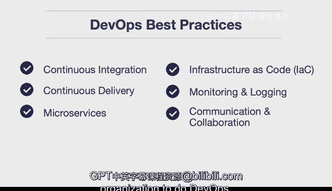

# 053：DevOps最佳实践 🚀

在本节课中，我们将学习DevOps的核心最佳实践。这些实践构成了一个组织成功实施DevOps文化的关键检查清单，旨在提升软件质量、加快交付速度并增强团队协作。

---

## 概述 📋

DevOps是一套结合了开发与运维的文化、实践与工具，旨在缩短系统开发生命周期，并提供高质量的持续交付。接下来，我们将逐一探讨构成DevOps核心的几项最佳实践。

---

## 持续集成（Continuous Integration）

上一节我们概述了DevOps的目标，本节中我们来看看第一项关键实践：持续集成。

持续集成是自动测试代码、确保软件质量并减少验证或发布新软件更新时间的过程。这是一个需要纳入检查清单的关键环节。

其核心流程通常通过代码来描述：
```bash
# 开发者提交代码到共享仓库
git commit -m "新功能"
git push origin main

# 持续集成服务器自动触发构建和测试
# 例如，运行测试套件
npm test
# 或
pytest
```

---

## 持续交付（Continuous Delivery）

理解了持续集成后，我们接下来探讨其自然延伸：持续交付。

持续交付是指代码变更能够被自动构建、测试，并准备好发布到生产环境的能力。这意味着你可以将所有变更部署到测试或预发布环境，且整个过程无需人工干预。

以下是实现持续交付的一个简化概念模型：
```
代码提交 -> 自动构建 -> 自动测试 -> 自动部署到预发布环境
```

---

## 微服务架构（Microservices）

除了集成与交付，系统架构本身也至关重要。以下是现代软件开发中一项关键的架构实践。

微服务是DevOps的关键组成部分。它允许你将一个单体应用构建为一组小型服务的集合。每个服务独立运行，并通过队列系统或其他接口进行通信。这种架构通过简化每个服务，极大地提升了系统的可扩展性。

---

## 基础设施即代码（Infrastructure as Code）

要实现高效的持续交付，基础设施的管理方式必须变革。以下是另一项组织必须拥有的最佳实践。

基础设施即代码允许你将基础设施本身（如服务器配置、网络设置）像应用程序代码一样，存入Git仓库进行版本管理。这使得你能够以自动化、可重复的方式编排基础设施，从而获得DevOps所带来的交付速度。

其核心思想可以用一个公式表达：
**基础设施配置 = 可版本控制的代码文件**

---

## 监控与日志（Monitoring and Logging）

在自动化部署之后，了解系统运行状况至关重要。以下是一项常被忽视但极其重要的实践。

监控与日志记录允许你查看应用程序指标和基础设施状态（如CPU负载、内存、磁盘使用情况），从而更快地定位问题根源。发现的问题可以通过持续交付流程进行修复，形成一个数据驱动的反馈闭环。这本质上是一个“观察-决策-部署”的循环。

---

## 沟通与协作（Communication and Collaboration）

最后，但同样重要的是，DevOps的成功离不开文化的支撑。以下是所有实践得以落地的基石。

沟通与协作意味着在组织文化层面，持续寻求更好的沟通方式。这可以通过工单系统、聊天工具让开发与运维人员讨论源代码管理的各个方面，或者在技术文档中添加详尽的注释来实现。将沟通与协作置于优先地位，是成功实施所有前述DevOps最佳实践的关键。

---

## 总结 🎯



本节课中我们一起学习了构成DevOps核心的六项最佳实践检查清单：
1.  **持续集成**：自动测试，保障质量。
2.  **持续交付**：自动化构建、测试与部署准备。
3.  **微服务架构**：构建小型、独立、可扩展的服务。
4.  **基础设施即代码**：以可编程、可版本控制的方式管理基础设施。
5.  **监控与日志**：建立数据驱动的反馈闭环，快速定位问题。
6.  **沟通与协作**：培育开放、透明的团队文化。


这些实践相辅相成，缺一不可。只有将它们全部融入组织的基础设施和文化中，才能真正实现DevOps的潜力。