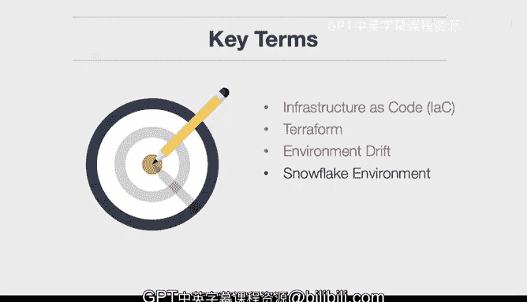

构建大规模云计算解决方案：1-2：使用IaC管理云基础设施介绍 🚀

在本节课中，我们将学习如何利用基础设施即代码来管理云基础设施。

首先，我们将解释什么是基础设施即代码。然后，我们将探讨如何利用它来管理云基础设施。

---

### 核心概念与术语

上一节我们介绍了课程目标，本节中我们来看看几个关键术语。

**基础设施即代码** 本身就是一个核心术语。它指的是**被检入代码仓库、用于部署基础设施的代码**。其核心思想非常简单。

**Terraform** 是基础设施即代码的一种流行工具。它可以在包括GCP、AWS和Azure在内的多个云平台上运行。

**环境漂移** 是指环境进入一种你无法确切知晓其状态的情况。基础设施即代码所解决的正是这个问题——它通过每次部署时**修正环境状态**，来阻止环境发生漂移和意外变更。

**雪花环境** 是一个很好的例子，说明了不使用自动化来定义基础设施时会发生什么。一个人很容易做出更改，然后忘记它。接着另一个人又来做出更改。不知不觉中，你的环境就变得**不可复现**。这很像童话故事里的蛋头先生，摔碎之后没人能把他拼回原样。雪花环境就是如此，我们将在后面详细讨论。

---

### 总结

本节课中，我们一起学习了基础设施即代码的基本概念及其核心价值。我们了解了**基础设施即代码**是存储在仓库中的部署代码，认识了**Terraform**这一跨平台工具，并探讨了**环境漂移**和**雪花环境**这两个因缺乏自动化管理而导致的典型问题。理解这些概念是迈向自动化、可重复云基础设施管理的第一步。