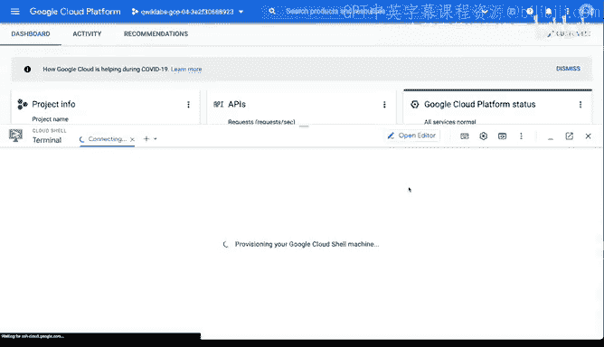
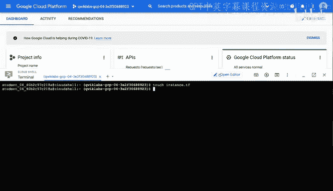
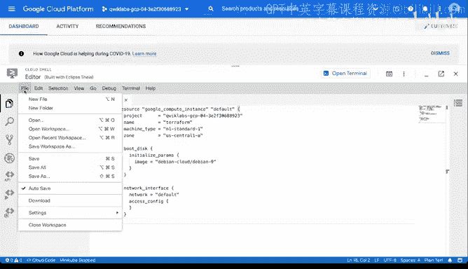
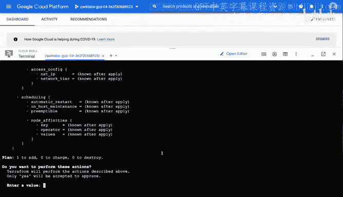
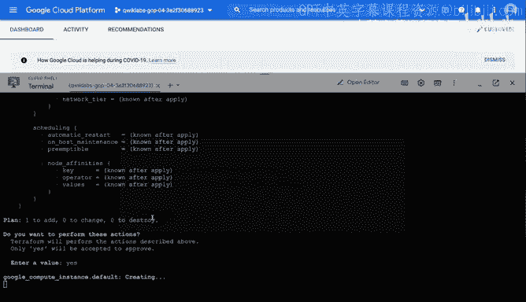
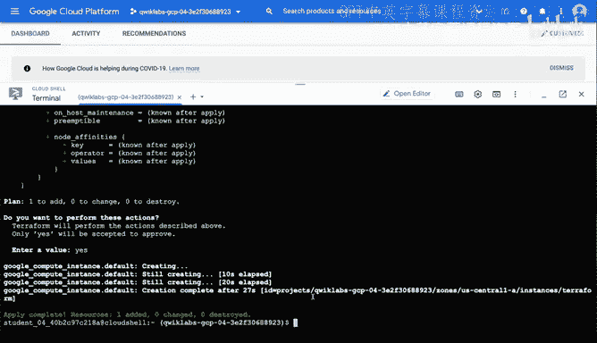
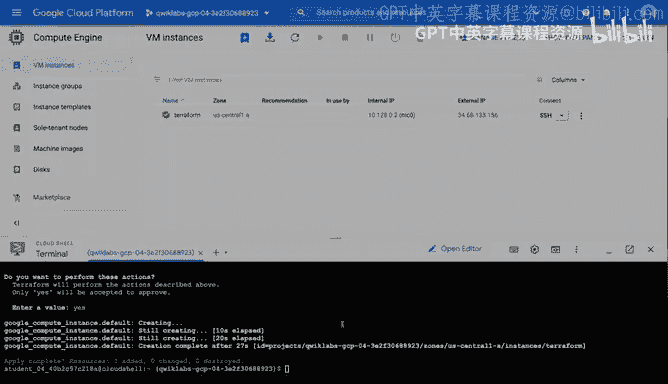

# 057：在GCP上使用Terraform启动虚拟机 🚀

在本节课中，我们将学习如何使用基础设施即代码工具Terraform，在Google Cloud Platform上启动一台虚拟机。我们将从激活Cloud Shell开始，逐步完成编写配置、初始化、规划和应用部署的完整流程。

---

## 激活Google Cloud Shell

首先，我们需要激活Google Cloud Shell。这是一个基于浏览器的命令行工具，允许我们直接在GCP控制台中交互式地构建解决方案。

## 验证与准备

在开始编写配置之前，最好先验证Terraform是否已正确安装。以下是验证步骤。

*   输入命令 `terraform` 来检查安装情况。
*   该命令会显示所有可用选项，确认Terraform已就绪。

接下来，我们需要创建一个存储虚拟机配置的空文件。

*   创建一个名为 `instance.tf` 的文件。
*   我们将使用内置的编辑器来编辑此文件，这对于不熟悉命令行工具的用户更为友好。

## 编写Terraform配置

现在，我们打开编辑器来编写配置。编辑器能识别`.tf`文件并提供语法支持。

我们将复制一段配置数据到 `instance.tf` 文件中。配置中唯一需要修改的是填入我们自己的GCP项目ID。

*   从GCP控制台顶部获取项目ID。
*   将项目ID粘贴到配置中 `project = “YOUR_PROJECT_ID”` 的位置。

配置完成后，我们来解读一下这个文件的内容。

*   `name = “terraform”`： 这是虚拟机的名称。
*   `machine_type = “n1-standard-1”`： 这是虚拟机的机器类型。
*   `zone = “us-central1-a”`： 这是虚拟机将在GCP中部署的区域（美国中部）。
*   `boot_disk.initialize_params.image = “debian-cloud/debian-9”`： 这指定了虚拟机要运行的操作系统镜像（Debian 9）。

基础设施即代码配置的优点在于，所有资源定义都声明在文件中。如果将此文件检入源代码仓库，其他人可以清晰地了解将要部署的内容。

确认无误后，保存文件。

## 初始化与规划

保存配置后，我们回到终端窗口。接下来，我们需要初始化Terraform工作目录。

*   执行命令 `terraform init`。

此命令会在后台下载所需的提供商插件（本例中是Google提供商），为后续步骤做好准备。

初始化完成后，在正式部署前，我们可以先执行规划操作来验证部署计划是否符合预期。

*   执行命令 `terraform plan`。

规划过程会列出Terraform将要执行的所有操作，例如创建虚拟机资源、配置启动盘等。这让我们有机会在真正改变基础设施之前进行确认。

## 应用配置

如果规划结果符合预期，我们就可以应用配置来实际创建资源了。

*   执行命令 `terraform apply`。

Terraform会再次显示执行计划，并询问是否继续。输入 `yes` 来批准执行。

系统可能会要求授权此次API调用。授权后，Terraform将通过GCP API在后台为我们创建资源。这体现了基础设施即代码在简化部署流程和确保可重复性方面的巨大价值。

虚拟机创建通常需要几分钟时间。完成后，终端会显示应用成功的消息。

## 验证部署结果

虚拟机创建成功后，我们如何找到它呢？

我们可以返回GCP控制台查看。

*   进入 **Compute Engine** -> **VM instances** 页面。

在实例列表中，可以看到名为“terraform”的虚拟机正在运行，其区域、IP地址等信息均与我们的配置一致。如果需要，我们还可以通过浏览器窗口SSH连接到该虚拟机进行操作。

---

## 总结

本节课中，我们一起学习了使用Terraform在GCP上启动虚拟机的完整过程。我们经历了激活Cloud Shell、编写声明式配置、初始化工作区、规划变更以及最终应用部署的关键步骤。Terraform提供了一种幂等、可重复且易于版本控制的方式来管理和配置云资源。本次实践只是Terraform强大功能的冰山一角，它为自动化和管理复杂云基础设施奠定了坚实基础。