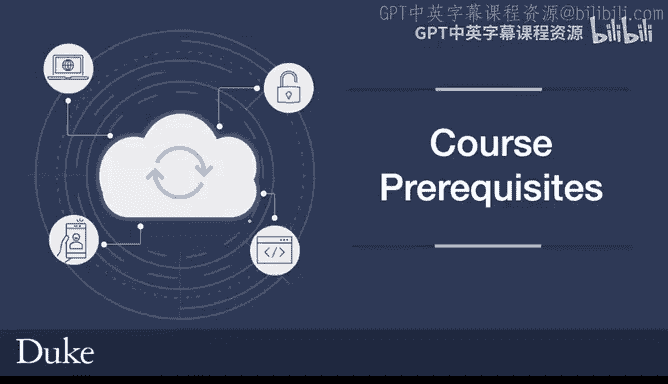
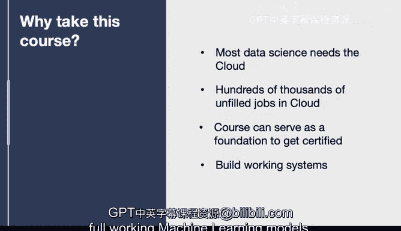

# 070：课程先修要求 📋

在本节课中，我们将介绍学习本课程所需的先修知识与技能，并阐述学习本课程的价值与意义。

## 先修知识要求

为了能更好地跟上课程进度并理解核心概念，建议学员在开始前具备以下基础。

以下是四项关键的先修知识：

1.  **中级Python知识**：这意味着你需要具备构建语句、理解变量以及编写小型脚本的能力。
2.  **Linux基础知识**：包括在文件系统中导航、运行Shell命令的能力，这将非常有帮助。
3.  **IT基础设施知识**：这是一个关键要求，意味着你需要理解什么是虚拟机、数据库，并对IT基础设施有基本的了解。
4.  **理解JSON与YAML文件格式**：你需要了解这两种格式及其包含的内容。这实际上非常容易掌握，但核心概念在于，通过传递本质上等同于Python字典的**JSON**数据，或传递**YAML**数据，你将能够控制云生态系统。这是你将要做的大量工作，因此了解这些基础知识很重要。

## 为何学习本课程

在了解了先修要求后，我们来看看为什么这门课程值得你投入时间学习。

以下是学习本课程的几个关键原因：

1.  **数据科学需要云**：大多数数据科学项目都需要云计算。很多时候你会在自己的笔记本电脑上进行小型项目，但笔记本电脑不具备近乎无限的计算和存储扩展能力，这就是为什么大多数数据科学真正需要云的原因。
2.  **巨大的就业机会**：根据亚马逊网络服务的研究，云计算领域存在数十万个未填补的职位空缺。确实存在未满足的需求和人才危机，需要快速培训人才。
3.  **三大云平台认证的基础**：本课程可以作为在全部三大云平台上获得认证的基础。你不仅可以后续获得AWS认证，还可以在首先学习本课程、打下基础后，决定向哪个方向深入，进而获得GCP或Azure认证。
4.  **学习构建可运行的系统**：本课程一个重要的组成部分是，你将学习构建可工作的系统。这非常注重职业技能，你将学习如何从命令行工具到Web应用程序，再到完整可运行的机器学习模型，一步步构建系统。

本节课中，我们一起学习了开始本课程所需的先修技能，包括Python、Linux、IT基础架构和文件格式知识，并探讨了学习云计算在数据科学、职业发展和技能认证方面的重要价值。准备好这些基础，你将能更顺利地开启云计算之旅。