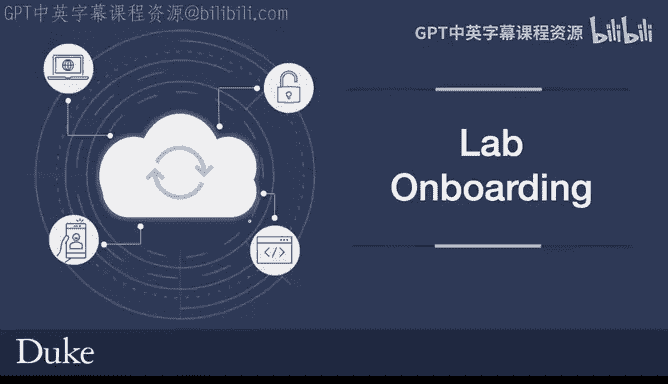
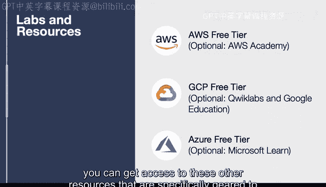

# 071：实验环境准备 🛠️

在本节课中，我们将学习如何为后续的课程实验准备免费的云平台环境。我们将介绍AWS、GCP和Azure三大主流云服务商提供的免费资源，并指导你如何获取和使用它们。

## 课程概述

本课程包含一系列动手实验，这些实验将在AWS、GCP和Azure云平台上进行。为了帮助你顺利完成所有实验，我们将利用各平台提供的免费套餐或教育优惠。无论你选择哪个平台，都可以在不产生费用的情况下完成本课程的全部内容。

## 实验平台与免费资源

以下是三个主要云平台的免费资源获取方式。

### AWS 平台资源

上一节我们介绍了课程的整体实验需求，本节中我们来看看AWS平台的具体准备方案。

AWS提供免费的套餐服务。使用AWS免费套餐，你基本可以完成本课程所需的所有操作。此外，如果你是教育机构AWS Academy的成员，还可以访问许多免费的实验资源，这些资源不仅有助于课程学习，也能为你考取AWS认证做好准备。我个人教学也使用这些实验。

以下是AWS资源的获取途径：
*   **AWS免费套餐**：适用于所有新用户，提供一定额度的免费服务。
*   **AWS Academy**：面向教育机构成员，提供丰富的免费实验模块。

### GCP 平台资源

了解了AWS的资源后，我们接下来看看GCP平台。

GCP平台提供非常慷慨的免费套餐。仅使用免费套餐，你就可以完成整个课程的所有作业。此外，你还可以访问可选的Quicklabs。如果你是学生，可以通过Google教育申请获取一些Quicklabs积分，并进行试用。

以下是GCP资源的获取途径：
*   **GCP免费套餐**：提供持续免费的特定产品使用额度。
*   **Google教育/Quicklabs**：学生可申请积分，用于完成交互式实验。

### Azure 平台资源

最后，我们来了解Azure平台的准备方案。

Azure平台同样提供非常慷慨的免费套餐，学生可以申请使用。如果你想自行完成更多实验，可以访问Microsoft Learn平台进行学习。

以下是Azure资源的获取途径：
*   **Azure免费套餐**：包含12个月的免费热门服务和永久免费的25+项服务。
*   **Microsoft Learn**：提供丰富的免费在线学习路径和交互式沙箱环境。

## 总结

本节课中我们一起学习了如何为AWS、GCP和Azure三大云平台准备免费的实验环境。总而言之，本课程所涵盖的所有内容，都可以通过利用AWS、GCP和Azure的免费功能来完成。如果你像杜克大学的学生一样是教育机构的一员，还可以获取那些专门为教育环境设计的实验资源。