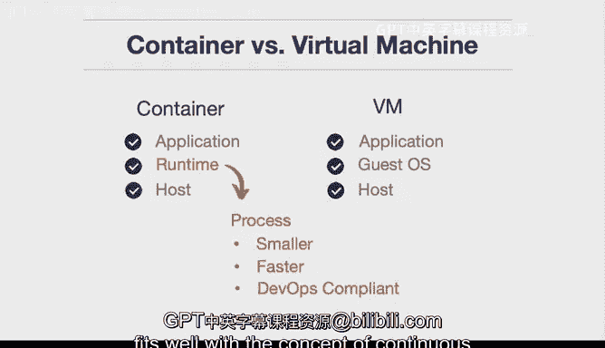

# 074：容器与虚拟机对比 🆚

在本节课中，我们将学习云计算中的两个核心概念：容器与虚拟机。我们将探讨它们的定义、架构差异以及各自适用的场景，帮助你理解在何时应选择容器，何时应选择虚拟机。

## 概述

容器和虚拟机是两种主流的应用部署与隔离技术。理解它们的区别对于设计高效、可扩展的云解决方案至关重要。本节将清晰地对比两者的架构和特点。

## 虚拟机详解

上一节我们概述了课程内容，本节中我们首先来深入了解虚拟机。

虚拟机模拟了一台完整的物理计算机。其核心架构包含一个**宿主机操作系统**和一个或多个**客户机操作系统**。例如，你可以在运行Ubuntu Linux的宿主机上，创建一个运行Red Hat Linux的客户机操作系统，并在其中运行应用程序。

**关键公式/概念**：`虚拟机 = 宿主机操作系统 + 虚拟机管理程序（Hypervisor） + 客户机操作系统 + 应用程序`

虚拟机本质上是一个完整的、可运行任何应用程序的操作系统克隆。

以下是虚拟机的主要适用场景：

*   **单体应用**：适合运行传统的、一体化的应用程序。
*   **遗留系统迁移**：非常适合“直接迁移”策略，将已在物理机上运行多年的旧系统（如一个老旧的PHP内容管理系统）完整地克隆并放入虚拟机中。

因此，虚拟机是处理遗留应用或需要完整操作系统环境场景的理想选择。

## 容器详解

了解了虚拟机之后，我们来看看容器技术有何不同。

容器与虚拟机的最大区别在于架构。容器同样运行在宿主机操作系统之上，但其核心是**运行时环境**，而非一个完整的操作系统。

**关键公式/概念**：`容器 = 宿主机操作系统 + 容器引擎（如Docker） + 应用及其依赖（二进制文件、库）`

容器更像是一个被隔离的进程，它只打包了运行特定应用程序所必需的文件和库，是操作系统的一个子集。

以下是容器的核心特点：

*   **轻量级**：由于不包含完整的操作系统，容器体积更小，启动速度更快。
*   **符合DevOps最佳实践**：容器与持续集成/持续交付流程天然契合。
*   **适合微服务架构**：其轻量、独立的特性非常适合构建和部署微服务。

## 核心对比与总结

现在，让我们将两者放在一起进行最终对比。

虚拟机的关键在于**完全复制**，它复制了整个操作系统环境。而容器的关键在于**便携性**，它打包了一个更小、更精简的应用运行环境，完美契合持续集成和持续交付的理念。

*虚拟机架构示意图*

*容器架构示意图*

本节课中，我们一起学习了容器与虚拟机的核心区别。总结如下：
*   **虚拟机**提供完整的操作系统隔离，适合遗留单体应用和直接迁移场景。
*   **容器**提供轻量级的应用层隔离，启动快、资源占用少，非常适合现代微服务架构和DevOps实践。

理解这些差异将帮助你在构建云解决方案时做出更合适的技术选型。