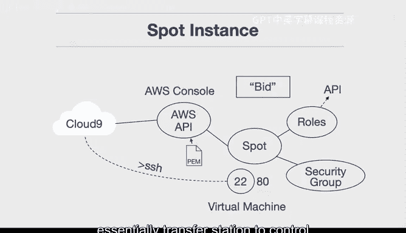

# 075：竞价实例工作原理 🏗️💡

在本节课中，我们将学习AWS竞价实例的工作原理及其核心架构组件。我们将通过一个具体的示例，了解如何设置和使用竞价实例，包括出价、安全组配置和SSH连接等关键步骤。

---

上一节我们介绍了云计算的基本概念，本节中我们来看看AWS竞价实例的具体工作流程。

首先，我们来看一个示例架构。在这个例子中，我们使用AWS Cloud 9作为控制台。Cloud 9是一个集成开发环境，可以作为我们执行命令、启动实例以及与AWS平台进行交互的“指挥中心”。你可以通过AWS API以编程方式启动竞价实例，也可以直接在AWS管理控制台中操作。

启动竞价实例有几个关键组件需要注意。以下是主要步骤：

首先，你需要对实例进行出价，这类似于参与拍卖。你可以设定你愿意为启动一台虚拟机支付的价格。竞价实例的价格折扣最高可达90%，对于在AWS平台上进行实验的用户来说，这是一个巨大的节省。

其次，除了虚拟机规格，安全组的配置至关重要。安全组决定了实例可以通信的端口。例如，如果你要运行Web服务，可能需要开放端口80；如果你想通过SSH连接来控制机器，则需要开放端口22。在本示例中，为了后续能通过SSH连接，我们必须在安全组中开放端口22。

另一个与SSH连接相关的组件是密钥对文件（PM文件）。这个SSH密钥将允许你安全地连接到启动的竞价实例。

最后，如果你希望该竞价实例能够调用其他AWS服务（例如进行自然语言处理或图像识别API调用），你需要为其分配一个IAM角色。这个角色赋予了实例进行这些连接和操作的权限。

综上所述，启动竞价实例需要关注的核心要素并不多，主要包括：**出价**、**安全组规则**以及**SSH密钥对文件**。

这就是为什么我推荐使用Cloud 9环境。你可以直接从Cloud 9实例建立SSH连接到竞价实例，这非常强大。相比于在个人笔记本电脑上管理一切，维护一个可随时启用的AWS Cloud 9实例作为控制中心更为便捷。当你不需要使用时，可以将其关闭以节省成本。它的优势在于，你可以通过这一个可靠的“中转站”，轻松控制AWS基础设施中的多个竞价实例。

---

本节课中我们一起学习了AWS竞价实例的启动流程和核心配置要素。我们了解了如何通过出价获得低成本计算资源，以及如何通过配置安全组、SSH密钥和IAM角色来确保实例的可访问性和功能性。同时，使用AWS Cloud 9作为集中管理工具可以极大地简化操作流程。接下来，我们就可以开始动手实践了。