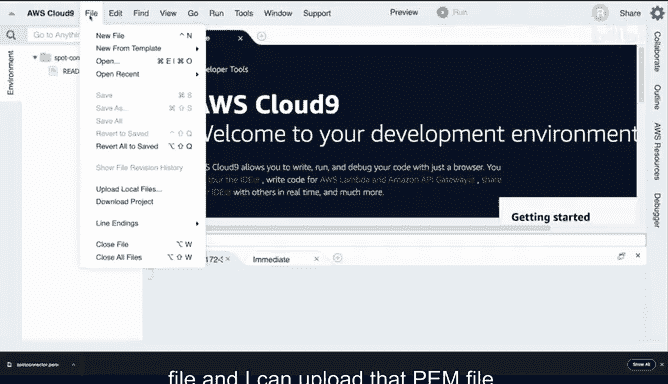
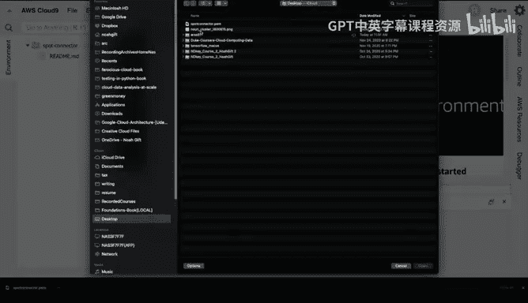
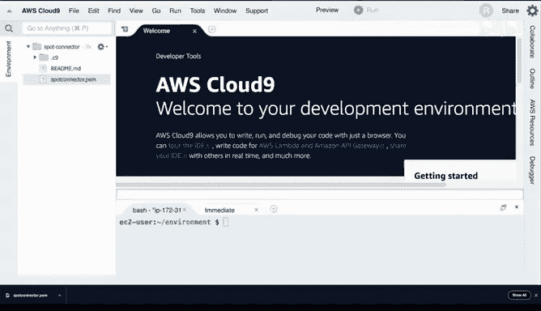
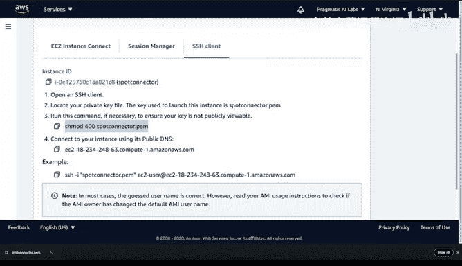
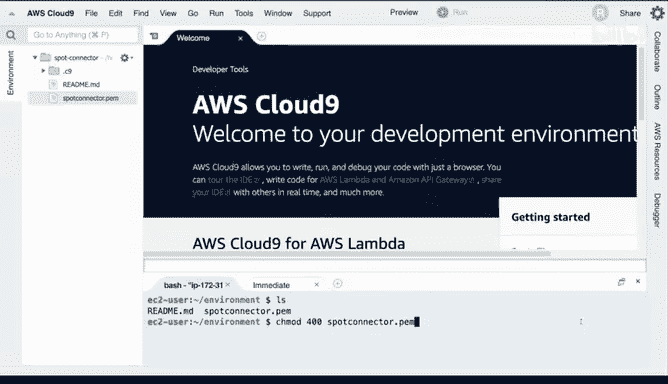
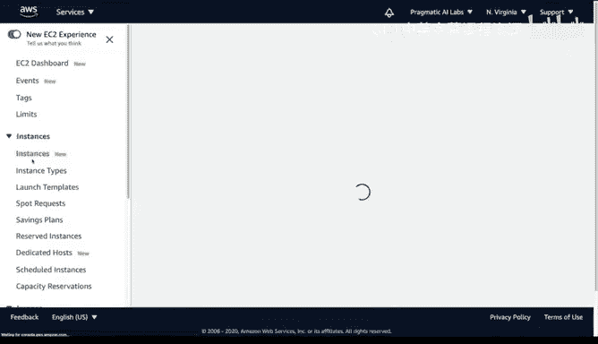

# 076：启动AWS竞价实例 🚀

在本节课中，我们将学习如何在AWS上启动一个竞价实例。竞价实例是一种极具成本效益的计算资源，通常可以节省高达90%的费用，非常适合用于原型开发、批处理任务或深度学习等场景。我们将从设置Cloud9开发环境开始，逐步完成竞价实例的请求、配置和连接。

---

## 概述

我们将通过以下步骤完成竞价实例的启动：
1.  设置一个AWS Cloud9环境作为操作平台。
2.  通过EC2控制台配置并提交竞价实例请求。
3.  配置关键的安全组和密钥对，以确保能够成功连接到实例。
4.  从Cloud9环境通过SSH连接到已启动的竞价实例。
5.  最后，学习如何清理和终止实例，以避免产生不必要的费用。

---

## 设置Cloud9环境

首先，我们需要一个操作基地。AWS Cloud9是一个基于云的集成开发环境，非常适合用来管理和连接我们的竞价实例。

以下是创建Cloud9环境的步骤：
*   在AWS控制台中搜索并进入Cloud9服务。
*   点击“创建环境”。
*   将环境命名为 `spot-connector`。
*   其余配置保持默认值，然后点击“创建”。



这个Cloud9环境非常有用，因为我们可以将SSH密钥文件上传到这里，之后便可以反复用它来连接多个竞价实例。

---

## 配置并启动竞价实例

上一节我们准备好了操作环境，本节中我们来看看如何配置并启动一个竞价实例。





首先，在AWS控制台中导航到EC2服务，然后在左侧菜单中找到“Spot Requests”（竞价请求）并点击“Request Spot Instances”（请求竞价实例）。

在配置界面中，有几个关键部分需要注意：
*   **AMI选择**：你可以选择默认的Amazon Linux，也可以根据需求选择其他镜像，例如用于深度学习的AMI、Ubuntu或Windows。AMI代表Amazon Machine Image，你可以使用预配置的镜像来快速启动实例。
*   **实例类型**：你可以根据工作负载选择。对于本教程，选择“Big data workload”或其他任何类型均可。
*   **密钥对**：这是用于SSH连接的关键。点击“创建新的密钥对”，命名为 `spot-connector` 并下载`.pem`文件。**请务必妥善保存此文件**。
*   **网络设置**：通常可以保持默认的VPC和子网设置。
*   **安全组**：这是一个常见的配置错误点。默认安全组可能不允许SSH连接。我们需要创建一个新的安全组。
*   **IAM实例配置文件**：如果你的实例需要访问其他AWS服务（如S3或Rekognition），则需要在此处关联一个具有相应权限的IAM角色。否则，可以跳过。
*   **用户数据**：你可以在此处输入实例启动时自动运行的脚本，例如挂载文件系统或安装软件包。

---

## 配置安全组与上传密钥

配置竞价实例时，安全组和密钥对是确保能够成功连接的两个最重要环节。忘记配置它们是最常见的错误。

首先，我们来配置安全组。在“配置安全组”部分，点击“创建新的安全组”。
*   将安全组命名为 `spot-connect`。
*   添加一条入站规则：类型选择“SSH”，端口为 `22`，来源可以暂时设置为“任何位置”（`0.0.0.0/0`）以方便测试。在生产环境中，建议将来源限制为你的Cloud9环境IP或特定IP段。

接下来，处理密钥对。我们需要将之前下载的 `spot-connector.pem` 密钥文件上传到Cloud9环境中，以便后续连接。
*   在Cloud9环境中，点击菜单栏的 **File** -> **Upload Local Files...**。
*   选择你下载的 `spot-connector.pem` 文件进行上传。

---

## 提交请求并连接实例

完成所有配置后，我们就可以提交竞价实例请求了。

在请求表单底部，设置你需要的实例数量（例如1个），然后查看预估的节省费用（通常可达70%以上）。确认无误后，点击“Launch”（启动）。

提交请求后，状态会显示为“pending fulfillment”（等待履行）。你可以在“Spot Requests”列表中点击该请求查看详细状态。当状态变为“fulfilled”（已履行）时，实例就启动成功了。

此时，在EC2的“Instances”（实例）列表中，你应该能看到一个处于“running”（运行中）状态的新实例。建议立即为它命名（例如 `spot-connector`），以便于管理。

要连接到这个实例，请执行以下步骤：
1.  在实例列表中选中它，点击顶部的“Connect”（连接）按钮。
2.  连接向导会给出具体的SSH命令。首先，它要求你设置密钥文件的权限。在你的Cloud9终端中运行：
    ```bash
    chmod 400 spot-connector.pem
    ```
3.  然后，复制并运行向导提供的SSH命令，其格式通常如下：
    ```bash
    ssh -i "spot-connector.pem" ec2-user@<你的实例公有DNS>
    ```
4.  首次连接时可能会询问是否信任主机，输入 `yes` 即可。



如果一切顺利，你现在应该已经进入了竞价实例的命令行界面，可以开始运行你的命令了。

---



## 清理资源

使用完竞价实例后，及时清理资源非常重要，可以避免产生意外费用。

清理的正确步骤是：
1.  返回EC2控制台的“Spot Requests”页面。
2.  选中你创建的竞价请求。
3.  点击“Actions”（操作），选择“Cancel request”（取消请求）。
4.  **关键**：在弹出的对话框中，务必勾选“Terminate instances”（终止实例）选项。这样会同时取消请求并终止关联的实例。如果不勾选，仅取消请求，实例可能仍会运行。
5.  确认操作后，实例状态会变为“shutting-down”（关闭中）并最终消失。

对于Cloud9环境，因为它采用按使用时间计费（当环境不活动时会自动休眠），你可以直接关闭浏览器标签页。如果需要彻底删除，可以回到Cloud9控制台删除该环境。

---

## 总结




本节课中我们一起学习了如何启动和连接AWS竞价实例。我们了解了从创建Cloud9环境、配置竞价请求（包括选择AMI、设置密钥对和安全组），到最终通过SSH连接实例的完整流程。同时，我们也强调了三个最常见的配置错误：**忘记创建/上传密钥对**、**未配置允许SSH的安全组规则**，以及**未为需要访问AWS服务的实例分配IAM角色**。最后，我们学习了如何正确地取消竞价请求并终止实例以进行资源清理。掌握这些步骤后，你就可以充分利用竞价实例的高性价比优势，进行原型开发、测试或运行批处理作业了。