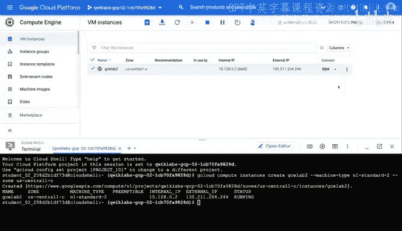
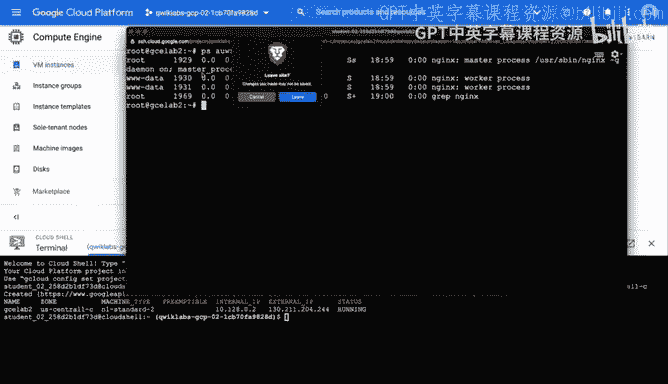
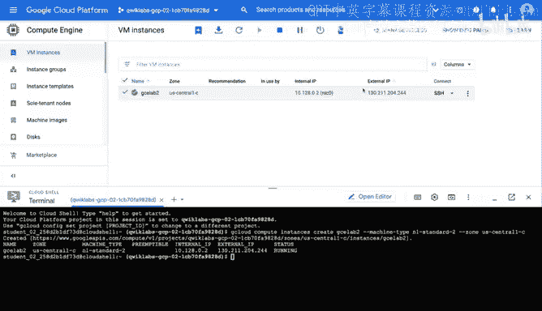
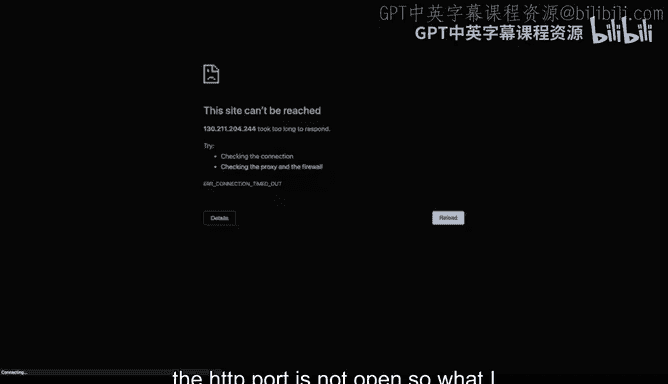
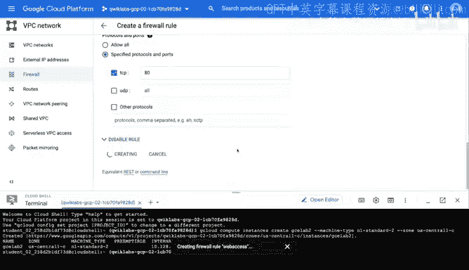
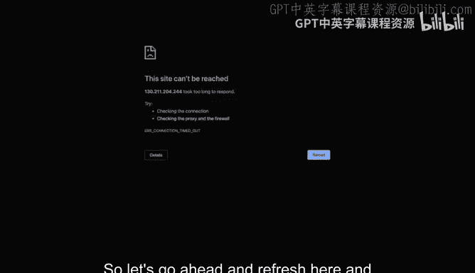
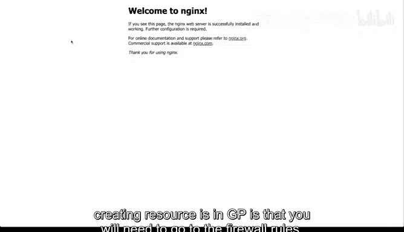
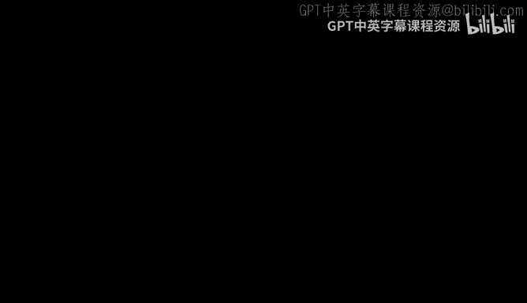

# 077：通过终端创建GCP虚拟机 🖥️

在本节课中，我们将学习如何在Google Cloud Platform上启动一台虚拟机。我们将通过Cloud Shell环境，使用命令行来创建虚拟机实例，然后通过SSH连接到该实例，并安装一个名为Nginx的Web服务器。

---

## 启动Cloud Shell环境

首先，我们需要激活Cloud Shell环境。Cloud Shell是一个基于浏览器的命令行工具，它预装了Google Cloud SDK和其他实用程序，方便我们管理云资源。

在GCP控制台中，点击顶部的Cloud Shell图标即可激活它。


## 通过命令行创建虚拟机

上一节我们启动了Cloud Shell环境，本节中我们来看看如何使用`gcloud`命令行工具来创建虚拟机实例。

`gcloud`是Google Cloud SDK的主要命令行界面。以下是创建虚拟机的命令示例：

```bash
gcloud compute instances create gce-lab --machine-type n1-standard-2 --zone us-central1-a
```



*   **`gcloud compute instances create gce-lab`**: 这是创建虚拟机实例的核心命令，`gce-lab`是我们为实例指定的名称。
*   **`--machine-type n1-standard-2`**: 此参数定义了虚拟机的规格，`n1-standard-2`代表一种标准配置的机型。
*   **`--zone us-central1-a`**: 此参数指定了虚拟机将要部署的区域，`us-central1-a`是位于美国中部的一个可用区。

运行此命令后，系统可能会要求授权，之后便会以编程方式启动虚拟机。通过Cloud Shell执行此操作，无需在控制台界面中导航，这是一个关键优势。


## 连接到虚拟机并安装软件

虚拟机创建完成后，我们可以在GCP控制台的“VM实例”页面找到它。该页面提供了连接到虚拟机的选项。

我们可以通过SSH连接到这台机器。在实例列表中找到对应的机器，点击“SSH”按钮，并选择“在浏览器窗口中打开”。


成功连接后，我们会获得一个独立的终端窗口，可以在此对虚拟机执行操作。

首先，我们以root用户身份登录，并更新Ubuntu操作系统。更新系统的命令是：

```bash
apt-get update
```



接下来，我们安装Nginx Web服务器。在Ubuntu系统中，我们使用`apt-get`包管理器来安装软件。安装Nginx的命令是：

```bash
apt-get install nginx
```



安装完成后，我们可以验证Nginx服务是否正在运行。使用以下命令查看系统进程，并筛选出与Nginx相关的进程：

```bash
ps aux | grep nginx
```



如果命令输出中显示了`nginx`进程，则说明Web服务器已成功运行。


## 配置防火墙规则

现在，Web服务器已经在虚拟机上运行。我们尝试通过虚拟机的公网IP地址在浏览器中访问它。

然而，你可能会发现无法访问。这是一个在GCP中创建资源时的常见问题：默认的防火墙规则可能阻止了外部访问。



要解决这个问题，我们需要创建一个新的防火墙规则来允许HTTP流量。

以下是创建防火墙规则的步骤：
1.  在GCP控制台中导航到“防火墙规则”页面。
2.  点击“创建防火墙规则”。
3.  为规则命名，例如 `web-access`。
4.  将“流量方向”设置为“入站”。
5.  在“目标”部分，可以选择“网络中的所有实例”。
6.  在“来源IP地址范围”中，输入 `0.0.0.0/0` 以允许所有IP地址访问（生产环境中建议限制为特定IP）。
7.  在“协议和端口”部分，选择“TCP”，并指定端口 `80`。
8.  点击“创建”。

创建防火墙规则后，返回浏览器并刷新虚拟机的公网IP地址页面。此时，你应该能看到Nginx的默认欢迎页面，这证明Web服务已可通过网络访问。


---







本节课中我们一起学习了通过GCP命令行工具创建虚拟机、连接实例、安装Nginx Web服务器以及配置防火墙规则以允许外部访问的完整流程。掌握这些步骤是构建和部署云上应用的基础。