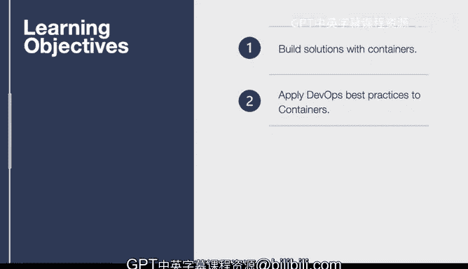
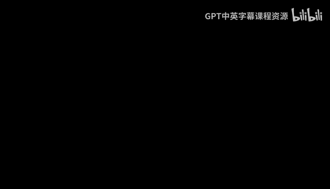

# 081：容器技术简介 🐳

在本节课中，我们将学习容器技术。容器是一种将应用程序的运行时环境与源代码一起打包的强大方式。我们还将探讨什么是Docker，如何使用Docker Hub，以及如何利用容器注册表（包括亚马逊的ECR）来构建应用。让我们开始学习这些目标。

首先，我们将进入使用容器构建解决方案的部分。我会逐步展示如何基于源代码控制仓库构建一个容器，并将该代码推送到容器注册表。之后，我们将探讨如何将DevOps最佳实践（如持续集成和持续交付）应用于容器。

---

## 什么是容器？📦

上一节我们概述了课程内容，本节中我们来看看容器的核心概念。容器是一种轻量级、可移植的软件打包技术。它将应用程序及其所有依赖项（如库、配置文件）打包在一个标准化的单元中。这确保了应用程序在任何计算环境中都能以相同的方式运行。

容器与虚拟机不同。虚拟机模拟整个操作系统，而容器则共享主机操作系统的内核，这使得它们更加高效和快速启动。理解这一点对于掌握容器化至关重要。

---

## Docker简介 🐋

在了解了容器的基础概念后，本节我们来认识Docker。Docker是目前最流行的容器化平台。它提供了一套工具，使得创建、部署和运行容器变得非常简单。

以下是Docker的核心组件：
*   **Docker镜像**：一个只读的模板，包含了运行应用所需的代码、运行时、库和环境变量。镜像是通过一个名为 `Dockerfile` 的文本文件定义的。
*   **Docker容器**：是Docker镜像的一个运行实例。你可以使用 `docker run` 命令从镜像启动一个或多个容器。
*   **Docker Hub**：一个公共的镜像注册表，你可以从中拉取（下载）现成的镜像，也可以推送（上传）自己构建的镜像。

---

## 使用Docker Hub 🌐

上一节我们介绍了Docker的基本组件，本节中我们来看看如何使用Docker Hub。Docker Hub是一个云端的服务，用于存储和分发Docker镜像。你可以把它想象成容器镜像的“GitHub”。

以下是使用Docker Hub的基本步骤：
1.  **搜索镜像**：你可以在Docker Hub网站上或使用 `docker search` 命令查找你需要的软件镜像，例如 `nginx` 或 `python`。
2.  **拉取镜像**：找到镜像后，使用 `docker pull [镜像名]` 命令将其下载到本地。
3.  **推送镜像**：如果你构建了自己的镜像，可以登录Docker Hub后，使用 `docker push [你的用户名]/[镜像名]` 命令将其分享到云端。

---

## 构建与推送容器镜像 🛠️

在熟悉了镜像仓库后，本节我们将动手实践如何构建和推送一个容器镜像。这个过程通常从编写一个 `Dockerfile` 开始。

以下是一个简单的示例，展示如何为一个Python应用构建镜像：
```dockerfile
# 使用官方Python运行时作为父镜像
FROM python:3.9-slim

# 设置工作目录
WORKDIR /app

# 将当前目录内容复制到容器的/app目录下
COPY . /app

# 安装应用所需的依赖
RUN pip install --no-cache-dir -r requirements.txt

# 声明容器运行时监听的端口
EXPOSE 80

# 定义容器启动时执行的命令
CMD ["python", "app.py"]
```
构建好 `Dockerfile` 后，你可以使用 `docker build -t my-python-app .` 命令来构建镜像，然后使用 `docker push` 命令将其推送到你选择的容器注册表。

---

## 应用DevOps最佳实践 🔄

我们已经学会了如何构建和存储容器镜像，本节我们将探讨如何将DevOps理念融入容器化工作流。核心实践是持续集成和持续交付。

以下是关键实践点：
*   **持续集成**：每当有代码变更提交到源代码仓库时，自动触发构建新的Docker镜像并进行测试。
*   **持续交付/部署**：将通过测试的镜像自动部署到测试或生产环境。这可以通过与Amazon ECR、GitHub Actions、Jenkins等工具集成来实现。



将容器与CI/CD管道结合，可以实现快速、可靠且一致的软件发布流程。

---



## 总结 📝

本节课中我们一起学习了容器技术。我们从容器的基础概念讲起，介绍了Docker平台及其核心组件。我们学习了如何使用Docker Hub，并逐步演示了如何通过 `Dockerfile` 构建镜像并将其推送到注册表。最后，我们探讨了如何将DevOps的持续集成与持续交付实践应用于容器化项目，以实现高效的软件开发和部署。掌握这些知识是构建现代化、可扩展云解决方案的重要一步。