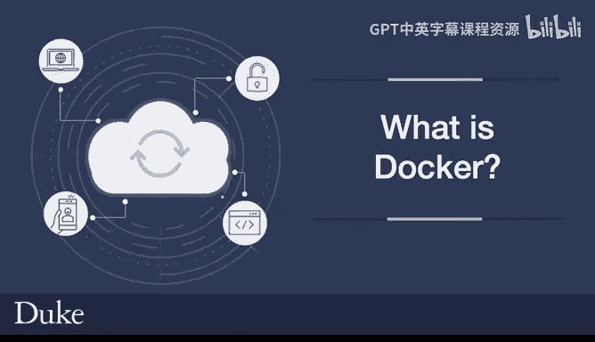
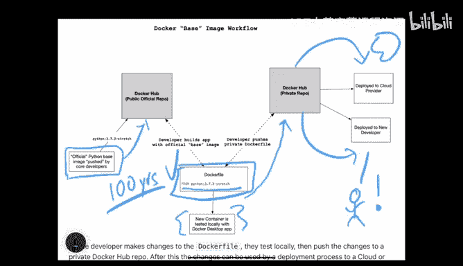
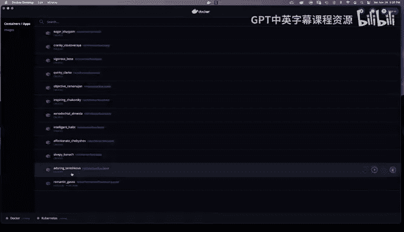
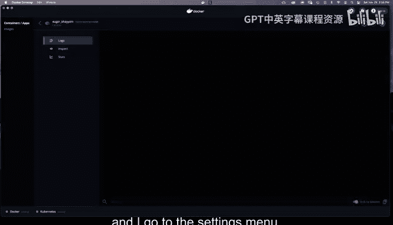
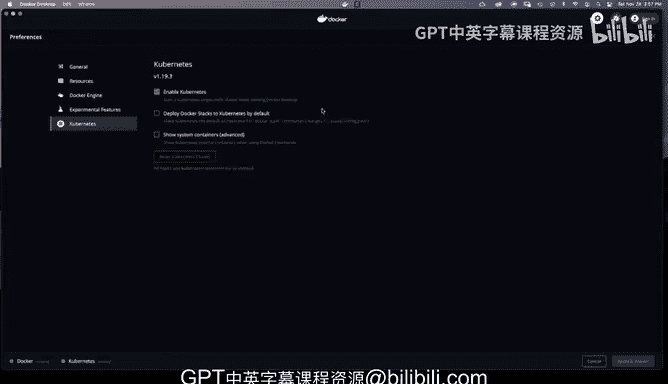

# 083：Docker概述 🐳



在本节课中，我们将要学习Docker是什么，了解其核心组件Docker Desktop和Docker Hub，并探索如何在本地开发环境中使用Docker。

---

## 什么是Docker？

Docker是一个由Docker Desktop和Docker Hub组成的特定产品。这是一个在初次接触容器技术时非常常见的问题。

Docker Desktop是一个安装在您电脑上的应用程序，用于本地开发工作流。它包含一个**容器运行时**，这是关键组件之一。它还包含开发者工具，允许您执行诸如启动Kubernetes、配置不同堆栈的启动和关闭等操作。此外，它还有一个图形用户界面应用程序，您可以用来控制各项功能。如前所述，它可以与Kubernetes交互，您实际上可以在Docker内部启动和管理集群。因此，它本质上是一个本地开发工作流。

Docker Hub则允许您将内容签入公共或私有仓库。您可以通过GitHub自动化容器的构建，可以拉取和使用经过认证的镜像。例如，您可以获取数据库的官方版本并拉取下来，并且知道创建该数据库的开发人员就是认证它的人。Docker Hub还支持团队和组织功能，这更像是一个协作环境，而Docker Desktop则是开发环境。

---

## Docker工作流解析

上一节我们介绍了Docker的组成，本节中我们来看看一个典型的基于Docker的工作流是如何运作的。

当您使用基于Docker的工作流时，通常会从使用核心开发者提供的基础镜像开始。例如，尽管我有多年的Python经验，但Python核心开发者比我知识渊博得多。我可以通过在我的`Dockerfile`中拉取他们的基础镜像来利用他们的知识。

以下是一个示例：
```dockerfile
FROM python:3.7.3
```
这个指令利用了Python核心开发者对Python的深厚知识，这远超过我个人所能掌握的。他们可能拥有我一生都无法复现的百年经验，他们已经运行了所有正确的Bash命令和构建命令，而我可以直接在我的项目中利用这一点。

接下来，我会基于那个原始的基础镜像创建一个新的复合项目，然后将这些更改推送到我的私有Docker Hub仓库。这意味着，如果我愿意，我可以拉取这个镜像，在云中测试并运行这个新项目，或者将其交给新开发者用于入职，新开发者可以使用我的代码并部署它。

这个理念非常类似于源代码控制，只不过控制的是运行时本身。就像人们经常利用专家开发者编写的库的力量一样，您也可以利用专家开发者构建的运行时环境的力量。

这就是Docker的核心理念。`Dockerfile`是其中的关键要点。



---

## Docker Desktop界面导览

上一节我们解析了Docker的工作流理念，本节中我们来看看Docker Desktop本身，了解其图形用户界面工具如何工作。



让我们深入了解Docker在操作系统（以macOS为例，其他系统类似）上是如何工作的。在菜单栏上，可以看到Docker Desktop正在运行，Kubernetes也在运行。这是Docker安装的一部分。



如果我点击这个仪表板，它可以让我对Docker环境中运行的所有内容进行更详细的控制。例如，我可以看到Docker有一些可用的镜像。如果我愿意，可以拉取其中一个，查看和检查它，或者运行它。它提供了启动等控制选项。

此外，如果我回到Docker Desktop环境并进入设置菜单，我还可以配置不同的选项。例如，我可能希望登录时自动启动Docker Desktop（假设我正在做大量活跃开发），或者我的机器资源有限，所以不想自动启动它（这是我的典型做法）。

在资源设置下，我可以为我的机器配置所需的选项。我有一台性能相当强大的机器，所以我告诉Docker可以使用我32个可用CPU中的16个，以及我300GB可用RAM中的50GB。我还可以在这里更改其他参数，如交换空间或磁盘大小。这是一种定制本地开发环境的方式，让您拥有或多或少的控制权。

Docker还有其他一些功能。您可以将Docker容器映射到磁盘上的物理位置，也可以配置其他选项，比如如何启动Docker镜像，或者您希望启用哪些实验性功能（例如，更多云体验或FUSE文件系统）。对于包含在内的Kubernetes，您可以设置是否希望默认启用它，以及是否希望Docker部署到本地Kubernetes集群。

总而言之，它确实是一个开发环境加上一个图形用户界面，这个界面为您提供了许多不同的配置选项。

---

## 总结




本节课中我们一起学习了Docker的基础知识。我们了解到Docker是一个包含**Docker Desktop**（本地开发环境与GUI工具）和**Docker Hub**（镜像仓库与协作平台）的产品。我们探讨了如何通过`Dockerfile`利用专家制作的基础镜像来构建自己的应用，并初步浏览了Docker Desktop的界面和配置选项，它让容器的本地开发、管理和资源调配变得可视化且便捷。